# Agent Architecture Diagram

```mermaid
flowchart TD
    User[👤 User Creates Issue]
    Workflow[⚙️ GitHub Workflow<br/>Auto-assign Copilot]
    Lobby[🎯 Lobby Agent<br/>Analyze & Route]
    
    Designer[🎨 Designer Agent<br/>Diagrams & Layouts]
    Coder[💻 Coder Agent<br/>Code Examples]
    PM[✅ Project Manager<br/>Quality & Testing]
    Trainer[📚 Trainer Agent<br/>Organization & Balance]
    
    Config[(📋 Training Config<br/>Curriculum & Tools)]
    
    Solutions{3 Solutions<br/>Developed}
    AutoSelect[Best Option<br/>30%+ Better?]
    UserChoice[Present Options<br/>to User]
    
    PR[📝 Create Pull Request]
    Review[👁️ Quality Review<br/>by PM]
    Merge[✅ User Merges PR]
    
    User --> Workflow
    Workflow --> Lobby
    
    Lobby --> Designer
    Lobby --> Coder
    Lobby --> PM
    Lobby --> Trainer
    
    Config -.Reference.-> Designer
    Config -.Reference.-> Coder
    Config -.Reference.-> PM
    Config -.Reference.-> Trainer
    
    Designer --> Solutions
    Coder --> Solutions
    PM --> Solutions
    Trainer --> Solutions
    
    Solutions --> AutoSelect
    AutoSelect -->|Yes| PR
    AutoSelect -->|No| UserChoice
    UserChoice --> PR
    
    PR --> Review
    Review --> Merge
    
    style User fill:#e1f5ff
    style Lobby fill:#fff3cd
    style Designer fill:#d4edda
    style Coder fill:#d4edda
    style PM fill:#d4edda
    style Trainer fill:#d4edda
    style Config fill:#f8d7da
    style PR fill:#cfe2ff
```



## Component Descriptions

### User Entry Point
- **User Creates Issue**: Simply describe what you need in natural language
- **GitHub Workflow**: Automatically triggers and assigns Copilot

### Intelligence Layer
- **Lobby Agent**: 
  - Analyzes issue content and keywords
  - Routes to appropriate specialist
  - Coordinates multi-agent tasks
  - Escalates only critical decisions

### Specialized Agents
All agents reference centralized training configuration and use GPT-4o model.

- **Designer Agent**:
  - Creates Mermaid diagrams
  - Designs slide layouts
  - Ensures visual consistency
  - Makes concepts visually clear

- **Coder Agent**:
  - Develops Node.js examples
  - Creates IaC (Terraform, Ansible, K8s)
  - Writes GitHub Actions workflows
  - Ensures code quality and testing

- **Project Manager Agent**:
  - Reviews all contributions
  - Ensures consistency across content
  - Validates quality standards
  - Tracks progress and dependencies

- **Trainer Agent**:
  - Organizes slide content
  - Balances theory/practice (50/50)
  - Matches content to trainee level
  - Ensures pedagogical effectiveness

### Decision Framework
- **3 Solutions**: Each agent develops multiple approaches
- **Auto-select**: If one option is 30%+ better, implement automatically
- **User Choice**: Otherwise, present all options with analysis

### Delivery Pipeline
- **Pull Request**: Agent creates PR with implementation
- **Quality Review**: Project Manager validates
- **User Merges**: Final approval by repository owner

## Routing Keywords

| Keywords | Agent | Use Case |
|----------|-------|----------|
| diagram, layout, design, visual | Designer | Create DevOps loop diagram |
| code, example, implementation | Coder | Add Terraform example |
| test, quality, consistency | Project Manager | Review slides for consistency |
| slides, organization, exercises | Trainer | Balance Day 3 content |

## Data Flow

1. **Issue Created** → Workflow triggers
2. **Copilot Assigned** → Lobby agent activated
3. **Routing Decision** → Keyword analysis
4. **Agent Assignment** → Specialist takes over
5. **Solution Development** → 3 options created
6. **Quality Check** → Compare solutions
7. **Implementation** → PR created
8. **Review Cycle** → PM validates
9. **Merge** → User approves

## Configuration Flow

```
README.md (Single Source of Truth for Training Content)
         ↓
training-config.yml (Structured Configuration Reference)
         ↓
    ┌────┴────┬────────┬────────┐
    ↓         ↓        ↓        ↓
Designer   Coder    PM      Trainer
    ↓         ↓        ↓        ↓
All reference the same curriculum,
technical stack, and session structure
```

**Note**: README.md is the authoritative source for training content. The training-config.yml provides a structured reference for agents.

## Benefits

✅ **Automated Routing**: No manual agent selection needed
✅ **Quality Built-in**: PM reviews everything
✅ **Consistent Curriculum**: Single config file
✅ **Pedagogical Focus**: Trainer ensures learning effectiveness
✅ **Minimal Overhead**: Auto-select when obvious
✅ **Flexible**: Can handle any training content need
