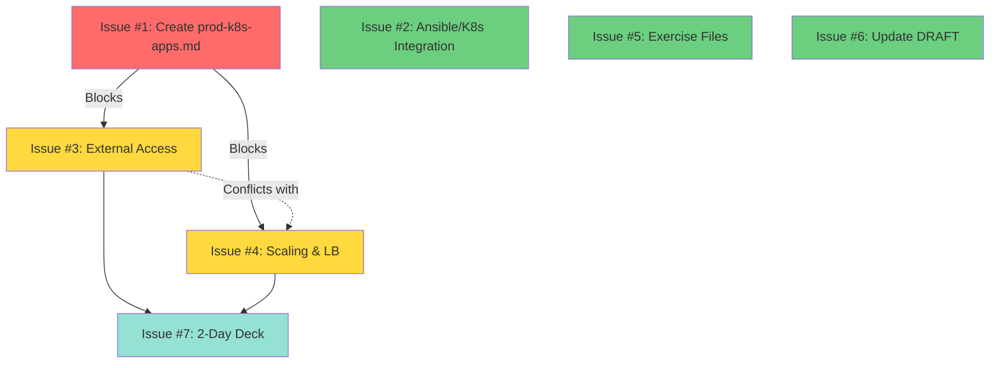

# File Dependency Quick Reference

Quick visual guide for issue coordinators.

## 📌 At a Glance

### Production Track Issues (ISSUES_TO_CREATE.md)



**Legend:**
- 🔴 Red (Critical): Must complete first
- 🟡 Yellow (Dependent): Depends on red issue
- 🟢 Green (Independent): Can work in parallel
- 🔵 Blue (Structural): Do last

### Developer Track Issues (Open Issues)

#### High-Conflict Files

**`dev-advanced-github.md`** (9 issues)
```
#60, #61, #62, #63, #64, #65, #66, #67, #68
└── Recommendation: Sequential or section-based assignment
```

**`dev-sonarqube-xray.md`** (9 issues)
```
#49, #50, #51, #52, #53, #54, #55, #56, #57
└── Recommendation: Sequential or consolidate into meta-issue
```

**`dev-intro-artifactory.md`** (6 issues)
```
#41, #42, #43, #44, #47, #48
└── Recommendation: Group by topic (integration, rules, exercises)
```

**`dev-ci.md`** (7 issues)
```
#31, #34, #35, #36, #37, #38, #40
└── Recommendation: Section-based division
```

**`dev-containerization.md`** (7 issues)
```
#33, #34, #35, #36, #37, #39, #40
└── Recommendation: Section-based division
```

## 🎯 Decision Tree

```
Are you assigning multiple issues?
│
├─ YES → Are they in the dependency matrix?
│        │
│        ├─ YES → Follow recommended order
│        │        (See ISSUES_TO_CREATE.md end)
│        │
│        └─ NO → Check ISSUE_COORDINATION_GUIDE.md
│                 for file conflicts
│
└─ NO → Assign freely, but check for:
         • High-conflict files (9+ issues)
         • Communicate in issue comments
```

## 📋 Quick Checklists

### Before Assigning Production Issues

- [ ] Issue #1 completed? (If assigning #3 or #4)
- [ ] Issues #1-#4 completed? (If assigning #7)
- [ ] Check if #3 and #4 can work on different sections
- [ ] Consider option 2 for #4 (separate file) for parallelism

### Before Assigning Developer Issues

- [ ] Check which file(s) the issue modifies
- [ ] Count how many other issues affect the same file
- [ ] If 5+ issues: Plan sequential or section-based
- [ ] If 2-4 issues: Communicate with other assignees
- [ ] If 1 issue: Safe to assign

## 📞 When to Use Each Guide

| Situation | Use This Guide |
|-----------|---------------|
| Creating production track issues | ISSUES_TO_CREATE.md (see dependency matrix at end) |
| Assigning ANY issues simultaneously | ISSUE_COORDINATION_GUIDE.md |
| Quick conflict check | This file (FILE_DEPENDENCY_QUICK_REF.md) |
| Understanding multi-agent system | .github/agents/README.md |

## 🚨 Critical Rules

1. **NEVER** assign Issues #3 or #4 before #1 is complete
2. **COORDINATE** when assigning issues that modify:
   - `dev-advanced-github.md` (9 issues)
   - `dev-sonarqube-xray.md` (9 issues)
   - `dev-ci.md` (7 issues)
   - `dev-containerization.md` (7 issues)
   - `prod-k8s-apps.md` (3 planned issues)
3. **SEQUENCE** or use section-based division for high-conflict files
4. **COMMUNICATE** assignments in issue comments to avoid surprises

## 📊 Statistics

### Open Issues by File

| File | Issue Count | Risk Level |
|------|-------------|------------|
| `dev-advanced-github.md` | 9 | 🔴 Critical |
| `dev-sonarqube-xray.md` | 9 | 🔴 Critical |
| `dev-ci.md` | 7 | 🟠 High |
| `dev-containerization.md` | 7 | 🟠 High |
| `dev-intro-artifactory.md` | 6 | 🟠 Medium |
| Others | 1-2 | 🟢 Low |

### Planned Issues by File

| File | Issue Count | Risk Level |
|------|-------------|------------|
| `prod-k8s-apps.md` | 3 | 🔴 Critical |
| `README.md` | 1 | 🟢 Low |
| Others | 1 each | 🟢 Low |

## 🔗 Full Documentation

- **[ISSUE_COORDINATION_GUIDE.md](ISSUE_COORDINATION_GUIDE.md)** - Complete coordination strategies
- **[ISSUES_TO_CREATE.md](ISSUES_TO_CREATE.md)** - Issue templates with dependency matrix
- **[README.md](README.md)** - Project overview with coordination section

---

**Last Updated**: 2025-11-07  
**Quick Tip**: When in doubt, check the full guides or ask in issue comments!
