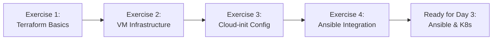

# Terraform Exercises - DevOps for Operators

Comprehensive hands-on exercises for Day 2 of the DevOps training, focusing on Infrastructure as Code with Terraform and libvirt.

## 📋 Overview

These exercises will teach you to:
- Understand Terraform syntax and workflow
- Create and manage virtual machines using libvirt provider
- Configure VMs with cloud-init
- Generate dynamic inventories for Ansible integration
- Apply Infrastructure as Code best practices

### Learning Path



### Time Estimates

| Exercise | Duration | Difficulty |
|----------|----------|------------|
| Exercise 1: Terraform Basics | 45 min | Beginner |
| Exercise 2: VM Infrastructure | 60 min | Intermediate |
| Exercise 3: Cloud-init Configuration | 45 min | Intermediate |
| Exercise 4: Outputs & Inventory | 30 min | Intermediate |
| **Total** | **3 hours** | |

### Prerequisites

**Required Software:**
- Terraform ≥ 1.5.0
- QEMU/KVM + libvirt
- SSH client
- Git and text editor (VS Code recommended)

**System Requirements:**
- 8 GB RAM minimum (16 GB recommended)
- 20 GB free disk space
- CPU virtualization support (Intel VT-x or AMD-V)

**Knowledge Prerequisites:**
- Basic Linux command line
- Understanding of virtualization concepts
- Basic networking knowledge (IP addresses, SSH)

**Verify Your Setup:**
```bash
# Check Terraform
terraform version    # Should be ≥ 1.5.0

# Check libvirt
virsh version       # Should show libvirt daemon running
virsh list --all    # Should list VMs (may be empty)

# Check KVM support
kvm-ok             # Should show "KVM acceleration can be used"
# or on some systems:
egrep -c '(vmx|svm)' /proc/cpuinfo  # Should be > 0

# Check SSH
ssh -V              # Any recent version
```

---

## 🎯 Exercise 1: Terraform Basics

**Learning Objectives:**
- Understand Terraform project structure
- Learn HCL syntax basics
- Execute Terraform workflow (init, plan, apply)
- Understand Terraform state

**Background:**
Terraform uses declarative configuration files written in HashiCorp Configuration Language (HCL) to define infrastructure. The basic workflow involves initializing a project, planning changes, and applying them.

### Step-by-Step Instructions

#### 1.1 Create a Simple Terraform Configuration

Create a new directory for your first Terraform project:

```bash
mkdir -p ~/terraform-lab/exercise-1
cd ~/terraform-lab/exercise-1
```

Create a file named `main.tf`:

```hcl
# main.tf - Your first Terraform configuration

# Terraform block specifies required providers
terraform {
  required_version = ">= 1.5.0"
  required_providers {
    local = {
      source  = "hashicorp/local"
      version = "~> 2.4"
    }
  }
}

# A simple resource that creates a local file
resource "local_file" "hello" {
  content  = "Hello from Terraform!\nCreated at: ${timestamp()}"
  filename = "${path.module}/hello.txt"
}

# Output to display information
output "file_path" {
  description = "Path to the created file"
  value       = local_file.hello.filename
}
```

#### 1.2 Initialize Terraform

```bash
# Initialize the working directory
terraform init
```

**Expected Output:**
```
Initializing the backend...
Initializing provider plugins...
- Finding hashicorp/local versions matching "~> 2.4"...
- Installing hashicorp/local v2.4.x...
Terraform has been successfully initialized!
```

**What Happened:**
- Terraform downloaded the `local` provider plugin
- Created a `.terraform` directory with provider binaries
- Created a `.terraform.lock.hcl` file to lock provider versions

#### 1.3 Plan Your Changes

```bash
# Preview what Terraform will do
terraform plan
```

**Expected Output:**
```
Terraform will perform the following actions:

  # local_file.hello will be created
  + resource "local_file" "hello" {
      + content  = "Hello from Terraform!..."
      + filename = "./hello.txt"
      ...
    }

Plan: 1 to add, 0 to change, 0 to destroy.
```

#### 1.4 Apply the Configuration

```bash
# Apply the changes
terraform apply
```

Type `yes` when prompted.

**Expected Output:**
```
local_file.hello: Creating...
local_file.hello: Creation complete after 0s

Apply complete! Resources: 1 added, 0 changed, 0 destroyed.

Outputs:

file_path = "./hello.txt"
```

#### 1.5 Verify and Explore

```bash
# Check the created file
cat hello.txt

# Inspect the Terraform state
terraform show

# List resources in state
terraform state list

# Get detailed state information
terraform state show local_file.hello
```

#### 1.6 Modify and Reapply

Edit `main.tf` and change the content:

```hcl
resource "local_file" "hello" {
  content  = "Updated content from Terraform!\nModified at: ${timestamp()}"
  filename = "${path.module}/hello.txt"
}
```

Run the workflow again:

```bash
terraform plan   # Shows the change
terraform apply  # Updates the file
cat hello.txt    # Verify the update
```

#### 1.7 Clean Up

```bash
# Destroy the resources
terraform destroy
```

Type `yes` when prompted.

**Expected Output:**
```
local_file.hello: Destroying...
local_file.hello: Destruction complete after 0s

Destroy complete! Resources: 1 destroyed.
```

### Success Criteria

- ✅ `terraform init` completes without errors
- ✅ `terraform plan` shows expected resources
- ✅ `terraform apply` creates the file
- ✅ File content matches the configuration
- ✅ State file (`terraform.tfstate`) is created
- ✅ You understand the difference between plan and apply
- ✅ `terraform destroy` removes the file

### Common Pitfalls

❌ **Error: Failed to install provider**
- **Cause:** No internet connection or proxy issues
- **Solution:** Check internet connectivity, configure proxy if needed

❌ **Error: Inconsistent dependency lock file**
- **Cause:** Provider version mismatch
- **Solution:** Run `terraform init -upgrade`

❌ **Warning: Interpolation-only expressions are deprecated**
- **Cause:** Using `"${var.name}"` instead of `var.name`
- **Solution:** Remove quotes when not needed: use `var.name` directly

---

## 🖥️ Exercise 2: VM Infrastructure with Libvirt

**Learning Objectives:**
- Configure the libvirt provider
- Create virtual machine resources
- Use variables for flexibility
- Manage multiple VMs with count

**Background:**
The libvirt provider allows Terraform to manage KVM/QEMU virtual machines. We'll create a Kubernetes-ready infrastructure with 1 master and 2 worker nodes.

### Step-by-Step Instructions

#### 2.1 Set Up Project Structure

```bash
mkdir -p ~/terraform-lab/exercise-2
cd ~/terraform-lab/exercise-2
```

Create the following file structure:
```
exercise-2/
├── main.tf          # Main configuration
├── variables.tf     # Variable definitions
├── outputs.tf       # Output definitions
└── terraform.tfvars # Variable values (optional)
```

#### 2.2 Configure the Libvirt Provider

Create `main.tf`:

```hcl
# main.tf - Libvirt VM infrastructure

terraform {
  required_version = ">= 1.5.0"
  required_providers {
    libvirt = {
      source  = "dmacvicar/libvirt"
      version = "~> 0.7"
    }
  }
}

# Configure the Libvirt provider
provider "libvirt" {
  uri = "qemu:///system"  # Use system-level libvirt
}

# Base OS image - Ubuntu 22.04 (downloaded once, used for all VMs)
resource "libvirt_volume" "base" {
  name   = "ubuntu-22.04-base.qcow2"
  pool   = "default"
  source = "https://cloud-images.ubuntu.com/releases/22.04/release/ubuntu-22.04-server-cloudimg-amd64.img"
  format = "qcow2"
}
```

#### 2.3 Define Variables

Create `variables.tf`:

```hcl
# variables.tf - Variable definitions

variable "masters" {
  description = "Number of master nodes"
  type        = number
  default     = 1
}

variable "workers" {
  description = "Number of worker nodes"
  type        = number
  default     = 2
}

variable "vm_memory" {
  description = "Memory for each VM in MB"
  type        = number
  default     = 2048
}

variable "vm_vcpu" {
  description = "Number of vCPUs for each VM"
  type        = number
  default     = 2
}

variable "disk_size" {
  description = "Disk size for each VM in bytes"
  type        = number
  default     = 10737418240  # 10 GB
}

variable "network_cidr" {
  description = "CIDR for the VM network"
  type        = string
  default     = "192.168.100.0/24"
}
```

#### 2.4 Create Master Node VMs

Add to `main.tf`:

```hcl
# Master node volumes (one per master)
resource "libvirt_volume" "master" {
  count          = var.masters
  name           = "master-${count.index + 1}.qcow2"
  base_volume_id = libvirt_volume.base.id
  pool           = "default"
  size           = var.disk_size
  format         = "qcow2"
}

# Master node domains (VMs)
resource "libvirt_domain" "master" {
  count  = var.masters
  name   = "k8s-master-${count.index + 1}"
  memory = var.vm_memory
  vcpu   = var.vm_vcpu

  disk {
    volume_id = libvirt_volume.master[count.index].id
  }

  network_interface {
    network_name   = "default"
    wait_for_lease = true
  }

  console {
    type        = "pty"
    target_type = "serial"
    target_port = "0"
  }

  graphics {
    type        = "vnc"
    listen_type = "address"
    autoport    = true
  }
}
```

#### 2.5 Create Worker Node VMs

Add to `main.tf`:

```hcl
# Worker node volumes
resource "libvirt_volume" "worker" {
  count          = var.workers
  name           = "worker-${count.index + 1}.qcow2"
  base_volume_id = libvirt_volume.base.id
  pool           = "default"
  size           = var.disk_size
  format         = "qcow2"
}

# Worker node domains
resource "libvirt_domain" "worker" {
  count  = var.workers
  name   = "k8s-worker-${count.index + 1}"
  memory = var.vm_memory
  vcpu   = var.vm_vcpu

  disk {
    volume_id = libvirt_volume.worker[count.index].id
  }

  network_interface {
    network_name   = "default"
    wait_for_lease = true
  }

  console {
    type        = "pty"
    target_type = "serial"
    target_port = "0"
  }

  graphics {
    type        = "vnc"
    listen_type = "address"
    autoport    = true
  }
}
```

#### 2.6 Initialize and Apply

```bash
# Initialize the project
terraform init

# Preview the changes
terraform plan -var 'masters=1' -var 'workers=2'

# Apply the configuration
terraform apply -var 'masters=1' -var 'workers=2'
```

**Note:** First run will download the Ubuntu image (~600 MB), which may take a few minutes.

#### 2.7 Verify VMs

```bash
# List VMs using virsh
virsh list --all

# Check VM details
virsh dominfo k8s-master-1

# View VM IP addresses
virsh domifaddr k8s-master-1
```

### Success Criteria

- ✅ Provider initialization succeeds
- ✅ Base image downloads successfully
- ✅ All VMs are created (1 master + 2 workers)
- ✅ VMs are in "running" state (`virsh list`)
- ✅ VMs have IP addresses assigned
- ✅ State file tracks all resources

### Common Pitfalls

❌ **Error: Failed to connect to libvirt**
- **Cause:** Libvirt service not running
- **Solution:** `sudo systemctl start libvirtd`

❌ **Error: Permission denied**
- **Cause:** User not in libvirt group
- **Solution:** `sudo usermod -aG libvirt $USER` then logout/login

❌ **Error: Storage pool 'default' not found**
- **Cause:** Default pool not defined
- **Solution:** 
  ```bash
  virsh pool-define-as default dir --target /var/lib/libvirt/images
  virsh pool-start default
  virsh pool-autostart default
  ```

❌ **Error: Cannot download image**
- **Cause:** Network issue or slow connection
- **Solution:** Download manually and reference local file:
  ```bash
  cd /var/lib/libvirt/images
  sudo wget https://cloud-images.ubuntu.com/releases/22.04/release/ubuntu-22.04-server-cloudimg-amd64.img
  ```
  Then update `source` in `main.tf` to point to local path

---

## ☁️ Exercise 3: Cloud-init Configuration

**Learning Objectives:**
- Understand cloud-init and its role
- Configure user accounts and SSH access
- Use Terraform templates
- Apply cloud-init to VMs

**Background:**
Cloud-init is a standard for VM initialization. It configures users, SSH keys, packages, and more during first boot. This is essential for automated infrastructure.

### Step-by-Step Instructions

#### 3.1 Prepare Your SSH Key

If you don't have an SSH key:

```bash
# Generate SSH key pair
ssh-keygen -t ed25519 -C "terraform-lab" -f ~/.ssh/terraform_lab
```

Get your public key:

```bash
# Display your public key
cat ~/.ssh/terraform_lab.pub
```

#### 3.2 Create Cloud-init Template

Create `cloud-init.yaml`:

```yaml
#cloud-config

# User configuration
users:
  - name: devops
    groups: sudo
    sudo: ALL=(ALL) NOPASSWD:ALL
    shell: /bin/bash
    ssh_authorized_keys:
      - ${ssh_public_key}

# Set hostname
hostname: ${hostname}
fqdn: ${hostname}.local

# Update packages on first boot
package_update: true
package_upgrade: true

# Install essential packages
packages:
  - curl
  - wget
  - vim
  - git
  - net-tools

# Enable SSH password authentication (for emergencies)
ssh_pwauth: true

# Set password for devops user (change this!)
chpasswd:
  list: |
    devops:devops123
  expire: false

# Run commands on first boot
runcmd:
  - echo "VM initialized at $(date)" > /var/log/cloud-init-complete.log
  - systemctl enable ssh
  - systemctl start ssh
```

#### 3.3 Update Variables

Add to `variables.tf`:

```hcl
variable "ssh_public_key" {
  description = "SSH public key for VM access"
  type        = string
  # Default to your public key or set via terraform.tfvars
}
```

Create `terraform.tfvars`:

```hcl
# terraform.tfvars - Variable values

masters = 1
workers = 2

# Replace with your actual public key
ssh_public_key = "ssh-ed25519 AAAAC3Nza... your-email@example.com"
```

#### 3.4 Create Cloud-init Data Source

Add to `main.tf`:

```hcl
# Cloud-init configuration for master nodes
data "template_file" "master_cloud_init" {
  count    = var.masters
  template = file("${path.module}/cloud-init.yaml")
  
  vars = {
    hostname       = "k8s-master-${count.index + 1}"
    ssh_public_key = var.ssh_public_key
  }
}

# Cloud-init configuration for worker nodes
data "template_file" "worker_cloud_init" {
  count    = var.workers
  template = file("${path.module}/cloud-init.yaml")
  
  vars = {
    hostname       = "k8s-worker-${count.index + 1}"
    ssh_public_key = var.ssh_public_key
  }
}

# Cloud-init disk for master nodes
resource "libvirt_cloudinit_disk" "master" {
  count     = var.masters
  name      = "master-${count.index + 1}-cloudinit.iso"
  user_data = data.template_file.master_cloud_init[count.index].rendered
  pool      = "default"
}

# Cloud-init disk for worker nodes
resource "libvirt_cloudinit_disk" "worker" {
  count     = var.workers
  name      = "worker-${count.index + 1}-cloudinit.iso"
  user_data = data.template_file.worker_cloud_init[count.index].rendered
  pool      = "default"
}
```

#### 3.5 Attach Cloud-init to VMs

Update the `libvirt_domain` resources in `main.tf`:

```hcl
resource "libvirt_domain" "master" {
  count  = var.masters
  name   = "k8s-master-${count.index + 1}"
  memory = var.vm_memory
  vcpu   = var.vm_vcpu

  # Add cloud-init disk
  cloudinit = libvirt_cloudinit_disk.master[count.index].id

  disk {
    volume_id = libvirt_volume.master[count.index].id
  }

  network_interface {
    network_name   = "default"
    wait_for_lease = true
  }

  console {
    type        = "pty"
    target_type = "serial"
    target_port = "0"
  }

  graphics {
    type        = "vnc"
    listen_type = "address"
    autoport    = true
  }
}

resource "libvirt_domain" "worker" {
  count  = var.workers
  name   = "k8s-worker-${count.index + 1}"
  memory = var.vm_memory
  vcpu   = var.vm_vcpu

  # Add cloud-init disk
  cloudinit = libvirt_cloudinit_disk.worker[count.index].id

  disk {
    volume_id = libvirt_volume.worker[count.index].id
  }

  network_interface {
    network_name   = "default"
    wait_for_lease = true
  }

  console {
    type        = "pty"
    target_type = "serial"
    target_port = "0"
  }

  graphics {
    type        = "vnc"
    listen_type = "address"
    autoport    = true
  }
}
```

#### 3.6 Recreate VMs with Cloud-init

```bash
# Destroy existing VMs
terraform destroy

# Recreate with cloud-init
terraform apply
```

#### 3.7 Test SSH Access

Wait 2-3 minutes for cloud-init to complete, then:

```bash
# Get master IP
MASTER_IP=$(virsh domifaddr k8s-master-1 | grep ipv4 | awk '{print $4}' | cut -d'/' -f1)

# SSH to master node
ssh -i ~/.ssh/terraform_lab devops@$MASTER_IP

# Once connected, verify:
hostname  # Should show k8s-master-1
whoami    # Should show devops
sudo ls   # Should work without password
```

### Success Criteria

- ✅ Cloud-init configuration is valid YAML
- ✅ VMs boot successfully with cloud-init
- ✅ SSH access works with your key
- ✅ Hostname is set correctly
- ✅ User `devops` exists with sudo access
- ✅ Required packages are installed

### Common Pitfalls

❌ **Cannot SSH to VM**
- **Cause:** Cloud-init still running or SSH key not added
- **Solution:** Wait 2-3 minutes, check `/var/log/cloud-init-output.log` on VM console

❌ **Error: Invalid YAML**
- **Cause:** Indentation errors in cloud-init.yaml
- **Solution:** Validate YAML at https://www.yamllint.com/

❌ **Error: Template file not found**
- **Cause:** Wrong path in `file()` function
- **Solution:** Use `${path.module}/cloud-init.yaml` for relative path

❌ **SSH key not working**
- **Cause:** Wrong public key or format
- **Solution:** Verify with `ssh-keygen -l -f ~/.ssh/terraform_lab.pub`

---

## 🔄 Exercise 4: Outputs and Ansible Inventory

**Learning Objectives:**
- Define Terraform outputs
- Generate Ansible inventory from Terraform
- Integrate Terraform with Ansible
- Prepare for Day 3 (Ansible and Kubernetes)

**Background:**
Terraform outputs can export information about your infrastructure. We'll use this to automatically generate an Ansible inventory file for the next day's exercises.

### Step-by-Step Instructions

#### 4.1 Define Outputs

Create `outputs.tf`:

```hcl
# outputs.tf - Export infrastructure information

# Master node information
output "master_ips" {
  description = "IP addresses of master nodes"
  value = [
    for domain in libvirt_domain.master :
    domain.network_interface[0].addresses[0]
  ]
}

output "master_names" {
  description = "Hostnames of master nodes"
  value = [
    for domain in libvirt_domain.master :
    domain.name
  ]
}

# Worker node information
output "worker_ips" {
  description = "IP addresses of worker nodes"
  value = [
    for domain in libvirt_domain.worker :
    domain.network_interface[0].addresses[0]
  ]
}

output "worker_names" {
  description = "Hostnames of worker nodes"
  value = [
    for domain in libvirt_domain.worker :
    domain.name
  ]
}

# All node IPs for convenience
output "all_ips" {
  description = "All VM IP addresses"
  value = concat(
    [for domain in libvirt_domain.master : domain.network_interface[0].addresses[0]],
    [for domain in libvirt_domain.worker : domain.network_interface[0].addresses[0]]
  )
}

# Inventory summary
output "inventory_summary" {
  description = "Quick inventory summary"
  value = <<-EOT
  
  Kubernetes Cluster Inventory:
  =============================
  
  Masters (${var.masters}):
  ${join("\n  ", [for i, domain in libvirt_domain.master : "${domain.name}: ${domain.network_interface[0].addresses[0]}"])}
  
  Workers (${var.workers}):
  ${join("\n  ", [for i, domain in libvirt_domain.worker : "${domain.name}: ${domain.network_interface[0].addresses[0]}"])}
  
  EOT
}
```

#### 4.2 Apply and View Outputs

```bash
# Apply configuration
terraform apply

# View all outputs
terraform output

# View specific output
terraform output master_ips

# View as JSON
terraform output -json
```

#### 4.3 Generate Ansible Inventory

Create a template file `inventory.tpl`:

```ini
# Ansible Inventory - Generated by Terraform
# Generated at: ${timestamp}

[all:vars]
ansible_user=devops
ansible_ssh_private_key_file=~/.ssh/terraform_lab
ansible_ssh_common_args='-o StrictHostKeyChecking=no'

[masters]
%{ for idx, ip in master_ips ~}
${master_names[idx]} ansible_host=${ip}
%{ endfor ~}

[workers]
%{ for idx, ip in worker_ips ~}
${worker_names[idx]} ansible_host=${ip}
%{ endfor ~}

[k8s_cluster:children]
masters
workers
```

#### 4.4 Create Inventory Resource

Add to `main.tf`:

```hcl
# Generate Ansible inventory file
resource "local_file" "ansible_inventory" {
  content = templatefile("${path.module}/inventory.tpl", {
    timestamp     = timestamp()
    master_ips    = [for domain in libvirt_domain.master : domain.network_interface[0].addresses[0]]
    master_names  = [for domain in libvirt_domain.master : domain.name]
    worker_ips    = [for domain in libvirt_domain.worker : domain.network_interface[0].addresses[0]]
    worker_names  = [for domain in libvirt_domain.worker : domain.name]
  })
  
  filename        = "${path.module}/inventory.ini"
  file_permission = "0644"
}

output "inventory_file" {
  description = "Path to generated Ansible inventory"
  value       = local_file.ansible_inventory.filename
}
```

#### 4.5 Apply and Generate Inventory

```bash
# Apply to generate inventory
terraform apply

# View the generated inventory
cat inventory.ini
```

**Expected Output:**
```ini
# Ansible Inventory - Generated by Terraform
# Generated at: 2025-11-07T...

[all:vars]
ansible_user=devops
ansible_ssh_private_key_file=~/.ssh/terraform_lab
ansible_ssh_common_args='-o StrictHostKeyChecking=no'

[masters]
k8s-master-1 ansible_host=192.168.100.10

[workers]
k8s-worker-1 ansible_host=192.168.100.11
k8s-worker-2 ansible_host=192.168.100.12

[k8s_cluster:children]
masters
workers
```

#### 4.6 Test Inventory with Ansible

```bash
# Install Ansible if not already installed
sudo apt-get update && sudo apt-get install -y ansible

# Test connectivity
ansible -i inventory.ini all -m ping

# Get hostname from all nodes
ansible -i inventory.ini all -m shell -a "hostname"

# Check OS version
ansible -i inventory.ini all -m shell -a "cat /etc/os-release | grep VERSION"
```

**Expected Output:**
```
k8s-master-1 | SUCCESS => {
    "changed": false,
    "ping": "pong"
}
k8s-worker-1 | SUCCESS => {
    "changed": false,
    "ping": "pong"
}
k8s-worker-2 | SUCCESS => {
    "changed": false,
    "ping": "pong"
}
```

### Success Criteria

- ✅ All outputs display correctly
- ✅ `inventory.ini` file is generated
- ✅ Inventory file has correct format
- ✅ IP addresses match actual VMs
- ✅ Ansible ping test succeeds for all nodes
- ✅ Ready for Day 3 Ansible exercises

### Common Pitfalls

❌ **Error: Missing attribute**
- **Cause:** Trying to access network interface before it's ready
- **Solution:** Ensure `wait_for_lease = true` in network_interface block

❌ **Error: Template file not found**
- **Cause:** Wrong path to inventory.tpl
- **Solution:** Verify file exists and use correct path

❌ **Ansible cannot connect**
- **Cause:** SSH not ready or wrong key
- **Solution:** Wait longer, verify SSH key path in inventory

---

## 🔧 Troubleshooting

### Common Error Messages

#### "Failed to connect to libvirt daemon"

**Error Message:**
```
Error: failed to connect to libvirt: virError(Code=38, Domain=7, Message='Failed to connect socket to '/var/run/libvirt/libvirt-sock': No such file or directory')
```

**Diagnosis:**
```bash
# Check if libvirt is running
sudo systemctl status libvirtd
```

**Solutions:**
1. Start libvirt service:
   ```bash
   sudo systemctl start libvirtd
   sudo systemctl enable libvirtd
   ```

2. Check user permissions:
   ```bash
   # Add user to libvirt group
   sudo usermod -aG libvirt $USER
   
   # Apply group changes (logout/login or:)
   newgrp libvirt
   ```

#### "Error creating libvirt domain: Network 'default' not found"

**Diagnosis:**
```bash
# List networks
virsh net-list --all
```

**Solution:**
```bash
# Define and start default network
virsh net-define /usr/share/libvirt/networks/default.xml
virsh net-start default
virsh net-autostart default
```

#### "Error downloading image: connection timeout"

**Solutions:**

1. **Download manually:**
   ```bash
   cd /var/lib/libvirt/images
   sudo wget https://cloud-images.ubuntu.com/releases/22.04/release/ubuntu-22.04-server-cloudimg-amd64.img
   ```

2. **Update Terraform to use local file:**
   ```hcl
   resource "libvirt_volume" "base" {
     name   = "ubuntu-22.04-base.qcow2"
     pool   = "default"
     source = "/var/lib/libvirt/images/ubuntu-22.04-server-cloudimg-amd64.img"
     format = "qcow2"
   }
   ```

#### "Cloud-init not configuring SSH key"

**Diagnosis:**
```bash
# Connect via console and check logs
virsh console k8s-master-1
# (Press Enter)
# Login with: devops / devops123

# Check cloud-init logs
cat /var/log/cloud-init.log
cat /var/log/cloud-init-output.log
```

**Common Causes:**
- SSH key format is wrong (should be full key with prefix like `ssh-ed25519`)
- YAML indentation errors
- Cloud-init disk not attached

**Solution:**
Verify your cloud-init template and redeploy:
```bash
# Validate YAML
python3 -c "import yaml; yaml.safe_load(open('cloud-init.yaml'))"

# Check rendered template
terraform console
> data.template_file.master_cloud_init[0].rendered
```

#### "VMs created but no IP address"

**Diagnosis:**
```bash
# Check VM network
virsh domiflist k8s-master-1

# Check network DHCP leases
virsh net-dhcp-leases default
```

**Solutions:**

1. **Wait longer** - DHCP can take 30-60 seconds
2. **Restart VM:**
   ```bash
   virsh destroy k8s-master-1
   virsh start k8s-master-1
   ```
3. **Check network configuration:**
   ```bash
   virsh net-dumpxml default
   ```

### Debugging Techniques

#### Enable Terraform Debug Logging

```bash
# Set debug level
export TF_LOG=DEBUG
export TF_LOG_PATH=./terraform-debug.log

# Run Terraform commands
terraform apply

# View logs
less terraform-debug.log
```

#### Use Terraform Console

```bash
# Interactive console to test expressions
terraform console

# Try expressions:
> var.masters
> libvirt_domain.master[0].name
> length(libvirt_domain.worker)
```

#### Check Terraform State

```bash
# List all resources
terraform state list

# Show specific resource
terraform state show libvirt_domain.master[0]

# View entire state
terraform show
```

#### Inspect VM Directly

```bash
# Connect to VM console
virsh console k8s-master-1
# Press Enter to activate console
# Ctrl+] to exit

# View VM logs
virsh dumpxml k8s-master-1

# Check VM disk
virsh domblklist k8s-master-1
```

### Getting Help

1. **Check Terraform Documentation:**
   - Main docs: https://developer.hashicorp.com/terraform/docs
   - Libvirt provider: https://registry.terraform.io/providers/dmacvicar/libvirt/latest/docs

2. **Community Resources:**
   - Terraform Discuss: https://discuss.hashicorp.com/c/terraform-core
   - GitHub Issues: https://github.com/dmacvicar/terraform-provider-libvirt/issues

3. **Instructor/Peers:**
   - Ask your instructor during lab time
   - Collaborate with fellow students
   - Share solutions that worked

4. **Useful Commands for Support:**
   ```bash
   # Gather diagnostic info
   terraform version
   virsh version
   uname -a
   
   # Provider plugin info
   ls -la .terraform/providers/
   
   # Network configuration
   virsh net-list --all
   ip addr show
   ```

---

## 📚 Reference Materials

### Terraform CLI Cheat Sheet

#### Essential Commands

```bash
# Initialize working directory
terraform init          # Download providers
terraform init -upgrade # Upgrade providers to latest allowed version

# Formatting and validation
terraform fmt           # Format .tf files
terraform fmt -check    # Check if files are formatted
terraform validate      # Validate configuration syntax

# Planning and applying
terraform plan                     # Preview changes
terraform plan -out=plan.tfplan    # Save plan to file
terraform apply                    # Apply changes
terraform apply plan.tfplan        # Apply saved plan
terraform apply -auto-approve      # Skip confirmation
terraform destroy                  # Destroy all resources
terraform destroy -target=resource # Destroy specific resource

# State management
terraform state list                      # List resources in state
terraform state show <resource>           # Show resource details
terraform state mv <source> <dest>        # Rename resource
terraform state rm <resource>             # Remove from state
terraform state pull                      # Download state
terraform state push                      # Upload state

# Outputs
terraform output              # Show all outputs
terraform output <name>       # Show specific output
terraform output -json        # Show outputs as JSON

# Workspaces
terraform workspace list      # List workspaces
terraform workspace new <name> # Create workspace
terraform workspace select <name> # Switch workspace

# Other
terraform console             # Interactive console
terraform graph              # Generate dependency graph
terraform show               # Show current state
terraform version            # Show version info
```

### HCL Syntax Reference

#### Resource Block

```hcl
resource "type" "name" {
  argument1 = value1
  argument2 = value2
  
  nested_block {
    nested_arg = value
  }
}
```

#### Variable Block

```hcl
variable "name" {
  description = "Description of variable"
  type        = string  # string, number, bool, list, map, object
  default     = "default value"
  sensitive   = false   # Hide in output
  validation {
    condition     = length(var.name) > 0
    error_message = "Must not be empty"
  }
}
```

#### Output Block

```hcl
output "name" {
  description = "Description of output"
  value       = resource.type.name.attribute
  sensitive   = false
}
```

#### Data Source

```hcl
data "type" "name" {
  # Query existing resources
  argument = value
}
```

#### Local Values

```hcl
locals {
  common_tags = {
    Environment = "Dev"
    ManagedBy   = "Terraform"
  }
  instance_name = "web-${var.environment}"
}

# Use: local.common_tags
```

#### For Expressions

```hcl
# List transformation
[for item in var.list : upper(item)]

# Map transformation
{for k, v in var.map : k => upper(v)}

# Conditional
[for s in var.list : upper(s) if s != ""]
```

#### Count and For_Each

```hcl
# Count - numeric index
resource "type" "name" {
  count = 3
  name  = "instance-${count.index}"
}

# For_each - map or set
resource "type" "name" {
  for_each = toset(var.names)
  name     = each.value  # or each.key
}
```

### Provider Documentation

#### Libvirt Provider

**Official Docs:** https://registry.terraform.io/providers/dmacvicar/libvirt/latest/docs

**Key Resources:**

- `libvirt_volume` - Virtual disk images
- `libvirt_domain` - Virtual machines
- `libvirt_network` - Virtual networks
- `libvirt_cloudinit_disk` - Cloud-init configuration
- `libvirt_pool` - Storage pools

**Example Resources:**

```hcl
# Storage volume
resource "libvirt_volume" "example" {
  name   = "example.qcow2"
  pool   = "default"
  source = "https://cloud-images.ubuntu.com/..."
  format = "qcow2"
  size   = 10737418240  # 10 GB
}

# Virtual machine
resource "libvirt_domain" "example" {
  name   = "example-vm"
  memory = 2048
  vcpu   = 2
  
  disk {
    volume_id = libvirt_volume.example.id
  }
  
  network_interface {
    network_name   = "default"
    wait_for_lease = true
  }
  
  cloudinit = libvirt_cloudinit_disk.example.id
}

# Cloud-init
resource "libvirt_cloudinit_disk" "example" {
  name      = "cloudinit.iso"
  user_data = data.template_file.cloud_init.rendered
}
```

### Cloud-init Documentation

**Official Docs:** https://cloudinit.readthedocs.io/

**Common Modules:**

```yaml
#cloud-config

# Users
users:
  - name: username
    groups: sudo
    sudo: ALL=(ALL) NOPASSWD:ALL
    shell: /bin/bash
    ssh_authorized_keys:
      - ssh-rsa AAAA...

# Packages
package_update: true
package_upgrade: true
packages:
  - package1
  - package2

# Files
write_files:
  - path: /etc/example.conf
    content: |
      Example content
    permissions: '0644'

# Commands
runcmd:
  - echo "Hello" >> /tmp/hello.txt
  - systemctl restart service
```

### Useful Links

#### Terraform

- [Official Documentation](https://developer.hashicorp.com/terraform/docs)
- [Tutorials](https://developer.hashicorp.com/terraform/tutorials)
- [Language Reference](https://developer.hashicorp.com/terraform/language)
- [Provider Registry](https://registry.terraform.io/)
- [Best Practices](https://www.terraform-best-practices.com/)

#### Libvirt

- [Libvirt Provider](https://registry.terraform.io/providers/dmacvicar/libvirt/latest/docs)
- [Libvirt Documentation](https://libvirt.org/docs.html)
- [KVM/QEMU](https://www.linux-kvm.org/)

#### Cloud-init

- [Cloud-init Docs](https://cloudinit.readthedocs.io/)
- [Examples](https://cloudinit.readthedocs.io/en/latest/reference/examples.html)
- [Module Reference](https://cloudinit.readthedocs.io/en/latest/reference/modules.html)

#### Community

- [Terraform Discuss](https://discuss.hashicorp.com/c/terraform-core)
- [r/Terraform](https://www.reddit.com/r/Terraform/)
- [Stack Overflow](https://stackoverflow.com/questions/tagged/terraform)

---

## 🎓 Next Steps

After completing these exercises, you will be ready for:

### Day 3: Ansible and Kubernetes
- Use your generated `inventory.ini` with Ansible
- Install Kubernetes on your Terraform-provisioned VMs
- Deploy applications to your cluster

### Additional Practice

1. **Modify Infrastructure:**
   - Try different VM sizes (memory, CPU)
   - Add more worker nodes
   - Create separate networks

2. **State Management:**
   - Experiment with remote state (S3, Consul)
   - Use workspaces for dev/staging/prod
   - Import existing resources

3. **Advanced Topics:**
   - Use modules for reusable configurations
   - Implement variable validation
   - Create custom cloud-init configurations
   - Use provisioners for post-configuration

4. **Integration:**
   - Trigger Terraform from CI/CD
   - Use Terraform Cloud
   - Automate with scripts

---

## 📝 Notes

- **Time Management:** Budget extra time for first-time setup and downloads
- **Resource Cleanup:** Always run `terraform destroy` when done to free resources
- **Version Control:** Commit your Terraform files (except `terraform.tfstate`, `.terraform/`)
- **Documentation:** Keep notes on problems and solutions for reference

---

## ✅ Exercise Completion Checklist

Use this checklist to track your progress:

- [ ] Exercise 1: Terraform Basics
  - [ ] Installed and verified Terraform
  - [ ] Created first configuration
  - [ ] Ran init, plan, apply successfully
  - [ ] Understood state management
  - [ ] Cleaned up with destroy

- [ ] Exercise 2: VM Infrastructure
  - [ ] Configured libvirt provider
  - [ ] Created master node(s)
  - [ ] Created worker node(s)
  - [ ] Verified VMs are running
  - [ ] Got IP addresses

- [ ] Exercise 3: Cloud-init Configuration
  - [ ] Created cloud-init template
  - [ ] Generated SSH key pair
  - [ ] Applied cloud-init to VMs
  - [ ] Successfully SSH'd to VMs
  - [ ] Verified user and packages

- [ ] Exercise 4: Outputs and Inventory
  - [ ] Defined outputs
  - [ ] Generated Ansible inventory
  - [ ] Tested with Ansible ping
  - [ ] Ready for Day 3 exercises

**Congratulations!** You've completed the Terraform exercises and are ready to proceed with Ansible and Kubernetes deployment!
