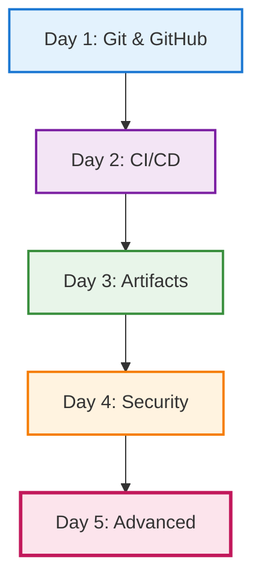

# Day 5 — Advanced GitHub usage

## Objectives

- Go beyond basics with GitHub Actions
- Explore advanced triggers and workflows
- Leverage GitHub for project management

---

# Day 5 — Building on the Week

**Day 1**: Git & GitHub basics → branches, PRs

**Day 2**: CI/CD basics → first workflows

**Day 3**: Artifacts → dependency management

**Day 4**: Security → SonarQube, Xray

**Today**: Advanced Actions & project management

---

# Week's Journey



---

# GitHub Actions — advanced triggers

**Recall from Day 2**: We created workflows with `on: push`

**Today**: We expand to sophisticated triggers

- on: schedule (cron)
- on: issue_comment, issues, pull_request_review
- on: workflow_run (chained workflows)
- Path filters and conditional jobs

```yaml
on:
  push:
    branches: [ main ]
    paths: [ 'src/**', '!docs/**' ]
  schedule:
    - cron: '0 7 * * 1-5' # weekdays 7am UTC
```

---

# Reusable and composite workflows

- Reusable workflows with workflow_call
- Composite actions to share steps

```yaml
# .github/workflows/reuse.yml
on: workflow_call
jobs:
  build:
    runs-on: ubuntu-latest
    steps:
      - uses: actions/checkout@v4
      - run: make ci
```

---

# Environments and approvals

- Protected environments (dev, staging, prod)
- Required reviewers and wait timers
- Environment secrets and variables

---

# Caching and artifacts

**Building on Day 3**: We learned about artifact management with Artifactory

**Today**: GitHub's built-in artifact and caching features

- actions/cache for dependencies
- upload/download-artifact for build outputs
- Retention and size limits

---

# GitHub-native security

**Building on Day 4**: We learned SonarQube and Xray

**Today**: GitHub's integrated security features

- CodeQL for code scanning
- Dependabot for dependency updates
- Secret scanning
- Security advisories

---

# Complete workflow example

Bringing together all 5 days:

```yaml
# .github/workflows/complete-pipeline.yml
name: Complete CI/CD Pipeline
on:
  push:
    branches: [ main ]          # Day 1: Git workflows
  pull_request:
    branches: [ main ]
  schedule:
    - cron: '0 2 * * 1'         # Day 5: Advanced triggers

jobs:
  build-and-test:
    runs-on: ubuntu-latest
    steps:
      - uses: actions/checkout@v4
      
      # Day 2: CI/CD automation
      - name: Setup Node.js
        uses: actions/setup-node@v4
        with:
          node-version: '20'
          
      # Day 3: Artifact caching
      - name: Cache dependencies
        uses: actions/cache@v4
        with:
          path: ~/.npm
          key: ${{ runner.os }}-node-${{ hashFiles('**/package-lock.json') }}
          
      - name: Install dependencies
        run: npm ci
        
      - name: Build project
        run: npm run build
        
      - name: Run tests
        run: npm test
        
      # Day 4: Security scanning
      - name: SonarQube Scan
        run: sonar-scanner
        env:
          SONAR_TOKEN: ${{ secrets.SONAR_TOKEN }}
          
      # Day 5: Advanced features
      - name: Upload test results
        uses: actions/upload-artifact@v4
        with:
          name: test-results
          path: coverage/
          
  security:
    runs-on: ubuntu-latest
    steps:
      - uses: actions/checkout@v4
      
      # Day 4 & 5: GitHub-native security
      - name: Initialize CodeQL
        uses: github/codeql-action/init@v3
        with:
          languages: javascript
          
      - name: Setup Node.js
        uses: actions/setup-node@v4
        with:
          node-version: '20'
          
      - name: Install and build
        run: |
          npm ci
          npm run build
          
      - name: Perform CodeQL Analysis
        uses: github/codeql-action/analyze@v3
```

---

# Project management with GitHub

- Issues, labels, milestones
- Projects (tables/boards), workflows automation
- Discussions and Wikis
- Code Owners and branch protection rules

---
layout: section
---

# Practical Exercises

## Hands-on practice for Day 5

Apply advanced GitHub Actions features through 10 detailed exercises with step-by-step guidance.

---

# Exercise setup

Before starting the exercises:

1. **Use your existing repository**
   - Continue with the repository from Day 2-4
   - Ensure you have push access

2. **Requirements**
   - GitHub account with Actions enabled
   - Understanding of basic workflows (Day 2)
   - Node.js project with tests

3. **Reference documentation**
   - [GitHub Actions docs](https://docs.github.com/en/actions)
   - [Workflow syntax](https://docs.github.com/en/actions/writing-workflows/workflow-syntax-for-github-actions)

---
layout: two-cols-header
---

# Exercise 1: Matrix Build Workflow

::left::

## Objective (20-30 min)

Create a workflow that tests code across multiple Node.js versions and operating systems.

## Instructions

1. Create `.github/workflows/matrix-test.yml`
2. Configure matrix strategy:
   - `node-version: [16, 18, 20]`
   - `os: [ubuntu-latest, windows-latest]`
3. Add steps: checkout, setup Node, install, test
4. Add `include` entry for Node 20 on Ubuntu to also run linting
5. Push and observe parallel job execution

::right::

## Workflow configuration

```yaml
name: Matrix Testing

on:
  push:
    branches: [ main, develop ]

jobs:
  test:
    runs-on: ${{ matrix.os }}
    strategy:
      matrix:
        node-version: [16, 18, 20]
        os: [ubuntu-latest, windows-latest]
      include:
        - node-version: 20
          os: ubuntu-latest
          run-lint: true
    steps:
      - uses: actions/checkout@v4
      - uses: actions/setup-node@v4
        with:
          node-version: ${{ matrix.node-version }}
      - run: npm ci
      - run: npm test
      - if: matrix.run-lint
        run: npm run lint
```

---

# Exercise 1: Observations

## Questions to explore

**How many jobs were created?**
- Count: 3 Node versions × 2 OS = 6 jobs total
- All run in parallel

**Which job runs linting?**
- Only Node 20 on ubuntu-latest
- Check the matrix include condition

**What happens if one job fails?**
- Other jobs continue by default
- Check the workflow summary

**Experiment: Add `fail-fast: false`**

```yaml
strategy:
  fail-fast: false
  matrix:
    # ... rest of matrix
```

What changes? All jobs complete even if one fails.

---
layout: two-cols-header
---

# Exercise 2: Concurrency Control

::left::

## Objective (15-20 min)

Prevent multiple workflow runs for the same branch from running simultaneously.

## Instructions

1. Create `.github/workflows/concurrency-demo.yml`
2. Add workflow that runs on push
3. Add long-running step: `sleep 60`
4. Add concurrency configuration:
   ```yaml
   concurrency:
     group: ${{ github.workflow }}-${{ github.ref }}
     cancel-in-progress: true
   ```
5. Push multiple commits rapidly to same branch
6. Observe cancellation in Actions tab

::right::

## Workflow example

```yaml
name: Concurrency Demo

on:
  push:
    branches: [ develop ]

concurrency:
  group: ${{ github.workflow }}-${{ github.ref }}
  cancel-in-progress: true

jobs:
  deploy:
    runs-on: ubuntu-latest
    steps:
      - uses: actions/checkout@v4
      
      - name: Long running task
        run: |
          echo "Starting deployment..."
          sleep 60
          echo "Deployment complete"
```

---

# Exercise 2: Observations

## What to notice

**Which runs were canceled?**
- Earlier runs are canceled when new push arrives
- Check for "Canceled" status with explanation

**Which run completed?**
- The most recent run completes
- Previous runs show cancellation reason

**What does the concurrency group name represent?**
- `github.workflow`: Workflow name
- `github.ref`: Branch reference
- Combined: unique per workflow + branch

**Try without `cancel-in-progress`**
- Remove or set to `false`
- Runs queue instead of canceling

---
layout: two-cols-header
---

# Exercise 3: Workflow Dispatch with Inputs

::left::

## Objective (20-25 min)

Create a manually triggered workflow with deployment options.

## Instructions

1. Create `.github/workflows/manual-deploy.yml`
2. Add `workflow_dispatch` trigger with inputs:
   - `environment`: choice (dev, staging, prod)
   - `version`: string
   - `dry-run`: boolean (default: true)
3. Use inputs in workflow steps
4. Trigger manually from GitHub Actions tab
5. Test with different input combinations

::right::

## Workflow with inputs

```yaml
name: Manual Deploy

on:
  workflow_dispatch:
    inputs:
      environment:
        description: 'Target environment'
        required: true
        type: choice
        options:
          - dev
          - staging
          - prod
      version:
        description: 'Version to deploy'
        required: true
        type: string
      dry-run:
        description: 'Perform dry run'
        required: false
        type: boolean
        default: true

jobs:
  deploy:
    runs-on: ubuntu-latest
    steps:
      - uses: actions/checkout@v4
      - name: Deploy
        run: |
          echo "Deploying to: ${{ inputs.environment }}"
          echo "Version: ${{ inputs.version }}"
          echo "Dry run: ${{ inputs.dry-run }}"
```

---

# Exercise 3: Observations

## Exploring manual triggers

**How do you access the manual trigger UI?**
1. Go to Actions tab
2. Select "Manual Deploy" workflow
3. Click "Run workflow" button
4. Fill in the input form

**How are inputs displayed in the workflow run?**
- Shown in run summary
- Available in logs
- Accessible via `${{ inputs.* }}`

**What happens when you don't specify optional inputs?**
- Default values are used
- Boolean defaults to false if not set
- Optional strings can be empty

---
layout: two-cols-header
---

# Exercise 4: Reusable Workflow (Part 1)

::left::

## Objective (30-40 min)

Create and use a reusable workflow for building with inputs and outputs.

## Instructions - Reusable workflow

1. Create `.github/workflows/reusable-build.yml`
2. Add `workflow_call` trigger
3. Define input: `node-version` (required, string)
4. Define output: `build-time`
5. Add build steps
6. Output timestamp using `$GITHUB_OUTPUT`

::right::

## Reusable workflow file

```yaml
name: Reusable Build

on:
  workflow_call:
    inputs:
      node-version:
        required: true
        type: string
    outputs:
      build-time:
        description: "Build completion time"
        value: ${{ jobs.build.outputs.timestamp }}

jobs:
  build:
    runs-on: ubuntu-latest
    outputs:
      timestamp: ${{ steps.build.outputs.time }}
    steps:
      - uses: actions/checkout@v4
      - uses: actions/setup-node@v4
        with:
          node-version: ${{ inputs.node-version }}
      - run: npm ci
      - run: npm run build
      - id: build
        run: echo "time=$(date -u +%Y-%m-%dT%H:%M:%SZ)" >> $GITHUB_OUTPUT
```

---

# Exercise 4: Reusable Workflow (Part 2)

## Instructions - Caller workflow

Create `.github/workflows/use-reusable.yml`:

```yaml
name: Use Reusable Build

on:
  push:
    branches: [ main ]

jobs:
  build-node-18:
    uses: ./.github/workflows/reusable-build.yml
    with:
      node-version: '18'
  
  build-node-20:
    uses: ./.github/workflows/reusable-build.yml
    with:
      node-version: '20'
  
  report:
    needs: [build-node-18, build-node-20]
    runs-on: ubuntu-latest
    steps:
      - name: Show build times
        run: |
          echo "Node 18 built at: ${{ needs.build-node-18.outputs.build-time }}"
          echo "Node 20 built at: ${{ needs.build-node-20.outputs.build-time }}"
```

---

# Exercise 4: Observations

## Understanding reusable workflows

**How is the reusable workflow displayed in Actions tab?**
- Shows as nested job
- Click to see detailed steps
- Called workflow name appears under caller

**Can you see the output value being passed?**
- Check "Report" job logs
- Outputs shown in job summary
- Available to dependent jobs via `needs.<job-id>.outputs.*`

**Try calling with different node-version values**
- Test with Node 14, 16, 18, 20
- Each creates separate job
- Reuse same workflow logic

**Benefits of reusable workflows**
- DRY principle (Don't Repeat Yourself)
- Centralized maintenance
- Consistent behavior across repos

---
layout: two-cols-header
---

# Exercise 5: Environment Protection

::left::

## Objective (20-30 min)

Set up staging and production environments with deployment protection rules.

## Instructions

1. Go to Settings → Environments
2. Create "staging" environment:
   - No protection rules
   - Add variable: `API_URL=https://staging.example.com`
3. Create "production" environment:
   - Add required reviewer (yourself)
   - Set wait timer: 5 minutes
   - Add variable: `API_URL=https://prod.example.com`
4. Create deployment workflow using both
5. Push and observe approval process

::right::

## Deployment workflow

```yaml
name: Deploy to Environments

on:
  push:
    branches: [ main ]

jobs:
  deploy-staging:
    runs-on: ubuntu-latest
    environment: staging
    steps:
      - uses: actions/checkout@v4
      - name: Deploy to staging
        run: |
          echo "Deploying to ${{ vars.API_URL }}"
          echo "No approval needed"
  
  deploy-production:
    needs: deploy-staging
    runs-on: ubuntu-latest
    environment: production
    steps:
      - uses: actions/checkout@v4
      - name: Deploy to production
        run: |
          echo "Deploying to ${{ vars.API_URL }}"
          echo "Approval was required"
```

---

# Exercise 5: Observations

## Environment protection in action

**Does staging deploy automatically?**
- Yes, no protection rules configured
- Deploys immediately after workflow starts

**What UI appears for production approval?**
- Yellow "Waiting" badge on workflow
- Review request notification
- Approve/Reject buttons in Actions tab

**What happens if you reject deployment?**
- Workflow run fails
- Production deployment doesn't execute
- Can view rejection reason in logs

**How long does wait timer delay deployment?**
- Minimum 5 minutes after workflow start
- Cannot approve before timer expires
- Useful for change freeze windows

---
layout: two-cols-header
---

# Exercise 6: Caching for Performance

::left::

## Objective (20-30 min)

Speed up workflow execution using dependency caching.

## Instructions

1. Create workflow **without** caching
2. Record the run time
3. Add caching with `actions/cache@v4`
4. Run again and compare times
5. Verify cache hit/miss in logs
6. Check cache entries in Settings → Actions → Caches

::right::

## Workflow with caching

```yaml
name: Build with Cache

on:
  push:
    branches: [ main ]

jobs:
  build:
    runs-on: ubuntu-latest
    steps:
      - uses: actions/checkout@v4
      
      - name: Setup Node.js
        uses: actions/setup-node@v4
        with:
          node-version: '20'
      
      - name: Cache dependencies
        uses: actions/cache@v4
        with:
          path: ~/.npm
          key: ${{ runner.os }}-node-${{ hashFiles('**/package-lock.json') }}
          restore-keys: |
            ${{ runner.os }}-node-
      
      - run: npm ci
      - run: npm run build
      - run: npm test
```

---

# Exercise 6: Observations

## Measuring cache impact

**What was the time difference?**
- First run: cache miss, downloads all deps
- Second run: cache hit, much faster
- Compare `npm ci` step duration

**Check cache hit/miss in logs**
- Look for "Cache restored" or "Cache not found"
- Shows cache key used
- Indicates size of cache

**What happens if you change package-lock.json?**
- Cache key changes (uses file hash)
- New cache created
- Old cache kept for restore-keys fallback

**Cache management**
- Max 10GB per repository
- Evicts old caches after 7 days
- Can manually delete in Settings

---
layout: two-cols-header
---

# Exercise 7: GitHub Project with Automation

::left::

## Objective (30-40 min)

Create a project board that automatically organizes issues and pull requests.

## Instructions

1. Go to Projects → New project
2. Select "Table" view
3. Add custom fields:
   - Status: Todo, In Progress, Done
   - Priority: Low, Medium, High, Critical
   - Estimate: Number
4. Create automation workflows:
   - Auto-add items when created
   - Auto-set status when closed
5. Create 3-5 test issues
6. Close an issue, observe auto-update
7. Switch to Board view

::right::

## Project setup steps

**Create custom fields:**
1. Click + next to field headers
2. Select field type
3. Define options for select fields
4. Set default values

**Configure automation:**
1. Click ⚙️ (Settings) in project
2. Go to "Workflows"
3. Enable "Auto-add to project"
4. Enable "Auto-archive items"
5. Create custom workflows:
   - When issue closed → Status: Done
   - When PR merged → Status: Done

**Link to repository:**
- Settings → Linked repositories
- Add your repository
- Issues auto-appear in project

---

# Exercise 7: Observations

## Project automation in practice

**How quickly do items appear in project?**
- Nearly instant (few seconds)
- Check automation logs in project settings
- Items appear with default field values

**What other automation options are available?**
- Set status based on PR state
- Auto-assign based on labels
- Set priority from issue labels
- Close items when PR merged

**Can you link pull requests to project items?**
- Yes, manually via sidebar
- Or auto-link using keywords in PR description
- "Closes #123" links and auto-closes

**Board view benefits:**
- Drag-and-drop to change status
- Visual workflow representation
- Filter by assignee, label, milestone

---
layout: two-cols-header
---

# Exercise 8: Branch Protection & Code Owners

::left::

## Objective (20-30 min)

Configure branch protection requiring code owner approval.

## Instructions

1. Create `CODEOWNERS` file in repository root:
   ```
   *                    @yourusername
   /.github/**          @yourusername
   /docs/**             @yourusername
   ```

2. Settings → Branches → Add rule for `main`:
   - Require pull request before merging
   - Require 1 approval
   - Require review from code owners
   - Require status checks to pass

3. Create feature branch, modify `.github/workflows/`
4. Create pull request
5. Observe required reviews

::right::

## CODEOWNERS format

```
# Default owner for everything
*                       @yourusername

# GitHub workflows - DevOps team
/.github/workflows/**   @devops-team

# Documentation - Tech writers
/docs/**                @tech-writers
*.md                    @tech-writers

# Frontend code
/src/frontend/**        @frontend-team

# Backend code  
/src/backend/**         @backend-team

# Database migrations - Require DBA
/migrations/**          @dba-team

# Multiple owners (all must approve)
/security/**            @security-team @lead-developer
```

---

# Exercise 8: Observations

## Code ownership in practice

**Who is automatically requested for review?**
- Code owners for changed files
- Check "Reviewers" section in PR
- Automatic based on CODEOWNERS patterns

**Can you merge without approval?**
- No, if branch protection requires it
- "Merge" button is disabled
- Shows reason: "Review required from code owner"

**What happens if CI fails?**
- Cannot merge if status checks required
- Must fix issues and re-run CI
- Green checkmark needed for merge

**Advanced patterns:**
- Use teams instead of individuals
- Require multiple approvals per section
- Different owners for different file types
- Path-based ownership rules

---
layout: two-cols-header
---

# Exercise 9: CodeQL Security Scanning

::left::

## Objective (30-40 min)

Set up automated security scanning using GitHub's CodeQL analysis.

## Instructions

1. Go to Security tab → Code scanning
2. Click "Set up CodeQL analysis"
3. GitHub creates `.github/workflows/codeql.yml`
4. Review generated workflow
5. Commit the workflow file
6. Add intentionally vulnerable code:
   ```js
   // Dangerous: eval of user input
   const userInput = req.query.code;
   eval(userInput);
   ```
7. Push and wait for scan
8. Review alerts in Security → Code scanning

::right::

## CodeQL workflow (generated)

```yaml
name: "CodeQL"

on:
  push:
    branches: [ main ]
  pull_request:
    branches: [ main ]
  schedule:
    - cron: '30 1 * * 0'

jobs:
  analyze:
    runs-on: ubuntu-latest
    permissions:
      security-events: write
      contents: read
    steps:
      - uses: actions/checkout@v4
      
      - name: Initialize CodeQL
        uses: github/codeql-action/init@v3
        with:
          languages: javascript
      
      - name: Autobuild
        uses: github/codeql-action/autobuild@v3
      
      - name: Perform CodeQL Analysis
        uses: github/codeql-action/analyze@v3
```

---

# Exercise 9: Observations

## Understanding security scanning

**What languages were detected?**
- Auto-detected from repository
- Check workflow for `languages:` field
- Supports: JS, Python, Java, C/C++, C#, Go, Ruby

**How long did the scan take?**
- Typically 2-10 minutes
- Depends on codebase size
- Builds code before analyzing

**What severity levels are shown?**
- Critical, High, Medium, Low
- Each alert has:
  - Description of vulnerability
  - Affected code location
  - Recommendation to fix

**How do you dismiss a false positive?**
1. Click on alert
2. Click "Dismiss alert"
3. Select reason
4. Add comment explaining why

---

# Exercise 9: Security best practices

## Working with CodeQL alerts

**Reviewing alerts:**
- Click alert to see code flow
- Shows data flow from source to sink
- Explains why it's vulnerable

**Fixing vulnerabilities:**
- Follow recommendation
- Fix and push commit
- Alert auto-closes when fixed

**Example fixes:**

```js
// ❌ Vulnerable to code injection
eval(userInput);

// ✅ Fixed: use safe alternative
const allowed = ['option1', 'option2'];
if (allowed.includes(userInput)) {
  // Safe to use
}
```

**Scheduled scans:**
- Weekly scans even without code changes
- Catches new vulnerability patterns
- Updated rules from GitHub Security Lab

---
layout: two-cols-header
---

# Exercise 10: Debug a Failing Workflow

::left::

## Objective (20-30 min)

Learn workflow debugging techniques and troubleshooting.

## Instructions

1. Create workflow with intentional issues
2. Enable debug logging:
   - Settings → Secrets and variables → Actions
   - Add secret: `ACTIONS_STEP_DEBUG = true`
3. Run workflow
4. Review detailed logs
5. Fix issues one by one
6. Document what you learned

::right::

## Intentionally broken workflow

```yaml
name: Debug Practice

on: push

jobs:
  debug-test:
    runs-on: ubuntu-latest
    steps:
      # Issue 1: Missing checkout!
      - name: Run tests
        run: npm test
      
      # Issue 2: Missing secret
      - name: Use secret
        run: echo "${{ secrets.MISSING_SECRET }}"
      
      # Issue 3: Wrong file path
      - name: Run script
        run: node nonexistent.js
      
      # Issue 4: Wrong command
      - name: Build
        run: npm run buildd  # Typo
```

---

# Exercise 10: Debugging techniques

## Identifying and fixing issues

**Issue 1: Missing checkout**

```
Error: npm: command not found
```

**Fix:** Add checkout step first

```yaml
- uses: actions/checkout@v4
- name: Run tests
  run: npm test
```

**Issue 2: Missing secret**

```
Warning: Secret is empty
```

**Fix:** Add the secret in repository settings, or remove the step if not needed

**Issue 3: Nonexistent file**

```
Error: Cannot find module 'nonexistent.js'
```

**Fix:** Correct the file path or remove the step

**Issue 4: Wrong command**

```
npm error Missing script: "buildd"
```

**Fix:** Correct the typo to `npm run build`

---

# Exercise 10: Advanced debugging

## Debug logging observations

**What additional info appears with debug logging?**
- Environment variables
- Runner details
- Action versions
- Internal timing

**How do you identify which step failed?**
- Red X icon on failed step
- Expand step to see error output
- Check exit code in summary

**What error messages are most helpful?**
- "command not found" → missing tool/dependency
- "permission denied" → token/permissions issue
- "No such file" → wrong path or missing checkout
- "exit code 1" → command failed, check output

**Debugging workflow:**

1. Read error message carefully
2. Check previous steps for dependencies
3. Verify environment setup
4. Look for typos in commands
5. Check file paths and references
6. Validate secrets and variables exist

---

# Summary and next steps

## What you practiced

✅ **Matrix builds** - Test across multiple environments  
✅ **Concurrency control** - Manage parallel workflow runs  
✅ **Manual workflows** - Workflow dispatch with inputs  
✅ **Reusable workflows** - DRY principle for CI/CD  
✅ **Environment protection** - Approvals and gates  
✅ **Caching** - Speed up builds significantly  
✅ **GitHub Projects** - Automated project management  
✅ **Code owners** - Enforce review requirements  
✅ **CodeQL** - Automated security scanning  
✅ **Debugging** - Troubleshoot workflow failures  

## Best practices learned

- Use matrix builds for cross-platform testing
- Implement concurrency to save resources
- Protect production with approvals
- Cache dependencies for speed
- Automate security scanning
- Document code ownership
- Enable debug logging when needed

## Apply to your projects

Take these patterns back to your work:
- Implement reusable workflows for common tasks
- Set up environment protection for production
- Enable CodeQL scanning for security
- Create project boards for visibility
