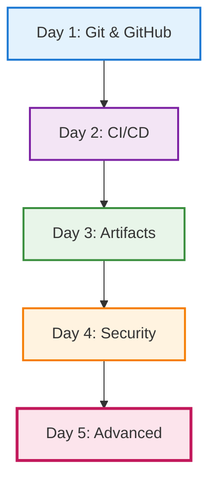

# Day 5 — Advanced GitHub usage

## Objectives

- Go beyond basics with GitHub Actions
- Explore advanced triggers and workflows
- Leverage GitHub for project management

---

# Day 5 — Building on the Week

**Day 1**: Git & GitHub basics → branches, PRs

**Day 2**: CI/CD basics → first workflows

**Day 3**: Artifacts → dependency management

**Day 4**: Security → SonarQube, Xray

**Today**: Advanced Actions & project management

---

# Week's Journey



---

# GitHub Actions — advanced triggers

**Recall from Day 2**: We created workflows with `on: push`

**Today**: We expand to sophisticated triggers

- on: schedule (cron)
- on: issue_comment, issues, pull_request_review
- on: workflow_run (chained workflows)
- Path filters and conditional jobs

```yaml
on:
  push:
    branches: [ main ]
    paths: [ 'src/**', '!docs/**' ]
  schedule:
    - cron: '0 7 * * 1-5' # weekdays 7am UTC
```

---

# Reusable and composite workflows

- Reusable workflows with workflow_call
- Composite actions to share steps

```yaml
# .github/workflows/reuse.yml
on: workflow_call
jobs:
  build:
    runs-on: ubuntu-latest
    steps:
      - uses: actions/checkout@v4
      - run: make ci
```

---

# Environments and approvals

- Protected environments (dev, staging, prod)
- Required reviewers and wait timers
- Environment secrets and variables

---

# Caching and artifacts

**Building on Day 3**: We learned about artifact management with Artifactory

**Today**: GitHub's built-in artifact and caching features

- actions/cache for dependencies
- upload/download-artifact for build outputs
- Retention and size limits

---

# GitHub-native security

**Building on Day 4**: We learned SonarQube and Xray

**Today**: GitHub's integrated security features

- CodeQL for code scanning
- Dependabot for dependency updates
- Secret scanning
- Security advisories

---

# Complete workflow example

Bringing together all 5 days:

```yaml
# .github/workflows/complete-pipeline.yml
name: Complete CI/CD Pipeline
on:
  push:
    branches: [ main ]          # Day 1: Git workflows
  pull_request:
    branches: [ main ]
  schedule:
    - cron: '0 2 * * 1'         # Day 5: Advanced triggers

jobs:
  build-and-test:
    runs-on: ubuntu-latest
    steps:
      - uses: actions/checkout@v4
      
      # Day 2: CI/CD automation
      - name: Setup Node.js
        uses: actions/setup-node@v4
        with:
          node-version: '20'
          
      # Day 3: Artifact caching
      - name: Cache dependencies
        uses: actions/cache@v4
        with:
          path: ~/.npm
          key: ${{ runner.os }}-node-${{ hashFiles('**/package-lock.json') }}
          
      - name: Install dependencies
        run: npm ci
        
      - name: Build project
        run: npm run build
        
      - name: Run tests
        run: npm test
        
      # Day 4: Security scanning
      - name: SonarQube Scan
        run: sonar-scanner
        env:
          SONAR_TOKEN: ${{ secrets.SONAR_TOKEN }}
          
      # Day 5: Advanced features
      - name: Upload test results
        uses: actions/upload-artifact@v4
        with:
          name: test-results
          path: coverage/
          
  security:
    runs-on: ubuntu-latest
    steps:
      - uses: actions/checkout@v4
      
      # Day 4 & 5: GitHub-native security
      - name: Initialize CodeQL
        uses: github/codeql-action/init@v3
        with:
          languages: javascript
          
      - name: Setup Node.js
        uses: actions/setup-node@v4
        with:
          node-version: '20'
          
      - name: Install and build
        run: |
          npm ci
          npm run build
          
      - name: Perform CodeQL Analysis
        uses: github/codeql-action/analyze@v3
```

---

# Project management with GitHub

GitHub provides a comprehensive suite of project management tools:

- **GitHub Projects v2**: Modern project boards with automation
- **Issue management**: Templates, labels, milestones
- **Branch protection**: Code reviews and quality gates
- **Discussions & Wiki**: Team collaboration
- **Code Owners**: Automated review assignments

---

# GitHub Projects v2 — Introduction

**What is GitHub Projects v2?**

A flexible project management tool integrated with GitHub repositories

**Key differences from Projects (classic)**:
- Table, board, and roadmap views
- Custom fields (text, number, date, single select, iteration)
- Built-in automation workflows
- GraphQL API for advanced integrations

**Benefits**:
- Track issues and pull requests across multiple repositories
- Visualize work in progress
- Automate status updates

---

# GitHub Projects v2 — Configuration

**Creating and configuring a project**:

1. **Create project**: From repository or organization
2. **Add items**: Issues, PRs, or draft issues
3. **Custom fields**:
   - Text: Notes, descriptions
   - Number: Story points, priority scores
   - Date: Deadlines, release dates
   - Single select: Status (Todo, In Progress, Done)
   - Iteration: Sprint planning

4. **Views**:
   - **Table**: Spreadsheet-like view with filters
   - **Board**: Kanban-style cards
   - **Roadmap**: Timeline view for planning

5. **Filters and grouping**: Organize by status, assignee, labels, etc.

---

# GitHub Projects v2 — Automation

**Built-in automations**:
- Auto-add items when: Issue created, PR opened
- Auto-set status when: Issue closed, PR merged
- Auto-archive items after inactivity

**GraphQL API for advanced automation**:

```graphql
mutation {
  updateProjectV2ItemFieldValue(input: {
    projectId: "PROJECT_ID"
    itemId: "ITEM_ID"
    fieldId: "FIELD_ID"
    value: { singleSelectOptionId: "OPTION_ID" }
  }) {
    projectV2Item { id }
  }
}
```

---

# GitHub Projects v2 — Workflow Integration

**Integrate projects with GitHub Actions**:

```yaml
name: Update Project Status
on:
  issues:
    types: [opened, closed]

jobs:
  update-project:
    runs-on: ubuntu-latest
    steps:
      - uses: actions/add-to-project@v0.5.0
        with:
          project-url: https://github.com/users/USERNAME/projects/1
          github-token: ${{ secrets.GH_TOKEN }}
```

**Benefits**:
- Automatic project updates
- Consistent workflow enforcement
- Reduced manual tracking

---

# Issue Templates and Forms

**Structured issue creation with YAML forms**:

```yaml
# .github/ISSUE_TEMPLATE/bug_report.yml
name: Bug Report
description: File a bug report
labels: ["bug", "triage"]
body:
  - type: input
    id: version
    attributes:
      label: Version
      placeholder: v1.0.0
    validations:
      required: true
  - type: textarea
    id: description
    attributes:
      label: What happened?
    validations:
      required: true
  - type: dropdown
    id: severity
    attributes:
      label: Severity
      options: [Critical, High, Medium, Low]
```

---

# Labels and Milestones

**Organizing work with labels**:

**Priority labels**:
- `P0` - Critical (red)
- `P1` - High (orange)
- `P2` - Medium (yellow)
- `P3` - Low (green)

**Type labels**:
- `bug` - Something isn't working
- `feature` - New feature request
- `documentation` - Documentation improvements
- `enhancement` - Improvement to existing feature

**Status labels**:
- `needs-triage` - Requires review
- `in-progress` - Being worked on
- `blocked` - Blocked by dependencies

**Milestones**:
- Group issues by release version
- Track progress toward goals
- Set due dates for planning

---

# Issue Automation

**Automate issue management with GitHub Actions**:

```yaml
name: Auto-label issues
on:
  issues:
    types: [opened]

jobs:
  label:
    runs-on: ubuntu-latest
    steps:
      - uses: actions/github-script@v7
        with:
          script: |
            if (context.payload.issue.title.includes('[BUG]')) {
              await github.rest.issues.addLabels({
                owner: context.repo.owner,
                repo: context.repo.repo,
                issue_number: context.payload.issue.number,
                labels: ['bug', 'needs-triage']
              });
            }
```

**Other automation ideas**:
- Auto-assign based on labels
- Stale issue management
- Auto-close duplicate issues

---

# Branch Protection Rules

**Configure protection for main/production branches**:

✅ **Required checks**:
- Require pull request reviews (1-3 reviewers)
- Dismiss stale approvals on new commits
- Require review from code owners
- Require status checks to pass (CI, CodeQL, etc.)
- Require conversation resolution

✅ **Code quality**:
- Require signed commits
- Require linear history (no merge commits)

❌ **Restrictions**:
- Allow force pushes (usually disabled)
- Allow deletions (usually disabled)

**Benefits**: Enforce quality gates, prevent accidents, ensure review

---

# Code Owners

**CODEOWNERS file for automatic review assignments**:

```
# Global owners
*                           @org/team-leads

# Frontend
/src/frontend/**            @org/frontend-team
*.css                       @org/design-team

# Backend
/src/backend/**             @org/backend-team
/src/api/**                 @org/api-team

# Infrastructure
/.github/**                 @org/devops-team
/terraform/**               @org/devops-team
/Dockerfile                 @org/security-team

# Documentation
/docs/**                    @org/tech-writers
*.md                        @org/tech-writers
```

**Features**:
- Automatic review requests
- Enforce with branch protection
- Team-based ownership

---

# Discussions and Wiki

**GitHub Discussions**:

**Categories**:
- 📢 **Announcements**: Important updates
- ❓ **Q&A**: Questions and answers (accepts solutions)
- 💡 **Ideas**: Feature requests and suggestions
- 🎉 **Show and tell**: Share projects and achievements

**Features**:
- Polls for community decisions
- Convert discussions to issues
- Pin important discussions

**GitHub Wiki**:
- Documentation organization
- Sidebar navigation for easy browsing
- Collaborative editing
- Version control for all pages

**When to use Wiki vs docs/ folder**: Wiki for collaborative docs, docs/ for versioned content

---

# Additional Features

**Pull request templates**:
- `.github/pull_request_template.md`
- Standardize PR descriptions
- Checklists for reviewers

**Saved replies**:
- Common responses to issues/PRs
- Save time on repetitive answers

**Slash commands**:
- `/duplicate` - Mark as duplicate
- `/close` - Close issue/PR
- `/assign @user` - Assign to user

**Keyboard shortcuts**:
- `?` - Show keyboard shortcuts
- `t` - File finder
- `s` - Focus search

**Notification management**:
- Watch/unwatch repositories
- Custom notification routing
- Email vs web preferences

---

# Practical exercises

- Add scheduled maintenance workflow
- Create reusable workflow for testing
- Set up environment protections for staging/prod
- Create a Project board with automation
