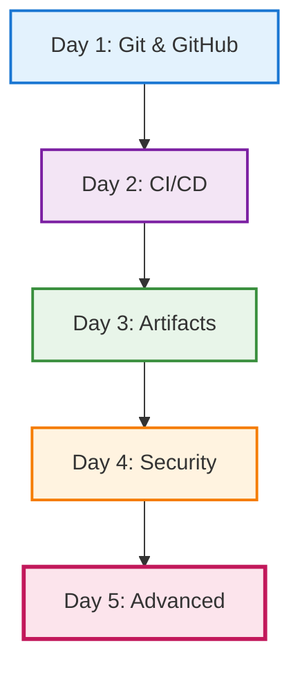
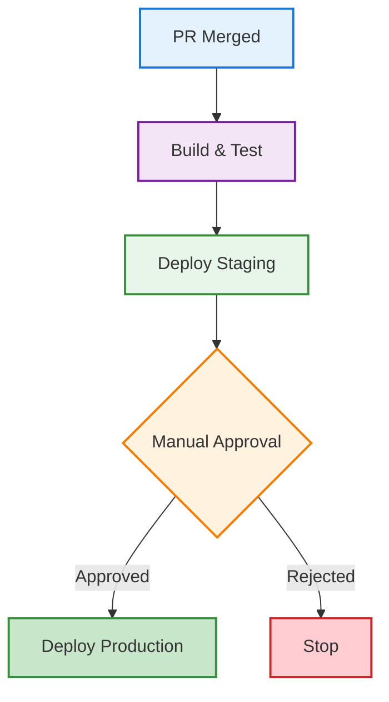

# Day 5 — Advanced GitHub usage

## Objectives

- Go beyond basics with GitHub Actions
- Explore advanced triggers and workflows
- Leverage GitHub for project management

---

# Day 5 — Building on the Week

**Day 1**: Git & GitHub basics → branches, PRs

**Day 2**: CI/CD basics → first workflows

**Day 3**: Artifacts → dependency management

**Day 4**: Security → SonarQube, Xray

**Today**: Advanced Actions & project management

---

# Week's Journey



---

# GitHub Actions — advanced triggers

**Recall from Day 2**: We created workflows with `on: push`

**Today**: We expand to sophisticated triggers

- on: schedule (cron)
- on: issue_comment, issues, pull_request_review
- on: workflow_run (chained workflows)
- Path filters and conditional jobs

```yaml
on:
  push:
    branches: [ main ]
    paths: [ 'src/**', '!docs/**' ]
  schedule:
    - cron: '0 7 * * 1-5' # weekdays 7am UTC
```

---

# Reusable and composite workflows

- Reusable workflows with workflow_call
- Composite actions to share steps

```yaml
# .github/workflows/reuse.yml
on: workflow_call
jobs:
  build:
    runs-on: ubuntu-latest
    steps:
      - uses: actions/checkout@v4
      - run: make ci
```

---

# Environment Protection

```yaml
jobs:
  deploy:
    runs-on: ubuntu-latest
    environment:
      name: production
      url: https://example.com
    steps:
      - uses: actions/checkout@v4
      - run: ./deploy.sh
```

**Configuration** (in repository settings):

- Required reviewers (individuals, teams)
- Wait timers (delays before deployment)
- Deployment branches (restrict to main, release/*)
- Environment secrets and variables

---

# Approval Workflow



---

# OIDC Authentication

**Traditional**: Long-lived credentials in secrets

**OIDC**: Short-lived tokens, no stored credentials

**Benefits**:

- Better security posture
- Automatic token rotation
- Comprehensive audit trail
- Eliminates credential management

**Supports**: AWS, Azure, GCP, HashiCorp Vault

---

# OIDC with AWS

```yaml
jobs:
  deploy-aws:
    runs-on: ubuntu-latest
    permissions:
      id-token: write
      contents: read
    steps:
      - uses: aws-actions/configure-aws-credentials@v4
        with:
          role-to-assume: arn:aws:iam::123456789:role/GitHubActions
          aws-region: us-east-1
      
      - run: aws s3 sync ./dist s3://my-bucket
```

**Setup**:

- Configure OIDC provider in AWS IAM
- Create IAM role with trust policy for GitHub
- Grant role permissions for required AWS services

---

# Secrets Management

**Best Practices**:

- ❌ Never hardcode secrets in code
- ✅ Use repository/environment/organization secrets
- ✅ Apply principle of least privilege
- ✅ Implement secret rotation policies
- ⚠️ Secrets disabled in PRs from forks (security feature)

**Secret Scopes**:

- **Repository**: Available to all workflows
- **Environment**: Only for specific environment
- **Organization**: Shared across repositories

**Access Control**: Secrets never appear in logs

---

# Dependabot Configuration

```yaml
# .github/dependabot.yml
version: 2
updates:
  - package-ecosystem: "npm"
    directory: "/"
    schedule:
      interval: "weekly"
    open-pull-requests-limit: 10
```

**Features**:

- Automated dependency updates
- Security vulnerability alerts
- Version compatibility checks
- Dependency review action for PRs

---

# CodeQL Security Scanning

```yaml
name: "CodeQL"
on:
  push:
    branches: [main]
  pull_request:
  schedule:
    - cron: '0 6 * * 1'

jobs:
  analyze:
    runs-on: ubuntu-latest
    permissions:
      security-events: write
    steps:
      - uses: actions/checkout@v4
      - uses: github/codeql-action/init@v3
        with:
          languages: javascript
      - uses: github/codeql-action/analyze@v3
```

**Supported Languages**: JavaScript, TypeScript, Python, Java, C/C++, C#, Go, Ruby

---

# Workflow Security

**Limit Permissions**:

```yaml
permissions:
  contents: read      # Minimal by default
  pull-requests: write  # Only what's needed
```

**Prevent Injection Attacks**:

- ❌ Avoid `${{ github.event.pull_request.title }}` in commands
- ✅ Use environment variables: `env: TITLE: ${{ ... }}`

**Safe PR Handling**:

- Use `pull_request_target` carefully
- Validate inputs from untrusted sources
- Review third-party actions before use

---

# Caching and artifacts

**Building on Day 3**: We learned about artifact management with Artifactory

**Today**: GitHub's built-in artifact and caching features

- actions/cache for dependencies
- upload/download-artifact for build outputs
- Retention and size limits

---

# GitHub-native security

**Building on Day 4**: We learned SonarQube and Xray

**Today**: GitHub's integrated security features

- CodeQL for code scanning
- Dependabot for dependency updates
- Secret scanning
- Security advisories

---

# Complete workflow example

Bringing together all 5 days:

```yaml
# .github/workflows/complete-pipeline.yml
name: Complete CI/CD Pipeline
on:
  push:
    branches: [ main ]          # Day 1: Git workflows
  pull_request:
    branches: [ main ]
  schedule:
    - cron: '0 2 * * 1'         # Day 5: Advanced triggers

jobs:
  build-and-test:
    runs-on: ubuntu-latest
    steps:
      - uses: actions/checkout@v4
      
      # Day 2: CI/CD automation
      - name: Setup Node.js
        uses: actions/setup-node@v4
        with:
          node-version: '20'
          
      # Day 3: Artifact caching
      - name: Cache dependencies
        uses: actions/cache@v4
        with:
          path: ~/.npm
          key: ${{ runner.os }}-node-${{ hashFiles('**/package-lock.json') }}
          
      - name: Install dependencies
        run: npm ci
        
      - name: Build project
        run: npm run build
        
      - name: Run tests
        run: npm test
        
      # Day 4: Security scanning
      - name: SonarQube Scan
        run: sonar-scanner
        env:
          SONAR_TOKEN: ${{ secrets.SONAR_TOKEN }}
          
      # Day 5: Advanced features
      - name: Upload test results
        uses: actions/upload-artifact@v4
        with:
          name: test-results
          path: coverage/
          
  security:
    runs-on: ubuntu-latest
    steps:
      - uses: actions/checkout@v4
      
      # Day 4 & 5: GitHub-native security
      - name: Initialize CodeQL
        uses: github/codeql-action/init@v3
        with:
          languages: javascript
          
      - name: Setup Node.js
        uses: actions/setup-node@v4
        with:
          node-version: '20'
          
      - name: Install and build
        run: |
          npm ci
          npm run build
          
      - name: Perform CodeQL Analysis
        uses: github/codeql-action/analyze@v3
```

---

# Project management with GitHub

- Issues, labels, milestones
- Projects (tables/boards), workflows automation
- Discussions and Wikis
- Code Owners and branch protection rules

---

# Practical exercises

- Add scheduled maintenance workflow
- Create reusable workflow for testing
- Set up environment protections for staging/prod
- Create a Project board with automation
