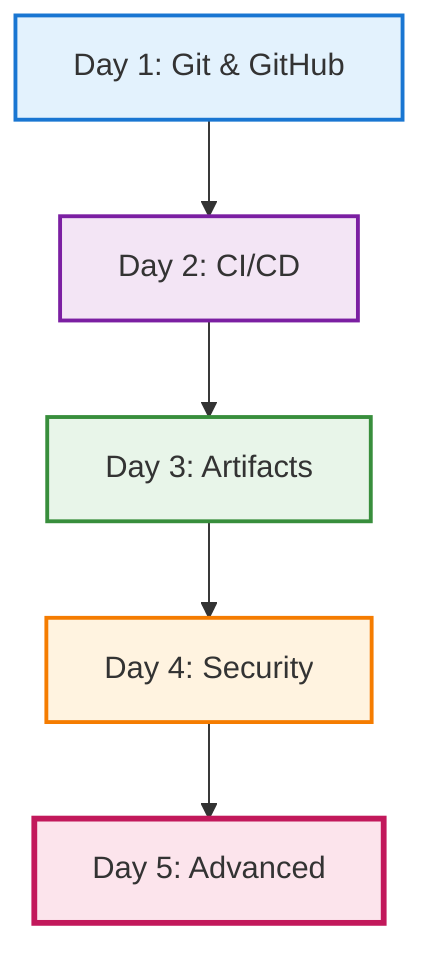

# Day 5 — Advanced GitHub usage

## Objectives

- Go beyond basics with GitHub Actions
- Explore advanced triggers and workflows
- Leverage GitHub for project management

---

# Day 5 — Building on the Week

**Day 1**: Git & GitHub basics → branches, PRs

**Day 2**: CI/CD basics → first workflows

**Day 3**: Artifacts → dependency management

**Day 4**: Security → SonarQube, Xray

**Today**: Advanced Actions & project management

---

# Week's Journey



---

# GitHub Actions — advanced triggers

**Recall from Day 2**: We created workflows with `on: push`

**Today**: We expand to sophisticated triggers

- on: schedule (cron)
- on: issue_comment, issues, pull_request_review
- on: workflow_run (chained workflows)
- Path filters and conditional jobs

```yaml
on:
  push:
    branches: [ main ]
    paths: [ 'src/**', '!docs/**' ]
  schedule:
    - cron: '0 7 * * 1-5' # weekdays 7am UTC
```

---

# Matrix Builds

Test across multiple configurations in parallel:

```yaml
strategy:
  matrix:
    os: [ubuntu-latest, windows-latest, macos-latest]
    node-version: [16, 18, 20]
```

**Benefits**:

- Run tests on multiple OS/versions simultaneously
- Catch platform-specific bugs early
- Reduce total CI time with parallelization

---

# Matrix Builds — Advanced

Control matrix execution with include/exclude:

```yaml
strategy:
  matrix:
    os: [ubuntu-latest, windows-latest, macos-latest]
    node-version: [16, 18, 20]
    include:
      - os: ubuntu-latest
        node-version: 20
        extra: "lint"
    exclude:
      - os: windows-latest
        node-version: 16
  fail-fast: false  # Continue other jobs if one fails
```

**Use cases**: Cross-platform libraries, multiple runtime versions

---

# Concurrency Control

Prevent overlapping workflow runs:

```yaml
concurrency:
  group: ${{ github.workflow }}-${{ github.ref }}
  cancel-in-progress: true
```

**Use cases**:

- Save CI minutes by canceling outdated runs
- Prevent deployment conflicts
- Control resource usage

**Example**: Cancel old builds when new commits are pushed

---

# Manual Workflow Triggers

Trigger workflows manually with custom inputs:

```yaml
on:
  workflow_dispatch:
    inputs:
      environment:
        type: choice
        options: [dev, staging, prod]
        required: true
      debug:
        type: boolean
        default: false
      version:
        type: string
        description: 'Version to deploy'
```

**Access inputs**: `${{ inputs.environment }}`

---

# Contexts Deep Dive — GitHub Context

The `${{ github }}` context provides workflow metadata:

```yaml
steps:
  - name: Print context
    run: |
      echo "Ref: ${{ github.ref }}"
      echo "SHA: ${{ github.sha }}"
      echo "Actor: ${{ github.actor }}"
      echo "Event: ${{ github.event_name }}"
      echo "Repository: ${{ github.repository }}"
```

**Common uses**: Conditional logic, tagging, notifications

---

# Contexts Deep Dive — Secrets and Variables

**Secrets** (`${{ secrets }}`): Sensitive data (API keys, tokens)

```yaml
env:
  API_KEY: ${{ secrets.API_KEY }}
```

**Variables** (`${{ vars }}`): Non-sensitive configuration

```yaml
env:
  DEPLOYMENT_URL: ${{ vars.STAGING_URL }}
```

**Environment variables** (`${{ env }}`): Job-level variables

```yaml
env:
  BUILD_VERSION: 1.0.0
steps:
  - run: echo ${{ env.BUILD_VERSION }}
```

---

# Contexts Deep Dive — Steps and Needs

**Steps context** (`${{ steps }}`): Access outputs from previous steps

```yaml
- name: Build
  id: build
  run: echo "version=1.2.3" >> $GITHUB_OUTPUT
- run: echo "Built version ${{ steps.build.outputs.version }}"
```

**Needs context** (`${{ needs }}`): Access outputs from previous jobs

```yaml
jobs:
  build:
    outputs:
      version: ${{ steps.build.outputs.version }}
  deploy:
    needs: build
    steps:
      - run: echo "Deploy ${{ needs.build.outputs.version }}"
```

---

# Contexts Deep Dive — Runner Context

The `${{ runner }}` context provides information about the runner:

```yaml
steps:
  - name: Runner info
    run: |
      echo "OS: ${{ runner.os }}"
      echo "Arch: ${{ runner.arch }}"
      echo "Temp: ${{ runner.temp }}"
      echo "Tool cache: ${{ runner.tool_cache }}"
```

**Use cases**: Platform-specific commands, caching paths

---

# Debugging Workflows

**Enable debug logging** with repository secrets:

```yaml
# Set these secrets in repository settings:
# ACTIONS_STEP_DEBUG = true
# ACTIONS_RUNNER_DEBUG = true
```

**Debugging techniques**:

- Read workflow logs effectively
- Print context: `echo '${{ toJSON(github) }}'`
- Use tmate action for SSH debugging
- Check runner environment: `env | sort`

**Common errors**: Missing secrets, wrong paths, syntax errors

---

# Performance Optimization

**Best practices**:

- Minimize job dependencies (run in parallel when possible)
- Use appropriate runners (ubuntu is fastest/cheapest)
- Cache dependencies aggressively
- Optimize Docker layer caching
- Use `if` conditions to skip unnecessary steps

```yaml
steps:
  - name: Build
    if: github.event_name == 'push'
    run: npm run build
```

**Result**: Faster feedback, lower costs

---

# Reusable and composite workflows

- Reusable workflows with workflow_call
- Composite actions to share steps

```yaml
# .github/workflows/reuse.yml
on: workflow_call
jobs:
  build:
    runs-on: ubuntu-latest
    steps:
      - uses: actions/checkout@v4
      - run: make ci
```

---

# Environments and approvals

- Protected environments (dev, staging, prod)
- Required reviewers and wait timers
- Environment secrets and variables

---

# Caching and artifacts

**Building on Day 3**: We learned about artifact management with Artifactory

**Today**: GitHub's built-in artifact and caching features

- actions/cache for dependencies
- upload/download-artifact for build outputs
- Retention and size limits

---

# GitHub-native security

**Building on Day 4**: We learned SonarQube and Xray

**Today**: GitHub's integrated security features

- CodeQL for code scanning
- Dependabot for dependency updates
- Secret scanning
- Security advisories

---

# Complete workflow example

Bringing together all 5 days:

```yaml
# .github/workflows/complete-pipeline.yml
name: Complete CI/CD Pipeline
on:
  push:
    branches: [ main ]          # Day 1: Git workflows
  pull_request:
    branches: [ main ]
  schedule:
    - cron: '0 2 * * 1'         # Day 5: Advanced triggers

jobs:
  build-and-test:
    runs-on: ubuntu-latest
    steps:
      - uses: actions/checkout@v4
      
      # Day 2: CI/CD automation
      - name: Setup Node.js
        uses: actions/setup-node@v4
        with:
          node-version: '20'
          
      # Day 3: Artifact caching
      - name: Cache dependencies
        uses: actions/cache@v4
        with:
          path: ~/.npm
          key: ${{ runner.os }}-node-${{ hashFiles('**/package-lock.json') }}
          
      - name: Install dependencies
        run: npm ci
        
      - name: Build project
        run: npm run build
        
      - name: Run tests
        run: npm test
        
      # Day 4: Security scanning
      - name: SonarQube Scan
        run: sonar-scanner
        env:
          SONAR_TOKEN: ${{ secrets.SONAR_TOKEN }}
          
      # Day 5: Advanced features
      - name: Upload test results
        uses: actions/upload-artifact@v4
        with:
          name: test-results
          path: coverage/
          
  security:
    runs-on: ubuntu-latest
    steps:
      - uses: actions/checkout@v4
      
      # Day 4 & 5: GitHub-native security
      - name: Initialize CodeQL
        uses: github/codeql-action/init@v3
        with:
          languages: javascript
          
      - name: Setup Node.js
        uses: actions/setup-node@v4
        with:
          node-version: '20'
          
      - name: Install and build
        run: |
          npm ci
          npm run build
          
      - name: Perform CodeQL Analysis
        uses: github/codeql-action/analyze@v3
```

---

# Project management with GitHub

- Issues, labels, milestones
- Projects (tables/boards), workflows automation
- Discussions and Wikis
- Code Owners and branch protection rules

---

# Practical exercises

- Add scheduled maintenance workflow
- Create reusable workflow for testing
- Set up environment protections for staging/prod
- Create a Project board with automation
