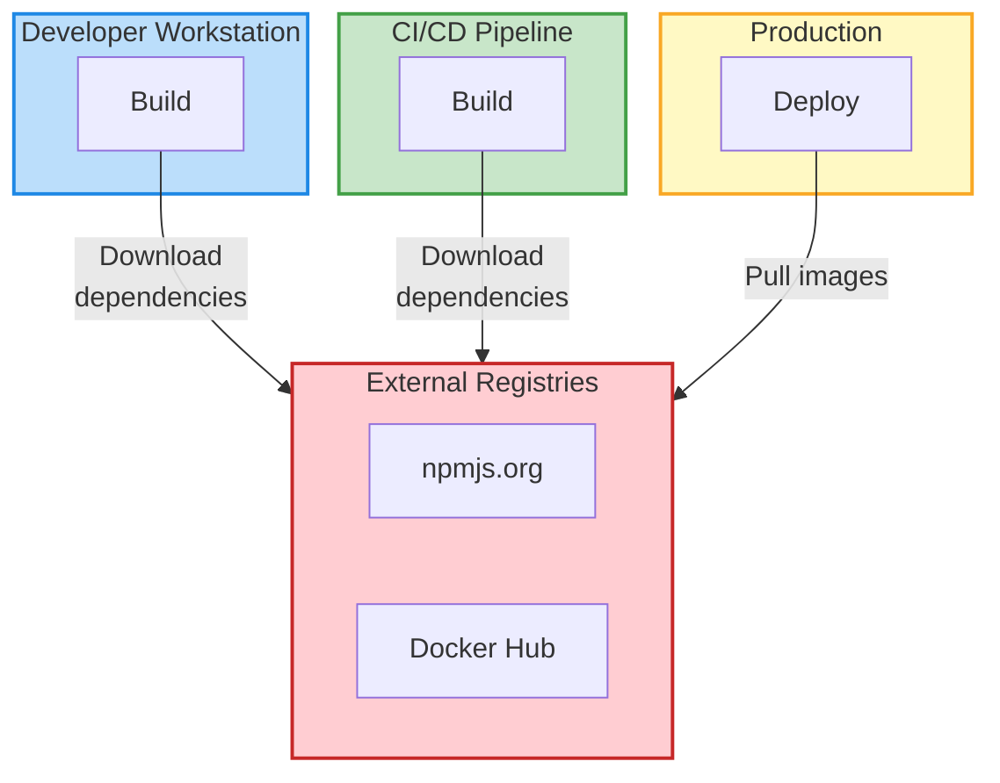
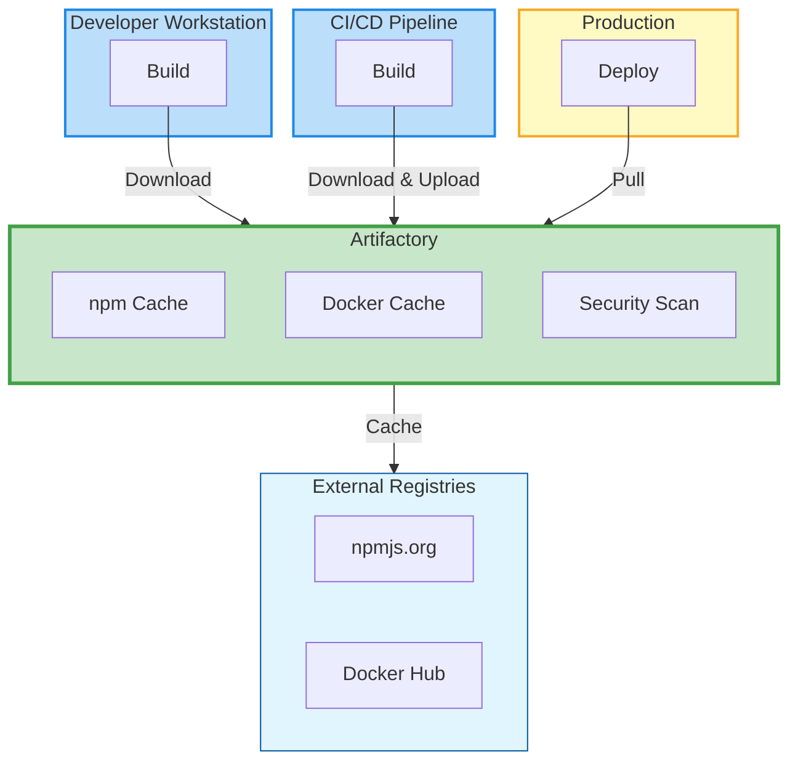
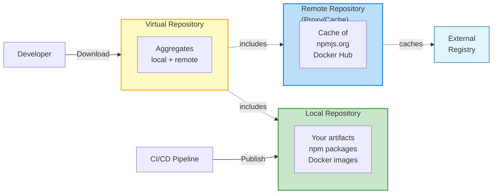
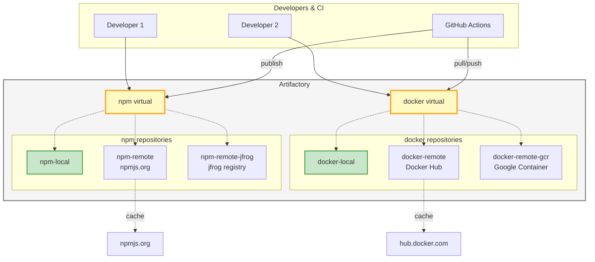

# Artifactory

---
layout: two-cols-header
---

# Introduction to Artifact Management

::left::

## What is an Artifact?

An **artifact** is any output produced during the software development lifecycle:

- **Binaries**: compiled executables, libraries
- **Packages**: npm, Maven, Python wheels
- **Container images**: Docker images
- **Documentation**: generated docs, PDFs
- **Build outputs**: compiled code, bundles

::right::

## Why Artifact Management Matters

**Problems it solves:**

- ✅ **Reproducibility**: Same build outputs every time
- ✅ **Traceability**: Track what went into production
- ✅ **Speed**: Cache dependencies, faster builds
- ✅ **Security**: Scan and control what's used
- ✅ **Governance**: Enforce policies and licenses
- ✅ **Reliability**: Don't depend on external services

---

## The Problem: Traditional Approach



**Issues:**
- Network failures block builds
- No control over dependency availability
- Security vulnerabilities undetected
- Bandwidth costs
- Different versions across environments

---

## The Solution: Centralized Artifact Management



**Benefits:**
- Single source of truth
- Works offline (cached dependencies)
- Centralized security scanning
- Bandwidth optimization
- Consistent across all environments

---
layout: section
---

# Installation and configuration

---

# Installation with Docker

## Quick Start (for development/testing)

JFrog Artifactory offers a free OSS version perfect for learning:

```bash
# Pull the Artifactory OSS image
docker pull releases-docker.jfrog.io/jfrog/artifactory-oss:latest

# Create a data volume for persistence
docker volume create artifactory-data

# Run Artifactory
docker run --name artifactory \
  -d \
  -p 8081:8081 \
  -p 8082:8082 \
  -v artifactory-data:/var/opt/jfrog/artifactory \
  releases-docker.jfrog.io/jfrog/artifactory-oss:latest
```

**Access**: After 1-2 minutes, open http://localhost:8081

---

# Installation with Docker Compose

## Production-ready Setup

```yaml
# docker-compose.yml
version: '3.8'

services:
  artifactory:
    image: releases-docker.jfrog.io/jfrog/artifactory-oss:latest
    container_name: artifactory
    restart: unless-stopped
    ports:
      - "8081:8081"  # Web UI
      - "8082:8082"  # Artifactory access
    volumes:
      - ./data:/var/opt/jfrog/artifactory
    environment:
      - JF_SHARED_DATABASE_TYPE=postgresql
      - JF_SHARED_DATABASE_USERNAME=artifactory
      - JF_SHARED_DATABASE_PASSWORD=password
    depends_on:
      - postgres
      
  postgres:
    image: postgres:15
    container_name: artifactory-postgres
    restart: unless-stopped
    environment:
      - POSTGRES_DB=artifactory
      - POSTGRES_USER=artifactory
      - POSTGRES_PASSWORD=password
    volumes:
      - ./postgres:/var/lib/postgresql/data
```

```bash
docker-compose up -d
```

---

# Initial Configuration

## First Login

**Default credentials:**
- Username: `admin`
- Password: `password`

**First-time setup wizard will guide you through:**

1. **Change admin password** (required for security)
2. **Configure base URL** (e.g., http://artifactory.mycompany.com:8081)
3. **Set proxy settings** (if behind corporate proxy)
4. **Configure default repositories** (quick-start templates)

**⚠️ Important:** Always change the default password immediately!

---

# Accessing the UI

## Web Interface Tour

**Main URL**: `http://localhost:8081` (or your configured domain)

**Key sections in the UI:**

- **📦 Artifacts**: Browse and search all artifacts
- **🔧 Administration**: Configure repositories, users, permissions
- **📊 Monitoring**: View storage, connections, logs
- **🔍 Search**: Find artifacts across all repositories
- **⚙️ User Profile**: API keys, settings, notifications

**Quick access:**
- **Application** → List all packages and artifacts
- **Artifacts** → Browse repository structure
- **Builds** → View CI/CD build information

---
layout: section
---

# User Interface

---
layout: two-cols-header
---

# Exploring the UI

::left::

## Main Navigation

**Left Sidebar:**
- **Home**: Dashboard and quick links
- **Artifacts**: Repository browser
- **Builds**: Build history and info
- **Pipelines**: CI/CD pipeline integration
- **Distribution**: Edge nodes and distribution
- **Security & Compliance**: Xray integration (Day 4)

**Top Bar:**
- Search bar (global artifact search)
- User menu (profile, API keys)
- Quick actions

::right::

## Repository Browser

**Artifacts view shows:**
- Repository tree structure
- Package metadata
- Download statistics
- Dependencies
- Security scan results

**Actions available:**
- 📥 Download artifacts
- 🗑️ Delete (with permissions)
- 📋 Copy/Move between repos
- 🔗 Get download URLs
- 📊 View statistics

---

# Searching for Artifacts

## Global Search Features

**Search by:**
- **Package name**: `express`, `react`, `lodash`
- **Version**: `@4.18.2`, `>=1.0.0`
- **Checksum**: SHA-256, MD5
- **Property**: custom metadata
- **Repository**: filter by specific repos

**Search syntax examples:**

```
# Find all versions of a package
name:express

# Find specific version
name:express AND version:4.18.2

# Search in specific repository
name:express AND repo:npm-local

# By date uploaded
uploaded:[NOW-7DAYS TO NOW]
```

**Advanced:**
- Use AQL (Artifactory Query Language) for complex queries
- Save frequent searches
- Export search results

---

# Managing Artifacts

## Common Operations

**Upload artifacts:**
- Via UI: Drag & drop or browse
- Via CLI: `curl`, `jfrog-cli`
- Via package managers: `npm publish`, `docker push`
- Via CI/CD: GitHub Actions, Jenkins

**Download artifacts:**
- Direct download from UI
- Package manager: `npm install`, `docker pull`
- REST API: programmatic access
- Bulk download via CLI

**Artifact metadata:**
- View properties (name, version, size, checksums)
- Custom properties (build info, team, environment)
- Dependencies tree
- Usage statistics
- Security scan results (if Xray enabled)

---
layout: section
epoch: d3pm
---

# Repository Management

---

# Understanding Repository Types

## Three Core Types



**🎯 Best Practice**: Developers/CI should always use **virtual** repositories

---

# Local Repository

## For Your Organization's Artifacts

**Purpose:**
- Store artifacts **produced by your team**
- Internal packages and libraries
- Build outputs from CI/CD
- Container images you create

**Configuration example:**

```yaml
Repository Key: npm-local
Package Type: npm
Description: Internal npm packages
Layout: npm-default

Settings:
  ✅ Handle Releases
  ✅ Handle Snapshots
  ❌ Exclude Patterns: **/*-test.tgz
```

**Use cases:**
- Publish internal libraries: `npm publish --registry http://artifactory:8082/npm-local`
- Share code between teams
- Version control for microservices

---

# Remote Repository (Proxy/Cache)

## Proxy to External Registries

**Purpose:**
- **Cache** packages from external sources (npmjs.org, Docker Hub)
- Improve download speed
- Work offline
- Control what enters your organization

**Configuration example:**

```yaml
Repository Key: npm-remote
Package Type: npm
URL: https://registry.npmjs.org
Description: Proxy to npm registry

Settings:
  Remote URL: https://registry.npmjs.org
  ✅ Store Artifacts Locally (cache)
  ✅ Synchronize Properties
  Cache Expiry: 7 days
  Missed Retrieval Cache: 1 hour
```

**Benefits:**
- Download once, use many times
- Offline access to cached packages
- Bandwidth savings
- Faster CI/CD builds

---

# Virtual Repository

## Aggregate Multiple Repositories

**Purpose:**
- **Single endpoint** for developers/CI
- Combines local + multiple remote repos
- Transparent access to all sources
- Resolution order configurable

**Configuration example:**

```yaml
Repository Key: npm
Package Type: npm
Description: Virtual aggregation of all npm repos

Included Repositories (in order):
  1. npm-local      (check first)
  2. npm-remote     (fallback to npmjs.org)
  
Default Deployment Repository: npm-local
```

**How it works:**
1. Request `npm install express`
2. Check `npm-local` first
3. If not found, check `npm-remote`
4. If not cached, fetch from npmjs.org
5. Cache in `npm-remote`, serve to client

**🎯 Configure npm to use**: `http://artifactory:8082/npm/`

---

# Repository Architecture Example



---

# NPM Repository Setup

## Complete npm Configuration

**1. Create repositories in Artifactory:**

- Local: `npm-local` (for your packages)
- Remote: `npm-remote` (proxy to npmjs.org)
- Virtual: `npm` (combines both)

**2. Configure npm on your machine:**

```bash
# Set Artifactory as your npm registry
npm config set registry http://artifactory.mycompany.com:8082/artifactory/api/npm/npm/

# Configure authentication
npm login --registry=http://artifactory.mycompany.com:8082/artifactory/api/npm/npm/
# Or use .npmrc file
```

**3. Create `.npmrc` in project root:**

```ini
registry=http://artifactory.mycompany.com:8082/artifactory/api/npm/npm/
always-auth=true
```

---

# NPM Repository Setup (cont.)

## Publishing Packages

```bash
# Publish to Artifactory (goes to npm-local)
npm publish

# Install from Artifactory (checks npm virtual)
npm install express
# Flow: npm -> npm-local (not found) -> npm-remote -> npmjs.org -> cached -> served
```

**Package metadata in Artifactory:**

```json
{
  "name": "my-internal-lib",
  "version": "1.0.0",
  "repo": "npm-local",
  "path": "my-internal-lib/-/my-internal-lib-1.0.0.tgz",
  "created": "2025-01-15T10:30:00.000Z",
  "size": "45678",
  "checksums": {
    "sha256": "abc123...",
    "md5": "def456..."
  }
}
```

**🔑 Authentication**: Use `.npmrc` with auth token from Artifactory

---

# Docker Repository Setup

## Complete Docker Configuration

**1. Create repositories in Artifactory:**

- Local: `docker-local` (your images)
- Remote: `docker-remote` (proxy to Docker Hub)
- Virtual: `docker` (combines both)

**2. Configure Docker:**

```bash
# Login to Artifactory Docker registry
docker login artifactory.mycompany.com:8082

# Or specify the registry in commands
docker login artifactory.mycompany.com:8082/docker
```

**3. Tag and push images:**

```bash
# Build image
docker build -t my-app:1.0.0 .

# Tag for Artifactory
docker tag my-app:1.0.0 artifactory.mycompany.com:8082/docker-local/my-app:1.0.0

# Push to Artifactory
docker push artifactory.mycompany.com:8082/docker-local/my-app:1.0.0
```

---

# Docker Repository Setup (cont.)

## Pulling Images via Artifactory

```bash
# Pull from Artifactory (checks virtual repo)
docker pull artifactory.mycompany.com:8082/docker/nginx:latest

# Flow: docker virtual 
#   -> docker-local (not found)
#   -> docker-remote (check cache)
#   -> Docker Hub (if not cached)
#   -> cache in docker-remote
#   -> serve to client
```

**Benefits:**
- Faster pulls (cached locally)
- Works offline
- Security scanning (with Xray)
- Consistent across team

**Repository configuration:**

```yaml
docker-remote:
  URL: https://registry-1.docker.io
  Cache: enabled
  Max Unique Tags: 100  # Keep last 100 tags per image
```

---
layout: section
---

# GitHub Integration

---

# Integrating with GitHub Actions

## Why Integrate?

**Benefits:**
- Publish artifacts from CI/CD automatically
- Use private packages in builds
- Cache dependencies for faster builds
- Security scanning during build

**Integration points:**
- **Push**: Upload build artifacts to Artifactory
- **Pull**: Download dependencies from Artifactory
- **Scan**: Check for vulnerabilities
- **Deploy**: Publish releases

---

# GitHub Actions + npm + Artifactory

## Example Workflow

```yaml
name: Build and Publish

on:
  push:
    branches: [main]

jobs:
  build:
    runs-on: ubuntu-latest
    steps:
      - uses: actions/checkout@v4
      
      # Configure npm to use Artifactory
      - name: Setup npm registry
        run: |
          echo "registry=http://artifactory:8082/artifactory/api/npm/npm/" > .npmrc
          echo "//artifactory:8082/artifactory/api/npm/npm/:_authToken=${{ secrets.ARTIFACTORY_TOKEN }}" >> .npmrc
      
      - name: Install dependencies
        run: npm ci  # Uses Artifactory for downloads
      
      - name: Build
        run: npm run build
      
      - name: Test
        run: npm test
      
      # Publish to Artifactory
      - name: Publish package
        if: github.ref == 'refs/heads/main'
        run: npm publish
```

---

# GitHub Actions + Docker + Artifactory

## Push/Pull Docker Images

```yaml
name: Build Docker Image

on:
  push:
    branches: [main]

jobs:
  docker:
    runs-on: ubuntu-latest
    steps:
      - uses: actions/checkout@v4
      
      # Login to Artifactory Docker registry
      - name: Login to Artifactory
        uses: docker/login-action@v3
        with:
          registry: artifactory.mycompany.com:8082
          username: ${{ secrets.ARTIFACTORY_USER }}
          password: ${{ secrets.ARTIFACTORY_PASSWORD }}
      
      # Build and push
      - name: Build and push
        uses: docker/build-push-action@v5
        with:
          push: true
          tags: |
            artifactory.mycompany.com:8082/docker-local/my-app:${{ github.sha }}
            artifactory.mycompany.com:8082/docker-local/my-app:latest
```

---

# Authentication Best Practices

## Securing Artifactory Access

**1. Generate API Token in Artifactory:**
- User menu → Edit Profile → Generate API Key
- Or use identity tokens (recommended)

**2. Store in GitHub Secrets:**
- Repository Settings → Secrets and variables → Actions
- Add: `ARTIFACTORY_TOKEN`, `ARTIFACTORY_USER`, `ARTIFACTORY_PASSWORD`

**3. Use in workflows:**

```yaml
env:
  ARTIFACTORY_TOKEN: ${{ secrets.ARTIFACTORY_TOKEN }}
```

**⚠️ Never commit credentials to code!**

**npm authentication:**
```bash
# .npmrc with environment variable
//artifactory:8082/artifactory/api/npm/npm/:_authToken=${ARTIFACTORY_TOKEN}
```

**Docker authentication:**
```bash
echo "${ARTIFACTORY_PASSWORD}" | docker login \
  -u "${ARTIFACTORY_USER}" \
  --password-stdin \
  artifactory.mycompany.com:8082
```

---
layout: section
---

# Hands-on Exercises

**Duration**: Approximately 3 hours

**Prerequisites:**
- Docker and Docker Compose installed
- Node.js and npm installed
- Access to a running Artifactory instance
- **Node.js project from Day 2** (the containerized app you built)

**Note**: These exercises build upon the Node.js application and Docker workflows you created on Day 2.

---

# Exercise 1: Install Artifactory with Docker

## Objective
Get Artifactory running locally using Docker

## Steps (20 minutes)

```bash
# 1. Pull and run Artifactory OSS
docker run --name artifactory -d \
  -p 8081:8081 -p 8082:8082 \
  -v artifactory-data:/var/opt/jfrog/artifactory \
  releases-docker.jfrog.io/jfrog/artifactory-oss:latest

# 2. Wait for startup (check logs)
docker logs -f artifactory

# 3. Access UI at http://localhost:8081
# Login: admin / password

# 4. Complete setup wizard
#    - Change password
#    - Skip base URL for now
#    - Create default repositories
```

**Expected outcome:**
- Artifactory accessible at http://localhost:8081
- Admin password changed
- Default repositories created

---

# Exercise 2: Configure npm to Use Artifactory

## Objective
Set up npm to download packages through Artifactory as a proxy

## Steps (25 minutes)

**1. Create npm repositories in Artifactory UI:**

- Navigate to Administration → Repositories → Add Repositories
- Create **Remote**: `npm-remote` → URL: `https://registry.npmjs.org`
  - This will cache packages from npmjs.org
- Create **Local**: `npm-local`
  - This will store your internal packages
- Create **Virtual**: `npm` → Include: `npm-local`, `npm-remote`
  - Set default deployment repository to `npm-local`
  - **This virtual repository is your single endpoint for all npm operations**

**2. Configure npm on your machine:**

```bash
# Set Artifactory as registry
npm config set registry http://localhost:8082/artifactory/api/npm/npm/

# Generate API token in Artifactory (User menu → Edit Profile → API Key)
# Then login
npm login --registry=http://localhost:8082/artifactory/api/npm/npm/
# Username: admin
# Password: [your-new-password]
# Email: admin@example.com
```

---

# Exercise 2: Configure npm (cont.)

## Steps (continued)

**3. Test the setup:**

```bash
# Install a package through Artifactory
npm install express --save

# Verify in Artifactory UI:
# - Go to Artifacts → npm-remote
# - Search for "express"
# - Confirm it was cached
```

**4. Create project `.npmrc`:**

```bash
# In your project directory
cat > .npmrc << 'EOF'
registry=http://localhost:8082/artifactory/api/npm/npm/
always-auth=true
EOF
```

**Expected outcome:**
- npm installs packages through Artifactory
- Packages cached in npm-remote repository
- Faster subsequent installs

---

# Exercise 3: Publish a Node.js Package

## Objective
Publish an internal package to Artifactory

## Steps (30 minutes)

**1. Create a simple library:**

```bash
mkdir my-internal-lib
cd my-internal-lib
npm init -y
```

**2. Update `package.json`:**

```json
{
  "name": "@mycompany/my-internal-lib",
  "version": "1.0.0",
  "description": "Internal utility library",
  "main": "index.js",
  "publishConfig": {
    "registry": "http://localhost:8082/artifactory/api/npm/npm-local/"
  }
}
```

---

# Exercise 3: Publish a Node.js Package (cont.)

## Steps (continued)

**3. Add some code:**

```javascript
// index.js
module.exports = {
  greet: (name) => `Hello, ${name}!`,
  version: '1.0.0'
};
```

**4. Publish to Artifactory:**

```bash
npm publish

# Verify in Artifactory UI:
# - Navigate to Artifacts → npm-local
# - Find your package: @mycompany/my-internal-lib
# - Check metadata, checksums
```

**5. Use in another project:**

```bash
cd ../another-project
npm install @mycompany/my-internal-lib
```

**Expected outcome:**
- Package published to npm-local
- Visible in Artifactory UI
- Can be installed by other projects

---

# Exercise 4: Configure Docker Registry

## Objective
Set up Docker to use Artifactory for image management and create a virtual Docker repository

## Steps (35 minutes)

**1. Create Docker repositories in Artifactory:**

- **Remote**: `docker-remote` → URL: `https://registry-1.docker.io`
  - This caches images from Docker Hub
- **Local**: `docker-local`
  - This stores your own Docker images
- **Virtual**: `docker` → Include both, set `docker-local` as default deployment
  - **This virtual repository provides a single endpoint for pulling and pushing images**

**2. Configure Docker daemon:**

For **Docker Desktop**, go to Settings → Docker Engine, add:

```json
{
  "insecure-registries": ["localhost:8082"]
}
```

For **Linux**, edit `/etc/docker/daemon.json`:

```json
{
  "insecure-registries": ["localhost:8082"]
}
```

Then restart Docker:
```bash
sudo systemctl restart docker
```

---

# Exercise 4: Configure Docker Registry (cont.)

## Steps (continued)

**3. Login to Artifactory Docker registry:**

```bash
docker login localhost:8082
# Username: admin
# Password: [your-password]
```

**4. Pull an image through Artifactory:**

```bash
# Pull through the virtual repository
docker pull localhost:8082/docker/nginx:alpine

# Verify in Artifactory UI:
# - Artifacts → docker-remote → library → nginx
# - Check tags and layers cached
```

**Expected outcome:**
- Docker configured to use Artifactory
- Images pulled and cached
- Faster subsequent pulls

---

# Exercise 5: Push Docker Image to Artifactory

## Objective
Push the Docker image you built on Day 2 to Artifactory

## Steps (30 minutes)

**1. Use your Node.js app from Day 2:**

If you completed Day 2's exercises, you should have a Dockerfile. If not, here's a reference:

```dockerfile
# Dockerfile
FROM node:20-alpine
WORKDIR /app
COPY package*.json ./
RUN npm ci
COPY . .
EXPOSE 3000
CMD ["npm", "start"]
```

**2. Build the image:**

```bash
docker build -t my-node-app:1.0.0 .
```

---

# Exercise 5: Push Docker Image (cont.)

## Steps (continued)

**3. Tag for Artifactory:**

```bash
docker tag my-node-app:1.0.0 \
  localhost:8082/docker-local/my-node-app:1.0.0

docker tag my-node-app:1.0.0 \
  localhost:8082/docker-local/my-node-app:latest
```

**4. Push to Artifactory:**

```bash
docker push localhost:8082/docker-local/my-node-app:1.0.0
docker push localhost:8082/docker-local/my-node-app:latest
```

**5. Verify in Artifactory:**

- Go to Artifacts → docker-local → my-node-app
- View image layers, manifest
- Check image size and checksums

**Expected outcome:**
- Docker image pushed to docker-local
- Multiple tags visible
- Image can be pulled by others

---

# Exercise 6: Update GitHub Actions Workflow

## Objective
Integrate Artifactory with the GitHub Actions CI/CD workflow you built on Day 2

## Steps (40 minutes)

**1. Add Artifactory secrets to GitHub:**

- Go to your repository → Settings → Secrets and variables → Actions
- Add `ARTIFACTORY_URL`: `http://your-artifactory-server:8082`
- Add `ARTIFACTORY_USER`: `admin`
- Add `ARTIFACTORY_PASSWORD`: your password
- Add `ARTIFACTORY_TOKEN`: your API token (preferred over password)

**2. Extend your workflow from Day 2:**

Starting from the workflow you created on Day 2 (Exercise 3), add Artifactory integration:

```yaml
# .github/workflows/build.yml
name: Build and Publish

on:
  push:
    branches: [main]

jobs:
  build:
    runs-on: ubuntu-latest
    steps:
      - uses: actions/checkout@v4
      
      - name: Setup Node.js
        uses: actions/setup-node@v4
        with:
          node-version: '20'
```

---

# Exercise 6: GitHub Actions Integration (cont.)

## Workflow (continued)

```yaml
      # Configure npm to use Artifactory
      - name: Setup Artifactory npm registry
        run: |
          echo "registry=${{ secrets.ARTIFACTORY_URL }}/artifactory/api/npm/npm/" > .npmrc
          echo "//${{ secrets.ARTIFACTORY_URL }}/artifactory/api/npm/npm/:_authToken=${{ secrets.ARTIFACTORY_TOKEN }}" >> .npmrc
      
      - name: Install dependencies via Artifactory
        run: npm ci
      
      - name: Run tests
        run: npm test
      
      # Build Docker image and push to Artifactory
      - name: Login to Artifactory Docker
        uses: docker/login-action@v3
        with:
          registry: ${{ secrets.ARTIFACTORY_URL }}
          username: ${{ secrets.ARTIFACTORY_USER }}
          password: ${{ secrets.ARTIFACTORY_PASSWORD }}
      
      - name: Build and push Docker image
        uses: docker/build-push-action@v5
        with:
          context: .
          push: true
          tags: |
            ${{ secrets.ARTIFACTORY_URL }}/docker-local/my-node-app:${{ github.sha }}
            ${{ secrets.ARTIFACTORY_URL }}/docker-local/my-node-app:latest
```

---

# Exercise 6: GitHub Actions Integration (cont.)

## Steps (continued)

**3. Test the workflow:**

```bash
git add .github/workflows/build.yml
git commit -m "Add Artifactory integration"
git push
```

**4. Monitor the workflow:**

- Go to GitHub → Actions
- Watch the build
- Verify npm packages pulled from Artifactory
- Verify Docker image pushed to Artifactory

**5. Check Artifactory:**

- See build info in Artifactory UI
- View Docker image with git commit SHA tag
- Check download statistics

**Expected outcome:**
- CI/CD uses Artifactory for dependencies
- Build artifacts published to Artifactory
- Full traceability from commit to artifact

---

# Troubleshooting Common Issues

## npm Issues

**Problem**: `npm install` fails with 401 Unauthorized

**Solution:**
```bash
# Regenerate API token in Artifactory
# Update .npmrc with new token
npm login --registry=http://localhost:8082/artifactory/api/npm/npm/
```

**Problem**: Package not found

**Solution:**
- Check virtual repository includes both local and remote
- Verify remote repository URL is correct
- Test with a known package: `npm install express`

---

# Troubleshooting Common Issues (cont.)

## Docker Issues

**Problem**: `unauthorized: authentication required`

**Solution:**
```bash
# Ensure you're logged in
docker login localhost:8082

# Check credentials are correct
```

**Problem**: `x509: certificate signed by unknown authority`

**Solution:**
```bash
# Add to insecure registries in Docker daemon config
# Or configure proper SSL certificates for Artifactory
```

**Problem**: Image push fails with "denied"

**Solution:**
- Verify you have write permissions to docker-local
- Check repository is set as default deployment target
- Ensure correct image naming: `<artifactory-url>/<repo>/<image>:<tag>`

---

# Best Practices Summary

## Repository Structure

✅ **Always use virtual repositories** for consumers
✅ **Separate local and remote** repositories
✅ **Consistent naming**: `<type>-local`, `<type>-remote`, `<type>` (virtual)
✅ **Set up mirrors** for critical external registries

## Security

✅ **Use API tokens** instead of passwords
✅ **Rotate credentials** regularly
✅ **Never commit credentials** to source control
✅ **Use GitHub Secrets** for CI/CD credentials
✅ **Enable access logging** in Artifactory

## Performance

✅ **Configure cache expiry** appropriately
✅ **Clean up old artifacts** with retention policies
✅ **Monitor storage usage** regularly
✅ **Use cleanup policies** for docker-remote (limit unique tags)
