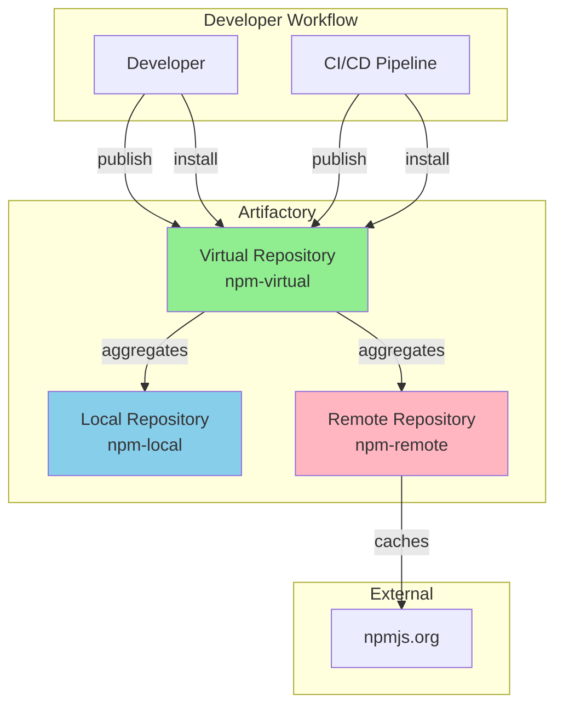

# Day 3 — Artifact Management with Artifactory

---
layout: section
---

# Morning Session

<!-- Duration: 3 hours -->

---

# Why Artifact Management?

<!-- Duration: 30 minutes -->

## The Problem

- Developers build artifacts (libraries, containers, binaries)
- Teams need to share these artifacts
- Dependencies from external sources need caching
- Version control and traceability are critical

## The Solution

- Centralized artifact repository
- Unified access control and security
- Caching and performance optimization
- Integration with CI/CD pipelines

---

# Benefits of Artifact Management

## For Development Teams

- **Reproducible builds**: Same dependencies every time
- **Faster builds**: Local cache of dependencies
- **Version control**: Track what's deployed where
- **Security**: Scan and control what enters your ecosystem

## For Operations

- **Single source of truth**: All artifacts in one place
- **Bandwidth savings**: Cache external dependencies
- **Compliance**: License and vulnerability tracking
- **High availability**: Replicate artifacts across regions

---
layout: section
---

# Artifactory Overview and Installation

<!-- Duration: 30 minutes -->

---

# What is Artifactory?

## Universal Artifact Repository Manager

- Supports multiple package formats: npm, Docker, Maven, NuGet, PyPI, etc.
- Enterprise-grade artifact management
- Integration with major CI/CD tools
- Advanced security and access control

## Key Features

- **Universal repository**: One tool for all artifact types
- **High availability**: Replication and clustering
- **Advanced search**: Find artifacts by metadata
- **Build integration**: Track build artifacts and dependencies

---

# Installation

## Docker-based Setup (Recommended for Training)

```bash
# Pull Artifactory OSS image
docker pull releases-docker.jfrog.io/jfrog/artifactory-oss:latest

# Run Artifactory
docker run -d --name artifactory \
  -p 8081:8081 \
  -p 8082:8082 \
  -v artifactory_data:/var/opt/jfrog/artifactory \
  releases-docker.jfrog.io/jfrog/artifactory-oss:latest
```

## Access

- Wait 1-2 minutes for startup
- Navigate to http://localhost:8081
- Default credentials: admin / password

---

# Initial Configuration

## First Login Steps

1. **Change admin password** (required)
2. **Set base URL** to http://localhost:8081
3. **Configure proxy settings** (if behind corporate proxy)
4. **Skip or configure repositories** (we'll do this manually)

## Essential Settings

- **Security**: Create additional users for team
- **Backups**: Configure backup schedule
- **Storage**: Check available disk space
- **License**: OSS version or upload Pro license

---
layout: section
---

# Repository Types and Architecture

<!-- Duration: 1 hour -->

---

# Repository Types Overview

## Three Main Types

**Local Repository (Hosted)**
- Store artifacts you create/build
- Your private packages and containers
- Example: `npm-local`, `docker-local`

**Remote Repository (Proxy)**
- Cache external repositories
- Proxy npmjs.org, Docker Hub, etc.
- Reduces bandwidth and improves speed

**Virtual Repository**
- Aggregates multiple repositories
- Single URL for clients
- Combines local + remote repos

---

# Repository Architecture



---

# Local Repositories

## Purpose: Store Your Artifacts

**Use Cases:**
- Internal npm packages
- Docker images built by your team
- Release binaries
- Documentation artifacts

**Configuration:**
- Package type (npm, Docker, generic, etc.)
- Layout (repository structure)
- Retention policies

**Example:** `npm-local` for your team's private packages

---

# Remote Repositories

## Purpose: Cache External Dependencies

**Use Cases:**
- Cache npmjs.org packages
- Mirror Docker Hub images
- Proxy Maven Central
- Cache PyPI packages

**Benefits:**
- **Speed**: Local cache is faster
- **Reliability**: Works even if upstream is down
- **Bandwidth**: Download once, use many times
- **Security**: Scan before making available

**Example:** `npm-remote` proxying npmjs.org

---

# Virtual Repositories

## Purpose: Unified Access Point

**Use Cases:**
- Single URL for npm install
- Combine internal + external packages
- Prioritize local over remote

**Resolution Order:**
1. Check local repository first
2. Check cached remote artifacts
3. Fetch from remote source if needed

**Example:** `npm-virtual` = `npm-local` + `npm-remote`

**Developer Experience:**
```bash
# One .npmrc configuration works for everything
npm config set registry http://artifactory:8081/artifactory/api/npm/npm-virtual/
```

---
layout: section
---

# UI Walkthrough and Basic Operations

<!-- Duration: 1 hour -->

---

# Accessing the UI

## Navigation Overview

**Main Sections:**
- **Home**: Dashboard and quick links
- **Artifacts**: Browse repositories
- **Search**: Find artifacts by name, checksum, property
- **Admin**: Configuration and management

**Quick Actions:**
- Deploy artifact
- Search by checksum
- View build info
- Set up repository

---

# Exploring the UI

## Left Navigation Panel

- **Artifacts**: Repository tree view
- **Artifacts Module Searches**: Advanced queries
- **Builds**: Build information and artifacts

## Repository Browser

- Tree view of all repositories
- Expand to see artifact contents
- Right-click for actions
- Download, delete, copy, move

## Repository Details

- **General**: Description, type, layout
- **Packages**: Browse by package
- **Builds**: Associated builds

---

# Searching for Artifacts

## Search Methods

**Quick Search** (Top bar)
- Search by artifact name
- Finds across all repositories
- Fast and simple

**Advanced Search** (Search menu)
- By name pattern
- By checksum (SHA-256, SHA-1, MD5)
- By property
- By date range

**Package Search**
- Docker images by tag
- npm packages by version
- Maven artifacts by GAV

---

# Managing Artifacts

## Common Operations

**Viewing Artifact Details:**
- Click on any artifact
- See metadata, checksums, properties
- View general info and build details

**Downloading:**
- Right-click → Download
- Or use direct URL
- Supports resumable downloads

**Deploying (Uploading):**
- Drag and drop in UI
- Use REST API
- Use package manager (npm publish)

**Setting Properties:**
- Custom metadata
- Used for search and automation
- Example: `quality=release`

---
layout: section
epoch: d3pm
---

# Afternoon Session

<!-- Duration: 3 hours -->

---
layout: section
---

# npm/Node.js Integration

<!-- Duration: 1 hour -->

---

# Setting Up npm with Artifactory

## Create npm Repositories

**Step 1: Create npm-local**
1. Admin → Repositories → Local
2. New Local Repository → npm
3. Name: `npm-local`
4. Create

**Step 2: Create npm-remote**
1. Admin → Repositories → Remote
2. New Remote Repository → npm
3. Name: `npm-remote`
4. URL: `https://registry.npmjs.org`
5. Create

**Step 3: Create npm-virtual**
1. Admin → Repositories → Virtual
2. New Virtual Repository → npm
3. Name: `npm-virtual`
4. Add `npm-local` and `npm-remote`
5. Set `npm-local` as default deployment
6. Create

---

# Configuring npm Client

## Using .npmrc

**Project-level** (`.npmrc` in project root):
```ini
registry=http://localhost:8081/artifactory/api/npm/npm-virtual/
//localhost:8081/artifactory/api/npm/npm-virtual/:_auth=YWRtaW46cGFzc3dvcmQ=
//localhost:8081/artifactory/api/npm/npm-virtual/:always-auth=true
```

**User-level** (`~/.npmrc`):
```bash
npm config set registry http://localhost:8081/artifactory/api/npm/npm-virtual/
npm login --registry=http://localhost:8081/artifactory/api/npm/npm-virtual/
```

## Authentication

- Use Artifactory credentials
- Or generate API token (recommended)
- Base64 encode for `_auth`: `echo -n "user:password" | base64`

---

# Publishing npm Packages

## Publish to Artifactory

**Update package.json:**
```json
{
  "name": "@yourorg/your-package",
  "version": "1.0.0",
  "publishConfig": {
    "registry": "http://localhost:8081/artifactory/api/npm/npm-local/"
  }
}
```

**Publish:**
```bash
npm publish
```

**Verify:**
- Check Artifactory UI
- Browse npm-local repository
- See your package under `@yourorg/your-package`

---

# Installing from Artifactory

## Developer Workflow

**Install dependencies:**
```bash
npm install express
```

**What happens:**
1. npm queries npm-virtual
2. Checks npm-local (not found)
3. Checks npm-remote cache (if cached, returns)
4. Fetches from npmjs.org (if not cached)
5. Stores in npm-remote cache
6. Returns to developer

**Subsequent installs are faster:**
- Cached in Artifactory
- No external network call
- Consistent versions across team

---
layout: section
---

# Docker Registry Integration

<!-- Duration: 45 minutes -->

---

# Setting Up Docker Registry

## Create Docker Repositories

**Step 1: Create docker-local**
1. Admin → Repositories → Local
2. New Local Repository → Docker
3. Name: `docker-local`
4. Repository Path: `docker-local`
5. Enable Docker API V2
6. Create

**Step 2: Create docker-remote**
1. Admin → Repositories → Remote
2. New Remote Repository → Docker
3. Name: `docker-remote`
4. URL: `https://registry-1.docker.io`
5. Enable External Pattern
6. Create

**Step 3: Create docker-virtual**
1. Admin → Repositories → Virtual
2. New Virtual Repository → Docker
3. Name: `docker`
4. Add docker-local and docker-remote
5. Default deployment: docker-local
6. Create

---

# Configuring Docker Client

## Docker Login

```bash
# Login to Artifactory
docker login localhost:8082
# Username: admin
# Password: your-password
```

## Port Configuration

- Port 8081: Artifactory UI and API
- Port 8082: Docker registry (configured in Artifactory)
- Ensure port is open and accessible

## Insecure Registry (Local Testing Only)

For localhost testing, configure Docker:

**Linux:** `/etc/docker/daemon.json`
```json
{
  "insecure-registries": ["localhost:8082"]
}
```

Restart Docker daemon after changes.

---

# Pushing Docker Images

## Tag and Push

**Build image from Day 2:**
```bash
cd exercises/nodejs_server
docker build -t nodejs-app:1.0.0 .
```

**Tag for Artifactory:**
```bash
docker tag nodejs-app:1.0.0 localhost:8082/docker-local/nodejs-app:1.0.0
```

**Push to Artifactory:**
```bash
docker push localhost:8082/docker-local/nodejs-app:1.0.0
```

**Verify in UI:**
- Navigate to docker-local repository
- See nodejs-app with version 1.0.0

---

# Pulling Docker Images

## From Artifactory

**Pull your image:**
```bash
docker pull localhost:8082/docker-local/nodejs-app:1.0.0
```

**Pull from Docker Hub via cache:**
```bash
docker pull localhost:8082/docker/node:20-alpine
```

**What happens:**
1. Docker queries Artifactory
2. Checks docker-local (not found)
3. Checks docker-remote cache
4. Fetches from Docker Hub if needed
5. Caches in docker-remote
6. Returns to client

**Benefits:**
- Faster subsequent pulls
- Reduced Docker Hub rate limits
- Works even if Docker Hub is down

---
layout: section
---

# GitHub Actions Integration

<!-- Duration: 45 minutes -->

---

# CI/CD Integration Overview

## Connecting Day 2 to Day 3

**Day 2: GitHub Actions + Docker**
- Built containers in CI
- Pushed to GitHub Container Registry (GHCR)

**Day 3: Artifactory Integration**
- Push to Artifactory instead
- Use Artifactory as npm registry
- Cache dependencies for faster builds

## Benefits

- Centralized artifact storage
- Better control and governance
- Enterprise-grade features
- Works with private networks

---

# Configuring npm in GitHub Actions

## Using Artifactory for Dependencies

**.github/workflows/ci.yml:**
```yaml
name: CI with Artifactory
on: [push]

jobs:
  build:
    runs-on: ubuntu-latest
    steps:
      - uses: actions/checkout@v4
      
      - name: Setup Node.js
        uses: actions/setup-node@v4
        with:
          node-version: '20'
      
      - name: Configure npm for Artifactory
        run: |
          npm config set registry http://artifactory:8081/artifactory/api/npm/npm-virtual/
          echo "//artifactory:8081/artifactory/api/npm/npm-virtual/:_auth=${{ secrets.ARTIFACTORY_AUTH }}" >> ~/.npmrc
      
      - name: Install dependencies
        run: npm ci
      
      - name: Run tests
        run: npm test
```

---

# Publishing to Artifactory from CI

## Push Artifacts from GitHub Actions

**npm package publish:**
```yaml
      - name: Publish to Artifactory
        if: github.ref == 'refs/heads/main'
        run: npm publish
        env:
          NODE_AUTH_TOKEN: ${{ secrets.ARTIFACTORY_TOKEN }}
```

**GitHub Secrets:**
- `ARTIFACTORY_AUTH`: Base64 encoded `user:password`
- `ARTIFACTORY_TOKEN`: API token from Artifactory

**Generate API Token:**
1. Artifactory UI → User Profile
2. Generate API Key
3. Add to GitHub Secrets

---

# Docker Build and Push in CI

## Using Artifactory Docker Registry

**.github/workflows/docker.yml:**
```yaml
name: Docker Build and Push to Artifactory

on:
  push:
    branches: [main]

jobs:
  docker:
    runs-on: ubuntu-latest
    steps:
      - uses: actions/checkout@v4
      
      - name: Login to Artifactory
        run: |
          echo "${{ secrets.ARTIFACTORY_PASSWORD }}" | \
          docker login artifactory:8082 -u ${{ secrets.ARTIFACTORY_USER }} --password-stdin
      
      - name: Build Docker image
        run: |
          docker build -t artifactory:8082/docker-local/nodejs-app:${{ github.sha }} .
          docker build -t artifactory:8082/docker-local/nodejs-app:latest .
      
      - name: Push to Artifactory
        run: |
          docker push artifactory:8082/docker-local/nodejs-app:${{ github.sha }}
          docker push artifactory:8082/docker-local/nodejs-app:latest
```

---

# Caching with Artifactory

## Faster CI Builds

**Benefits of Artifactory Caching:**
- npm dependencies cached
- Docker layers cached
- Reduces build time
- Reduces external bandwidth

**Example Build Time Improvement:**
- First build: 2 minutes (fetch from npmjs.org)
- Subsequent builds: 30 seconds (cached in Artifactory)

**Layer Caching:**
- Docker base images cached
- Reduces pull time from Docker Hub
- Consistent images across builds

---
layout: section
---

# Rules and Policies

<!-- Duration: 30 minutes -->

---

# Repository Rules

## Include/Exclude Patterns

**Purpose:** Control what can be stored

**Include Patterns:**
- Whitelist allowed artifact patterns
- Example: `**/*.tgz` for npm packages
- Example: `**/*` for all files

**Exclude Patterns:**
- Blacklist forbidden patterns
- Example: `**/*-SNAPSHOT*` to prevent snapshots
- Example: `**/*.exe` to block executables

**Configuration:**
- Admin → Repositories → [Repository] → Advanced
- Add patterns in Include/Exclude fields

---

# Security Policies

## Access Control

**Permissions:**
- Read: Download artifacts
- Annotate: Add properties
- Deploy/Cache: Upload artifacts
- Delete: Remove artifacts
- Manage: Full control

**Permission Targets:**
- Apply to specific repositories
- Apply to specific paths
- Grant to users or groups

**Example:**
- Developers: Read + Deploy to `npm-local`
- CI/CD: Read + Deploy to all repos
- Guests: Read only to `npm-virtual`

---

# Dependency Restrictions

## Blacklist/Whitelist Strategies

**Blacklist Approach:**
- Allow all by default
- Block specific packages or versions
- Example: Block known vulnerable versions

**Whitelist Approach:**
- Block all by default
- Allow only approved packages
- Example: Approved dependencies only

**Implementation:**
- Use property sets
- Use include/exclude patterns
- Integrate with XRAY (Day 4)

**Example Use Case:**
- Block `lodash` versions < 4.17.21 (security vulnerability)
- Only allow packages from specific scopes (@yourorg/*)

---

# Retention Policies

## Automatic Cleanup

**Purpose:** Manage storage space

**Common Policies:**
- Keep last N versions
- Delete artifacts older than X days
- Keep only artifacts with specific properties

**Configuration:**
1. Create cleanup policy
2. Set criteria (age, count, size)
3. Set scope (repositories, paths)
4. Schedule execution

**Example:**
- Keep last 10 versions of each package
- Delete unused artifacts after 180 days
- Keep all artifacts tagged as `release`

---

# License Compliance

## Track Package Licenses

**Purpose:** Ensure compliance with legal requirements

**Features:**
- Automatic license detection
- License approval/rejection
- Compliance reports

**Workflow:**
1. Set approved licenses (MIT, Apache, BSD)
2. Set rejected licenses (GPL for proprietary code)
3. Scan repositories
4. Block non-compliant artifacts

**Artifactory Pro feature** (demo only in OSS)

---
layout: section
---

# Hands-on Exercises

---

# Exercise 1: Configure npm with Artifactory

**Objective:** Use Artifactory as npm registry

**Tasks:**
1. Create npm repositories (local, remote, virtual) in Artifactory UI
2. Configure your local npm client to use Artifactory
3. Install a package (e.g., `express`) and verify it's cached
4. Verify in Artifactory UI that package appears in npm-remote

**Expected Outcome:**
- npm-virtual configured as registry
- express package cached in Artifactory
- Faster subsequent installs

**Time:** 15 minutes

---

# Exercise 2: Publish to Artifactory

**Objective:** Publish a Node.js package

**Tasks:**
1. Navigate to `exercises/nodejs_server`
2. Update package.json with publishConfig
3. Publish to npm-local
4. Verify package in Artifactory UI
5. Try installing from another directory

**Expected Outcome:**
- Package published to npm-local
- Visible in Artifactory UI
- Can be installed by team members

**Time:** 15 minutes

---

# Exercise 3: Push Docker Image to Artifactory

**Objective:** Use Artifactory as Docker registry

**Tasks:**
1. Create Docker repositories (local, remote, virtual) in Artifactory
2. Login to Artifactory Docker registry
3. Tag the nodejs_server image for Artifactory
4. Push image to docker-local
5. Verify in Artifactory UI
6. Pull image from another machine/directory

**Expected Outcome:**
- Docker image in Artifactory
- Can pull from Artifactory registry
- Understand difference vs GHCR (Day 2)

**Time:** 20 minutes

---

# Exercise 4: GitHub Actions Integration

**Objective:** Update CI to use Artifactory

**Tasks:**
1. Add Artifactory credentials to GitHub Secrets
2. Update GitHub Actions workflow to configure npm with Artifactory
3. Run workflow and verify dependencies come from Artifactory
4. (Optional) Update workflow to push Docker image to Artifactory

**Expected Outcome:**
- CI uses Artifactory for dependencies
- Faster builds due to caching
- Artifacts published to Artifactory

**Time:** 20 minutes

---

# Exercise 5: Set Up Access Controls

**Objective:** Configure repository permissions

**Tasks:**
1. Create a new user in Artifactory
2. Create permission target for npm-local
3. Grant read + deploy permissions to the user
4. Test by logging in as new user
5. Verify user can publish but not delete

**Expected Outcome:**
- Understand Artifactory security model
- User can publish packages
- User cannot perform admin actions

**Time:** 15 minutes

---
layout: center
---

# Day 3 Summary

## What We Learned

✓ Why artifact management matters  
✓ Artifactory architecture and repository types  
✓ npm and Docker integration  
✓ GitHub Actions integration  
✓ Rules, policies, and security  

## Tomorrow: Day 4

- SonarQube for code quality
- XRAY for dependency scanning
- Advanced security and compliance

---

# Questions?

**Resources:**
- JFrog Artifactory Documentation: https://jfrog.com/help/r/jfrog-artifactory-documentation
- npm Configuration: https://docs.npmjs.com/cli/v9/configuring-npm/npmrc
- Docker Registry API: https://docs.docker.com/registry/spec/api/

**Next Steps:**
- Complete any unfinished exercises
- Explore Artifactory UI
- Prepare questions for Day 4
