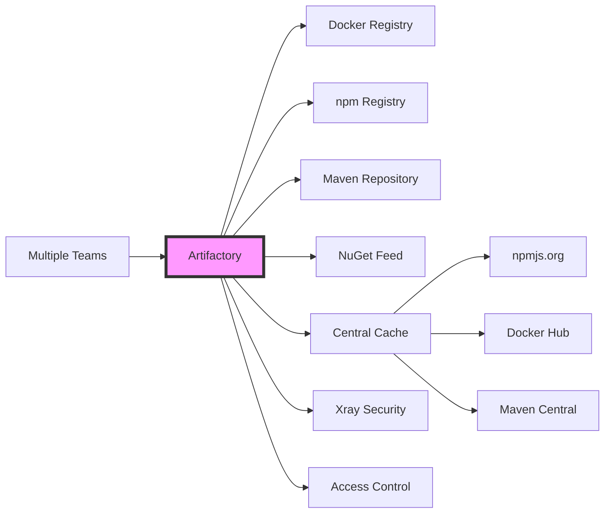

# Artifactory

---

# Building on Day 2

Yesterday we learned:
- Building Docker images for Node.js apps
- Pushing images to **GitHub Container Registry (GHCR)**
- Automating builds with GitHub Actions

Today: **Enterprise artifact management with Artifactory**

---

# From Day 2: Our Node.js App

```dockerfile
# syntax=docker/dockerfile:1
# Stage 1: Install dependencies
FROM node:20-alpine AS deps
WORKDIR /app
COPY package*.json ./
RUN npm ci --only=production

# Stage 2: Create production image
FROM node:20-alpine AS runner
WORKDIR /app
COPY --from=deps /app/node_modules ./node_modules
COPY . .
EXPOSE 3000
CMD ["node", "src/index.js"]
```

We pushed this to `ghcr.io/org/app:1.0.0`

---

# Today's Goals

- Understand **when** and **why** to use Artifactory vs GHCR
- Learn to manage **multiple artifact types** (npm, Docker, etc.)
- Integrate Artifactory into our **GitHub Actions CI/CD pipeline**
- Migrate our Node.js app from GHCR to Artifactory

---

## Introduction
### Role in production
### Managing artifacts and dependencies

---

# GHCR vs Artifactory: When to Use Each?

| Feature | GHCR | Artifactory |
|---------|------|-------------|
| **Best for** | Public open-source projects | Enterprise environments |
| **Artifact types** | Container images, npm packages | 30+ types (npm, Docker, Maven, NuGet, etc.) |
| **Access control** | GitHub PAT, basic permissions | Fine-grained RBAC, LDAP/SSO |
| **Repository types** | Hosted only | Local, remote (proxy), virtual |
| **Caching** | Limited | Advanced caching & CDN |
| **Scanning** | Basic (Dependabot) | Advanced (Xray integration) |
| **Cost** | Free for public, included in GitHub | Enterprise license required |

---

# Why Artifactory for Enterprise?



**Key benefits**: Unified management, caching, security, compliance

---

# Migration Path: GHCR → Artifactory

**Step-by-step approach:**

1. **Set up** Artifactory Docker repository
2. **Pull** existing image from GHCR
3. **Tag** and **push** to Artifactory
4. **Update** GitHub Actions workflow
5. **Test** the new pipeline
6. **Deprecate** GHCR usage

We'll practice this with our Node.js app today!

---
layout: section
---

# Installation and configuration

---

# Installation

---

# Initial configuration

---

# Accessing the UI

---
layout: section
---

# User interface

---

# Exploring the UI

---

# Searching for artifacts

---

# Managing artifacts

---
layout: section
epoch: d3pm
---

# Repository management

---

# Docker Repository Setup

**Creating a Docker registry in Artifactory:**

1. Navigate to **Administration** → **Repositories** → **Local**
2. Click **New Local Repository**
3. Select **Docker** as package type
4. Configure:
   - Repository Key: `docker-local`
   - Docker API Version: `V2`
   - Enable token authentication

---

# Using Our Node.js App with Artifactory

**From Day 2, we had:**
```sh
docker build -t ghcr.io/org/app:1.0.0 .
docker push ghcr.io/org/app:1.0.0
```

**Now with Artifactory:**
```sh
# Login to Artifactory
docker login artifactory.company.com

# Build and tag
docker build -t artifactory.company.com/docker-local/app:1.0.0 .

# Push to Artifactory
docker push artifactory.company.com/docker-local/app:1.0.0
```

---

# Updating GitHub Actions: Before (Day 2)

```yaml
name: Build and Push Docker Image
on: push

jobs:
  build:
    runs-on: ubuntu-latest
    steps:
      - uses: actions/checkout@v4
      
      - name: Login to GHCR
        uses: docker/login-action@v3
        with:
          registry: ghcr.io
          username: ${{ github.actor }}
          password: ${{ secrets.GITHUB_TOKEN }}
      
      - name: Build and push
        uses: docker/build-push-action@v5
        with:
          push: true
          tags: ghcr.io/org/app:${{ github.sha }}
```

---

# Updating GitHub Actions: After (Day 3)

```yaml
name: Build and Push to Artifactory
on: push

jobs:
  build:
    runs-on: ubuntu-latest
    steps:
      - uses: actions/checkout@v4
      
      - name: Login to Artifactory
        uses: docker/login-action@v3
        with:
          registry: artifactory.company.com
          username: ${{ secrets.ARTIFACTORY_USER }}
          password: ${{ secrets.ARTIFACTORY_TOKEN }}  # Access token, not password
      
      - name: Build and push
        uses: docker/build-push-action@v5
        with:
          push: true
          tags: artifactory.company.com/docker-local/app:${{ github.sha }}
```

---

# Key Changes: GHCR → Artifactory

**Authentication:**
- GHCR: `GITHUB_TOKEN` (automatic)
- Artifactory: Dedicated user + token (more secure)

**Registry URL:**
- GHCR: `ghcr.io`
- Artifactory: Your instance URL

**Secrets to configure:**
1. `ARTIFACTORY_USER` - Service account username
2. `ARTIFACTORY_TOKEN` - Access token or password

---
 
# NuGet repository

---

# NPM repository

---

# NPM Repository for Our Node.js App

**Day 2 recap:** Our app uses `npm ci` to install dependencies from npmjs.org

**With Artifactory as npm proxy:**

1. **Create remote repository** (proxy to npmjs.org)
2. **Create virtual repository** (aggregates local + remote)
3. **Configure npm** to use Artifactory

---

# Configuring npm to Use Artifactory

**Create `.npmrc` in your project:**
```ini
registry=https://artifactory.company.com/artifactory/api/npm/npm-virtual/
//artifactory.company.com/artifactory/api/npm/npm-virtual/:_auth=${ARTIFACTORY_TOKEN}
//artifactory.company.com/artifactory/api/npm/npm-virtual/:always-auth=true
```

⚠️ **Security:** Never commit `.npmrc` with actual tokens! Use environment variables or CI secrets.

**Benefits:**
- All npm packages cached in Artifactory
- Faster builds (no external calls after first download)
- Control over allowed packages
- Audit trail of all downloads

---

# Updated Dockerfile with Artifactory

```dockerfile
# syntax=docker/dockerfile:1
FROM node:20-alpine AS deps
WORKDIR /app

# Use build-time secret for Artifactory authentication (Docker BuildKit)
# Pass token via: docker build --secret id=npmrc,src=.npmrc .
RUN --mount=type=secret,id=npmrc,target=/root/.npmrc \
    npm ci --only=production

FROM node:20-alpine AS runner
WORKDIR /app
COPY --from=deps /app/node_modules ./node_modules
COPY . .
EXPOSE 3000
CMD ["node", "src/index.js"]
```

**Security:** Using `--mount=type=secret` prevents credentials from being stored in image layers

**Alternative:** Configure Artifactory as npm proxy globally on build machine

---
layout: section
---

# XRAY

---

# Accessing artifacts via XRAY

---

# Downloading artifacts

---
layout: section
---

# Exercises

---

# Exercise 1: Push Day 2's Docker Image to Artifactory

**Goal:** Migrate our Node.js app from GHCR to Artifactory

**Steps:**
1. Pull the image from GHCR: `docker pull ghcr.io/org/app:1.0.0`
2. Set up Docker repository in Artifactory
3. Login to Artifactory: `docker login artifactory.company.com`
4. Tag for Artifactory: `docker tag ghcr.io/org/app:1.0.0 artifactory.company.com/docker-local/app:1.0.0`
5. Push: `docker push artifactory.company.com/docker-local/app:1.0.0`
6. Verify in Artifactory UI

---

# Exercise 2: Configure npm to Use Artifactory

**Goal:** Set up npm proxy for the Node.js app

**Steps:**
1. Create npm remote repository (proxy to npmjs.org)
2. Create npm virtual repository
3. Create `.npmrc` file with Artifactory registry
4. Test: `npm install` - verify packages download from Artifactory
5. Check Artifactory UI to see cached packages

---

# Exercise 3: Update GitHub Actions Workflow

**Goal:** Modify Day 2's workflow to push to Artifactory

**Steps:**
1. Clone the Node.js app repository
2. Create Artifactory access token
3. Add secrets: `ARTIFACTORY_USER`, `ARTIFACTORY_TOKEN`
4. Update `.github/workflows/build.yml`:
   - Change registry from `ghcr.io` to Artifactory
   - Update login action with Artifactory credentials
   - Update image tags
5. Push changes and verify workflow runs successfully

---

# Exercise 4: Create Virtual Repository

**Goal:** Combine local and remote repositories

**Steps:**
1. Create local Docker repository: `docker-local`
2. Create remote Docker repository: `dockerhub-remote` (proxy to Docker Hub)
3. Create virtual repository: `docker` (includes both)
4. Test pulling from virtual repo
5. Test pushing to virtual repo (goes to local)
