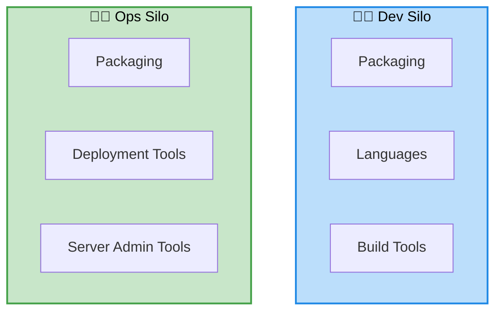
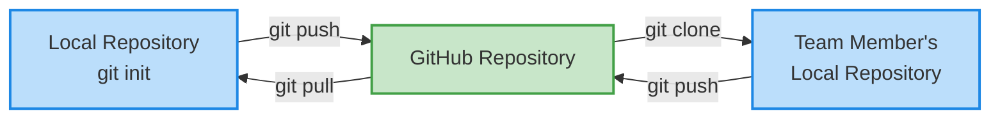

# Day 1 — DevOps foundations and warm-up

## Objectives

- Understand the DevOps approach vs the traditional approach
- Walk through the DevOps lifecycle
- Set up a sample Node.js application
- Review git and GitHub basics

---
layout: center
---

# DevOps: approach vs traditional


---
layout: two-cols-header
---

# DevOps: traditional approach

::left::



::right::

- Dev: Per-language tooling
- Ops: 
    - Per-platform: VMWare, bare-metal, ...
    - Per-framework tooling: IIS, J2EE, ...

---
layout: default
---

# The DevOps lifecycle


---
layout: two-cols-header
layoutClass: devops-bg
---

# DevOps lifecycle - Plan

::left::

::right::

## Actions

- User Stories
- Issues
- Pull-Requests

<div style="height:6rem"></div>

<div class="icon-row bg-black" >
  
  
</div>

---
layout: two-cols-header
layoutClass: devops-bg
---

# DevOps lifecycle - Code

::left::

::right::

## Actions

- Link branch to issue
- Pull request
- Edit
- Commit

<div style="height:6rem"></div>

<div class="icon-row bg-black">
  
  
</div>

---
layout: two-cols-header
layoutClass: devops-bg
---

# DevOps lifecycle - Build

::left::

::right::

## Actions

- Validate code
- Validate coding style

## Tools

- Continuous Integration
- GitHub Action

---

# Sample Node.js application

- Minimal HTTP API (Express, Fastify)
- npm scripts: dev, test, build
- Optional Makefile
- Best practices: .nvmrc, .editorconfig, linters

---
layout: section
---

# Git Basics

---
layout: two-cols-header
---

# Git — Introduction

::left::

## What is Git?

- **Decentralized** version control system
- **Free and open source** (GPL license)
- Created by **Linus Torvalds** in 2005
- Developed for the **Linux kernel**
  - One of the largest repositories in the world
  - Thousands of contributors
  - Millions of lines of code

::right::

## Why Git?

- Fast and efficient
- Works offline (distributed)
- Strong support for branching
- Data integrity (cryptographic hashing)
- Widely adopted in the industry

---
layout: two-cols-header
---

# Git — Core Concepts

::left::

## Repository Structure

- **Repository (repo)**: The complete project history
- **Working directory**: Current files you're editing
- **Staging area (index)**: Changes ready to commit

## Objects

- **Blob**: File contents
- **Tree**: Directory structure
- **Commit**: Snapshot of the repository
- **Tag**: Named reference to a commit

::right::

## References

- **SHA-1**: Unique identifier for each commit (40-character hash)
- **HEAD**: Pointer to current commit
- **Branch**: Movable pointer to a commit
  - `main` / `master`: Default branch
  - Feature branches, release branches, hotfix branches
- **Remote**: Reference to a remote repository
  - `origin`: Default remote name

---
layout: section
---

# Git Exercises

**Duration**: Approximately 2.5 hours

**Objectives**: 
- Understand basic Git commands
- Learn the differences between merge and rebase
- Build practical skills with hands-on exercises

---

# Exercise 1: Initialize a Repository

## Objective
Create a new Git repository and understand its structure

## Commands

```sh
# Create a new directory for your project
mkdir my-git-project
cd my-git-project

# Initialize a Git repository
git init
```

## Observations

- What files/directories were created?
- Use `ls -la` to see the `.git` directory
- Explore `.git` contents with `ls -la .git`

---

# Exercise 2: Stage Changes

## Objective
Learn how to add files to the staging area

## Commands

```sh
# Create a new file
echo "# My Project" > README.md

# Check repository status
git status

# Add file to staging area
git add README.md

# Check status again
git status
```

## Observations

- What does "untracked files" mean?
- What changed after `git add`?
- Try creating another file and use `git add .` to add all files

---

# Exercise 3: Create Commits

## Objective
Save changes to the repository history

## Commands

```sh
# Commit staged changes
git commit -m "Initial commit: Add README"

# Check the commit log
git log

# Create and commit more changes
echo "## Description" >> README.md
git add README.md
git commit -m "Add description section"

# View log in compact form
git log --oneline
```

## Observations

- What information does `git log` show?
- What is the commit hash (SHA-1)?
- Who is the author? How is the timestamp formatted?

---

# Exercise 4: View History

## Objective
Navigate and understand repository history

## Commands

```sh
# View detailed log
git log --all --decorate --oneline --graph

# View changes in last commit
git show HEAD

# View changes in a specific file
git log README.md

# Show differences between commits
git diff HEAD~1 HEAD
```

## Observations

- What does the `--graph` option show?
- What does `HEAD~1` refer to?
- How can you see what changed in each commit?

---

# Exercise 5: Work with Branches

## Objective
Create and manage branches

## Commands

```sh
# List branches
git branch

# Create a new branch
git branch feature/add-content

# List branches again
git branch

# Switch to the new branch
git checkout feature/add-content

# Or create and switch in one command
git checkout -b feature/add-footer
```

## Observations

- Which branch are you currently on? (Look for `*`)
- What does `git status` show about your current branch?
- Create a file on this branch and commit it

---

# Exercise 6: Switch Branches

## Objective
Navigate between branches and understand working directory changes

## Commands

```sh
# Create a file on feature branch
echo "Footer content" > footer.txt
git add footer.txt
git commit -m "Add footer"

# Switch back to main
git checkout main

# Check if footer.txt exists
ls -la

# Switch back to feature branch
git checkout feature/add-footer

# Check again
ls -la
```

## Observations

- Does `footer.txt` exist on the `main` branch?
- What happens to your working directory when you switch branches?
- Try editing a file without committing, then switch branches. What happens?

---

# Exercise 7: Merge Branches

## Objective
Integrate changes from one branch into another

## Commands

```sh
# Make sure you're on main branch
git checkout main

# Merge the feature branch
git merge feature/add-footer

# View the log
git log --oneline --graph

# Delete the merged branch
git branch -d feature/add-footer
```

## Observations

- What type of merge occurred? (fast-forward or merge commit)
- How does the commit graph look?
- What happens when you try to delete an unmerged branch?

---

# Exercise 8: Rebase Branches

## Objective
Understand rebasing and compare it with merging

## Commands

```sh
# Create a new branch from main
git checkout -b feature/rebase-example

# Add a commit on the feature branch
echo "Feature work" > feature.txt
git add feature.txt
git commit -m "Add feature work"

# Switch to main and add a commit
git checkout main
echo "Main work" >> README.md
git add README.md
git commit -m "Update README on main"

# Switch back to feature branch
git checkout feature/rebase-example

# Rebase onto main
git rebase main
```

## Observations

- How does the commit history look after rebase?
- Compare this with the merge from Exercise 7
- What does "rebase" actually do to your commits?

**Note**: Run `git log --oneline --graph --all` to visualize the difference

---

# Exercise 9: Merge vs Rebase Comparison

## Objective
Understand when to use merge vs rebase

## Setup & Commands

```sh
# View the history after merge (from Exercise 7)
git log --oneline --graph feature/add-content main

# View the history after rebase (from Exercise 8)
git log --oneline --graph feature/rebase-example main
```

## Key Differences

| Merge | Rebase |
|-------|--------|
| Creates a merge commit | Rewrites commit history |
| Preserves exact history | Creates linear history |
| Shows when branches diverged | Cleaner, easier to follow |
| Safer for shared branches | **Never rebase shared commits!** |

## When to Use

- **Merge**: For integrating completed features into main
- **Rebase**: For cleaning up local branch before pushing

---

# Exercise 10: Get Help

## Objective
Learn how to get help with Git commands

## Commands

```sh
# Get general help
git help

# Get help for a specific command
git help commit

# Quick help (short form)
git commit --help

# Even shorter help
git commit -h

# Search for commands
git help -a | grep branch
```

## Observations

- How is the help documentation structured?
- What are the common options for most commands?
- Try getting help for: `log`, `rebase`, `merge`

---

# Git Best Practices — Key Takeaways

After these exercises, remember:

1. **Commit often** with meaningful messages
2. **Pull before push** to avoid conflicts
3. **Use branches** for new features or experiments
4. **Rebase carefully** — never rebase shared commits
5. **Merge** for integrating features into main branch
6. **Use `.gitignore`** to exclude build artifacts and dependencies
7. **Review changes** with `git diff` before committing
8. **Use `git help`** when in doubt

**Modern Git**: Recent Git versions introduce `git switch` (for switching branches) and `git restore` (for restoring files) as alternatives to `git checkout`. While we use `git checkout` in these exercises (most common in existing projects), feel free to explore these newer commands!

---
layout: section
---

# GitHub — collaboration platform

## Understanding the Git ↔ GitHub relationship

<!--
Presenter notes:
- Screenshot suggestion: GitHub homepage showing the social coding features
- Illustration idea: Side-by-side comparison of Git logo and GitHub logo
- Emphasize that this section will bridge local Git with cloud-based GitHub
-->

---

# Git vs GitHub

## What's the difference?

**Git** (Local)
- Distributed version control system
- Works offline on your machine
- Manages code history locally
- Created by Linus Torvalds (2005)

**GitHub** (Remote/Cloud)
- Web-based hosting platform for Git repositories
- Collaboration and social features
- Project management tools
- CI/CD integration

<!--
Presenter notes:
- Screenshot suggestion: Split screen showing Git terminal commands on left and GitHub web interface on right
- Illustration idea: Icons representing offline (Git) vs online (GitHub) with connecting arrows
- Key point: Git is the tool, GitHub is the platform that hosts Git repositories
- Mention alternatives like GitLab, Bitbucket for context
-->

---

# The Git ↔ GitHub workflow



<!--
Presenter notes:
- Screenshot suggestion: Actual GitHub repository page showing clone button, branches, and commit history
- Illustration idea: Animated diagram showing the flow of commits from local to remote
- Walk through the diagram: init local repo → push to GitHub → colleague clones → colleague push
- Emphasize the bidirectional sync between local and remote
-->

---

# GitHub core concepts

## Repository

- Central storage for your project code
- Contains all files, history, and branches
- Can be public or private
- Includes README, license, .gitignore

**Types:**
- Personal repositories
- Organization repositories
- Forked repositories

<!--
Presenter notes:
- Screenshot suggestion: GitHub repository page showing README, file tree, and repository settings
- Show examples of: public repo (e.g., popular open source), private repo icon, and forked repo badge
- Illustration idea: Three cards showing different repository types with their icons
- Demonstrate creating a new repository live if time permits
-->

---

# GitHub core concepts

## Organization

- Shared workspace for teams
- Multiple repositories under one umbrella
- Centralized access control
- Billing management

**Benefits:**
- Team management
- Consistent permissions across repos
- Shared resources and settings

<!--
Presenter notes:
- Screenshot suggestion: GitHub organization page showing multiple repositories and team members
- Screenshot suggestion: Organization settings page showing team management interface
- Illustration idea: Organizational chart showing how teams fit under organizations
- Real example: Show a well-known organization (e.g., microsoft, google, facebook on GitHub)
-->

---

# GitHub core concepts

## Teams

- Groups of organization members
- Granular access control
- Hierarchical structure possible
- Permission levels: Read, Write, Admin

**Use cases:**
- Frontend team, Backend team
- Maintainers, Contributors
- Department-based groups

<!--
Presenter notes:
- Screenshot suggestion: Organization teams page showing team structure and members
- Screenshot suggestion: Repository access settings showing team permissions (Read/Write/Admin)
- Illustration idea: Hierarchical diagram showing parent team and nested teams
- Explain permission inheritance from organization to team to individual
-->

---

# GitHub core concepts

## Projects

- Visual project management
- Kanban boards, tables, roadmaps
- Tracks issues and PRs across repositories
- Automation with workflows

**Project views:**
- Board (Kanban)
- Table (Spreadsheet)
- Roadmap (Timeline)

<!--
Presenter notes:
- Screenshot suggestion: GitHub Projects board view with columns (Todo, In Progress, Done)
- Screenshot suggestion: Table view showing different metadata columns
- Screenshot suggestion: Roadmap view with timeline visualization
- Illustration idea: Side-by-side comparison of all three view types
- Mention this is similar to Jira but integrated with GitHub
-->

---
layout: two-cols-header
---

# Issues — track work and bugs

::left::

## What are Issues?

- Conversation about a task, bug, or feature
- Assigned to team members
- Labeled and organized
- Linked to PRs and commits

::right::

## Issue components

- **Title:** Clear, concise summary
- **Description:** Detailed explanation
- **Labels:** bug, enhancement, documentation
- **Assignees:** Responsible team members
- **Milestone:** Group related issues
- **Projects:** Track progress

<!--
Presenter notes:
- Screenshot suggestion: GitHub issue page showing all components (title, description, labels, assignees, milestone)
- Screenshot suggestion: Issue list with different colored labels
- Illustration idea: Annotated issue showing each component with arrows
- Demo creating a new issue live and show how labels work
- Emphasize issue templates if time permits
-->

---

# Pull Requests (PRs)

## Propose and review changes

**Workflow:**
1. Create a feature branch
2. Make changes and commit
3. Open a Pull Request
4. Team reviews the code
5. Address feedback
6. Merge to main branch

**PR = Quality Gate**
- Code review before merging
- Automated tests (CI)
- Discussion and collaboration

<!--
Presenter notes:
- Screenshot suggestion: Complete PR page showing conversation, commits, checks, and files changed tabs
- Screenshot suggestion: PR workflow diagram from branch creation to merge
- Illustration idea: Flow chart showing PR lifecycle with decision points
- Show a real PR with review comments and CI checks
- Explain the difference between Draft PR and Ready for Review
-->

---

# Code Review best practices

## Why review code?

- Catch bugs early
- Share knowledge
- Maintain code quality
- Enforce standards

## Review guidelines

✅ Be constructive and respectful
✅ Focus on code, not the person
✅ Explain the "why" behind suggestions
✅ Approve when satisfied
❌ Avoid nitpicking minor style issues

<!--
Presenter notes:
- Screenshot suggestion: PR review interface showing inline comments, suggestions, and approval buttons
- Screenshot suggestion: Example of good review comment vs poor review comment (side by side)
- Illustration idea: Do's and Don'ts of code review with emoji indicators
- Share real examples of constructive comments
- Mention GitHub's "suggestion" feature for proposing changes
-->

---

# Merge strategies

## Different ways to integrate changes

**Merge commit**
- Preserves full history
- Creates a merge commit
- All commits remain visible

**Squash and merge**
- Combines all commits into one
- Cleaner history
- Loses individual commit details

**Rebase and merge**
- Linear history
- No merge commit
- Rewrites commit history

<!--
Presenter notes:
- Screenshot suggestion: Git graph showing all three merge strategies side by side
- Illustration idea: Before/after diagrams for each merge type showing commit history
- Demo using git log --graph to show different outcomes
- Explain when to use each strategy (feature branches vs hotfixes)
- Show GitHub's merge button options
-->

---

# Branch protection rules

## Enforce quality standards

**Common protections:**
- Require pull request reviews (1, 2, or more)
- Require status checks to pass (CI/CD)
- Require branches to be up to date
- Restrict who can push to branch
- Require signed commits

**Benefits:**
- Prevent accidental deletions
- Ensure code quality
- Maintain stable main branch

<!--
Presenter notes:
- Screenshot suggestion: GitHub branch protection settings page with all options visible
- Screenshot suggestion: Example of blocked push due to protection rules
- Illustration idea: Shield icon with checkmarks showing protected vs unprotected branch
- Demo attempting to push directly to protected main (should fail)
- Explain how to configure protection rules for main/production branches
-->

---

# Branch protection — example

```yaml
Protected branch: main

✅ Require pull request before merging
   ✅ Require 2 approvals
   ✅ Dismiss stale reviews
   
✅ Require status checks to pass
   ✅ build
   ✅ test
   ✅ lint
   
✅ Require conversation resolution
✅ Require linear history
✅ Include administrators
```

<!--
Presenter notes:
- Screenshot suggestion: Actual GitHub branch protection configuration matching this example
- Screenshot suggestion: PR that fails to merge due to protection rules not met
- Illustration idea: Checklist visualization showing all requirements
- Walk through each setting and explain its purpose
- Explain "Include administrators" - why it's important even for admins to follow rules
-->

---
layout: section
---

# Hands-on exercises

## Let's practice GitHub collaboration!

**Note:** In the following exercises, replace:
- `YOUR_USERNAME` with your GitHub username
- `INSTRUCTOR_USERNAME` with the instructor's GitHub username

<!--
Presenter notes:
- Before starting exercises, ensure all students have GitHub accounts
- Walk around to help students who get stuck
- Consider pairing students for collaborative exercises
- Have backup exercises ready for faster students
-->

---

# Exercise 1: Create and link repository

## Steps (20 minutes)

1. **Create a new repository on GitHub**
   - Go to GitHub.com → New repository
   - Name: `devops-training-YOUR_USERNAME`
   - Add README.md
   - Choose .gitignore (Node)

2. **Clone and make changes**
   ```sh
   git clone https://github.com/YOUR_USERNAME/devops-training-YOUR_USERNAME.git
   cd devops-training-YOUR_USERNAME
   echo "## Description" >> README.md
   echo "This is my DevOps training project" >> README.md
   git add README.md
   git commit -m "Add project description to README"
   git push origin main
   ```

<!--
Presenter notes:
- Screenshot suggestion: Step-by-step screenshots of repository creation flow
- Screenshot suggestion: GitHub clone button and clone URL options (HTTPS/SSH)
- Illustration idea: Flow diagram from GitHub.com → create repo → clone → modify → push
- Common issues: SSH vs HTTPS authentication, Git not installed
- Show students where to find their repository URL
- Verify students can see their commit on GitHub after pushing
-->

---

# Exercise 2: Fork and contribute

## Steps (30 minutes)

1. **Fork the training repository**
   - Navigate to `GitHub.com/INSTRUCTOR_USERNAME/tuto_devops_github`
   - Click "Fork" button
   - Fork to your account

2. **Clone your fork**
   ```sh
   git clone https://github.com/YOUR_USERNAME/tuto_devops_github.git
   cd tuto_devops_github
   ```

3. **Add upstream remote**
   ```sh
   git remote add upstream https://github.com/INSTRUCTOR_USERNAME/tuto_devops_github.git
   git fetch upstream
   ```

<!--
Presenter notes:
- Screenshot suggestion: Fork button on GitHub and the forking process
- Screenshot suggestion: Network graph showing fork relationship
- Screenshot suggestion: Output of 'git remote -v' showing origin and upstream
- Illustration idea: Diagram showing original repo, fork, and upstream relationship
- Explain the difference between origin (your fork) and upstream (original repo)
- Demonstrate syncing fork with upstream using 'git fetch upstream && git merge upstream/main'
- Common gotcha: forgetting to add upstream remote
-->

---

# Exercise 3: Issues and Pull Requests

## Steps (45 minutes)

1. **Create an issue**
   - Go to your repository
   - Issues → New issue
   - Title: "Add feature: user authentication"
   - Add description, labels (enhancement)
   - Assign to yourself

2. **Create a branch for the issue**
   ```sh
   git checkout -b feature/user-auth
   # Make changes to your code
   git add .
   git commit -m "Add user authentication #1"
   git push origin feature/user-auth
   ```

<!--
Presenter notes:
- Screenshot suggestion: Issue creation form with all fields filled
- Screenshot suggestion: Issue number and how it links to commits (using #1)
- Illustration idea: Timeline showing issue → branch → commits → PR → merge
- Demonstrate how #1 in commit message creates automatic link to issue
- Show students the difference between issue number and PR number
- Common mistake: forgetting to create branch before making changes
-->

---

# Exercise 3: Issues and Pull Requests (cont.)

## Steps (continued)

3. **Create a Pull Request**
   - Go to GitHub → Pull requests → New pull request
   - Base: main, Compare: feature/user-auth
   - Title: "Implement user authentication"
   - Link to issue: "Closes #1"
   - Request review from a team member

4. **Review process**
   - Reviewer: Add comments, request changes
   - Author: Address feedback, push updates
   - Reviewer: Approve the PR
   - Author: Merge the PR

<!--
Presenter notes:
- Screenshot suggestion: PR creation page showing base and compare branches
- Screenshot suggestion: "Closes #1" in PR description and how it auto-links
- Screenshot suggestion: Review workflow showing requested changes, comments, and approval
- Illustration idea: PR lifecycle diagram with all states (Open → Review → Changes Requested → Approved → Merged)
- Demonstrate inline code comments and suggestions
- Show how issue automatically closes when PR is merged
- Pair students for this exercise so they can review each other's PRs
-->

---

# Exercise 4: Project board (Kanban)

## Steps (35 minutes)

1. **Create a project board**
   - Projects → New project → Board
   - Name: "Sprint 1"
   - Columns: Todo, In Progress, Done

2. **Add issues to board**
   - Create multiple issues
   - Add labels: bug, feature, documentation
   - Drag issues to appropriate columns

3. **Configure automation**
   - Auto-move to "In Progress" when PR is opened
   - Auto-move to "Done" when PR is merged
   - Filter by labels

<!--
Presenter notes:
- Screenshot suggestion: New project creation screen with Board template selected
- Screenshot suggestion: Project board with issues in different columns
- Screenshot suggestion: Automation workflow configuration
- Illustration idea: Before/after showing manual vs automated card movement
- Demonstrate dragging cards between columns
- Show how to add issues from different repositories to same project
- Explain the difference between organization-level and repository-level projects
-->

---

# Exercise 4: Project board (cont.)

## Explore interactions

**Labels and filtering:**
- Create labels: priority:high, priority:low
- Filter board by label
- Group by assignee or milestone

**Integration with PRs:**
- Link PR to issue
- Watch status update automatically
- See PR reviews in project view

**Milestones:**
- Create milestone: "v1.0 Release"
- Add issues to milestone
- Track progress

<!--
Presenter notes:
- Screenshot suggestion: Project with filters applied showing only high priority items
- Screenshot suggestion: Project view showing issue linked to PR with status indicators
- Screenshot suggestion: Milestone view showing progress bar
- Illustration idea: Connected diagram showing issue ↔ PR ↔ project ↔ milestone relationships
- Demonstrate custom fields in Projects (status, priority, etc.)
- Show insights and charts if time permits
- Encourage students to experiment with different views (Table, Roadmap)
-->

---

# Exercise 5: Branch protection

## Steps (20 minutes)

1. **Enable branch protection**
   - Settings → Branches → Add rule
   - Branch name pattern: `main`
   - Check: "Require pull request before merging"
   - Require approvals: 1

2. **Test protection**
   - Try to push directly to main (should fail)
   - Create a PR instead
   - Get approval and merge

<!--
Presenter notes:
- Screenshot suggestion: Branch protection settings page with options checked
- Screenshot suggestion: Error message when trying to push to protected branch
- Screenshot suggestion: PR showing "1 approval required" status
- Illustration idea: Shield protecting the main branch with red X on direct push
- Live demo: attempt git push to main and show the rejection
- Explain why even repository owners should follow protection rules
- Show students how to override in emergencies (and why not to!)
- Discuss naming patterns like `main`, `develop`, `release/*`
-->

---

# GitHub best practices — summary

**Issues:**
- Use clear, descriptive titles
- Add appropriate labels
- Link related issues and PRs
- Keep discussions focused

**Pull Requests:**
- Small, focused changes
- Write descriptive PR descriptions
- Reference related issues
- Keep PRs up to date with main

**Code Review:**
- Review promptly
- Be constructive
- Test the changes locally
- Approve only when satisfied

<!--
Presenter notes:
- Screenshot suggestion: Collage of well-written issues and PRs as examples
- Illustration idea: Checklist infographic of all best practices
- Emphasize "small PRs" - show example of 500 line PR vs 50 line PR
- Mention resources: GitHub Docs, GitHub Skills learning paths
- Encourage students to create templates in their repositories
-->

---

# GitHub best practices — summary (cont.)

**Branch Protection:**
- Protect main/production branches
- Require reviews
- Require status checks
- Enable automatic deletions of merged branches

**Project Management:**
- Use projects for planning
- Regular triage of issues
- Keep projects up to date
- Archive completed projects

**Collaboration:**
- Use teams for access control
- Document processes in CONTRIBUTING.md
- Use templates for issues and PRs
- Leverage GitHub Actions for automation

<!--
Presenter notes:
- Screenshot suggestion: Example CONTRIBUTING.md file from popular open source project
- Screenshot suggestion: Issue and PR templates in action
- Illustration idea: GitHub collaboration workflow diagram showing full cycle
- Recap key takeaways from the 2.5 hour session
- Share resources for continued learning (GitHub Docs, GitHub Skills, GitHub Community)
- Encourage students to practice on real projects
- Q&A time - address any remaining questions
- Remind about exercises and encourage completing them for practice
-->
