```mermaid
flowchart TB
  subgraph DEV["🧑‍💻 Dev Silo"]
    A3[Packaging]
    A2[Languages]
    A1[Build Tools]
  end

  subgraph OPS["🧑‍🔧 Ops Silo"]
    B3[Packaging]
    B2[Deployment Tools]
    B1[Server Admin Tools]
  end

  style DEV fill:#bbdefb,stroke:#1e88e5,stroke-width:2px,color:#000
  style OPS fill:#c8e6c9,stroke:#43a047,stroke-width:2px,color:#000
```

# Day 1 — DevOps foundations and warm-up

## Objectives

- Understand the DevOps approach vs the traditional approach
- Walk through the DevOps lifecycle
- Set up a sample Node.js application
- Review git and GitHub basics

---
layout: center
---

# DevOps: approach vs traditional

---
layout: two-cols-header
---

# DevOps: traditional approach

::left::

::right::

- Dev: Per-language tooling
- Ops: 
    - Per-platform: VMWare, bare-metal, ...
    - Per-framework tooling: IIS, J2EE, ...

---
layout: default
---

# The DevOps lifecycle

---
layout: two-cols-header
layoutClass: devops-bg
---

# DevOps lifecycle - Plan

::left::

::right::

## Actions

- User Stories
- Issues
- Pull-Requests

## Tools

- GitHub
- Jira

---
layout: two-cols-header
layoutClass: devops-bg
---

# DevOps lifecycle - Code

::left::

::right::

## Actions

- Link branch to issue
- Edit
- Commit

## Tools

- git
- GitHub

---
layout: two-cols-header
layoutClass: devops-bg
---

# DevOps lifecycle - Build

::left::

::right::

## Actions

- Validate code
- Validate coding style

## Tools

- Continuous Integration
- GitHub Action

---

# Sample Node.js application

- Minimal HTTP API (Express, Fastify)
- npm scripts: dev, test, build
- Optional Makefile
- Best practices: .nvmrc, .editorconfig, linters

---

# Git — basics (recap)

- init, add, commit, log
- branches: feature, release, hotfix
- merge vs rebase
- tags (versions)

---

# GitHub — collaboration

- repository, issues, pull requests
- branch protections
- GitHub Actions: overview (details on Day 2)
