```mermaid
flowchart TB
  subgraph DEV["🧑‍💻 Dev Silo"]
    A3[Packaging]
    A2[Languages]
    A1[Build Tools]
  end

  subgraph OPS["🧑‍🔧 Ops Silo"]
    B3[Packaging]
    B2[Deployment Tools]
    B1[Server Admin Tools]
  end

  style DEV fill:#bbdefb,stroke:#1e88e5,stroke-width:2px,color:#000
  style OPS fill:#c8e6c9,stroke:#43a047,stroke-width:2px,color:#000
```

# Day 1 — DevOps foundations and warm-up

## Objectives

- Understand the DevOps approach vs the traditional approach
- Walk through the DevOps lifecycle
- Set up a sample Node.js application
- Review git and GitHub basics

---
layout: center
---

# DevOps: approach vs traditional


---
layout: two-cols-header
---

# DevOps: traditional approach

::left::



::right::

- Dev: Per-language tooling
- Ops: 
    - Per-platform: VMWare, bare-metal, ...
    - Per-framework tooling: IIS, J2EE, ...

---
layout: default
---

# The DevOps lifecycle


---
layout: two-cols-header
layoutClass: devops-bg
---

# DevOps lifecycle - Plan

::left::

::right::

## Actions

- User Stories
- Issues
- Pull-Requests

<div style="height:6rem"></div>

<div class="icon-row bg-black" >
  
  
</div>

---
layout: two-cols-header
layoutClass: devops-bg
---

# DevOps lifecycle - Code

::left::

::right::

## Actions

- Link branch to issue
- Edit
- Commit

<div style="height:6rem"></div>

<div class="icon-row bg-black">
  
  
</div>

---
layout: two-cols-header
layoutClass: devops-bg
---

# DevOps lifecycle - Build

::left::

::right::

## Actions

- Validate code
- Validate coding style

## Tools

- Continuous Integration
- GitHub Action

---

# Sample Node.js application

- Minimal HTTP API (Express, Fastify)
- npm scripts: dev, test, build
- Optional Makefile
- Best practices: .nvmrc, .editorconfig, linters

---
layout: section
---

# Git Basics

---
layout: two-cols-header
---

# Git — Introduction

::left::

## What is Git?

- **Decentralized** version control system
- **Free and open source** (GPL license)
- Created by **Linus Torvalds** in 2005
- Developed for the **Linux kernel**
  - One of the largest repositories in the world
  - Thousands of contributors
  - Millions of lines of code

::right::

## Why Git?

- Fast and efficient
- Works offline (distributed)
- Strong support for branching
- Data integrity (cryptographic hashing)
- Widely adopted in the industry

---
layout: two-cols-header
---

# Git — Core Concepts

::left::

## Repository Structure

- **Repository (repo)**: The complete project history
- **Working directory**: Current files you're editing
- **Staging area (index)**: Changes ready to commit

## Objects

- **Blob**: File contents
- **Tree**: Directory structure
- **Commit**: Snapshot of the repository
- **Tag**: Named reference to a commit

::right::

## References

- **SHA-1**: Unique identifier for each commit (40-character hash)
- **HEAD**: Pointer to current commit
- **Branch**: Movable pointer to a commit
  - `main` / `master`: Default branch
  - Feature branches, release branches, hotfix branches
- **Remote**: Reference to a remote repository
  - `origin`: Default remote name

---
layout: section
---

# Git Exercises

**Duration**: Approximately 2.5 hours

**Objectives**: 
- Understand basic Git commands
- Learn the differences between merge and rebase
- Build practical skills with hands-on exercises

---

# Exercise 1: Initialize a Repository

## Objective
Create a new Git repository and understand its structure

## Commands

```sh
# Create a new directory for your project
mkdir my-git-project
cd my-git-project

# Initialize a Git repository
git init
```

## Observations

- What files/directories were created?
- Use `ls -la` to see the `.git` directory
- Explore `.git` contents with `ls -la .git`

---

# Exercise 2: Stage Changes

## Objective
Learn how to add files to the staging area

## Commands

```sh
# Create a new file
echo "# My Project" > README.md

# Check repository status
git status

# Add file to staging area
git add README.md

# Check status again
git status
```

## Observations

- What does "untracked files" mean?
- What changed after `git add`?
- Try creating another file and use `git add .` to add all files

---

# Exercise 3: Create Commits

## Objective
Save changes to the repository history

## Commands

```sh
# Commit staged changes
git commit -m "Initial commit: Add README"

# Check the commit log
git log

# Create and commit more changes
echo "## Description" >> README.md
git add README.md
git commit -m "Add description section"

# View log in compact form
git log --oneline
```

## Observations

- What information does `git log` show?
- What is the commit hash (SHA-1)?
- Who is the author? How is the timestamp formatted?

---

# Exercise 4: View History

## Objective
Navigate and understand repository history

## Commands

```sh
# View detailed log
git log --all --decorate --oneline --graph

# View changes in last commit
git show HEAD

# View changes in a specific file
git log README.md

# Show differences between commits
git diff HEAD~1 HEAD
```

## Observations

- What does the `--graph` option show?
- What does `HEAD~1` refer to?
- How can you see what changed in each commit?

---

# Exercise 5: Work with Branches

## Objective
Create and manage branches

## Commands

```sh
# List branches
git branch

# Create a new branch
git branch feature/add-content

# List branches again
git branch

# Switch to the new branch
git checkout feature/add-content

# Or create and switch in one command
git checkout -b feature/add-footer
```

## Observations

- Which branch are you currently on? (Look for `*`)
- What does `git status` show about your current branch?
- Create a file on this branch and commit it

---

# Exercise 6: Switch Branches

## Objective
Navigate between branches and understand working directory changes

## Commands

```sh
# Create a file on feature branch
echo "Footer content" > footer.txt
git add footer.txt
git commit -m "Add footer"

# Switch back to main
git checkout main

# Check if footer.txt exists
ls -la

# Switch back to feature branch
git checkout feature/add-footer

# Check again
ls -la
```

## Observations

- Does `footer.txt` exist on the `main` branch?
- What happens to your working directory when you switch branches?
- Try editing a file without committing, then switch branches. What happens?

---

# Exercise 7: Merge Branches

## Objective
Integrate changes from one branch into another

## Commands

```sh
# Make sure you're on main branch
git checkout main

# Merge the feature branch
git merge feature/add-footer

# View the log
git log --oneline --graph

# Delete the merged branch
git branch -d feature/add-footer
```

## Observations

- What type of merge occurred? (fast-forward or merge commit)
- How does the commit graph look?
- What happens when you try to delete an unmerged branch?

---

# Exercise 8: Rebase Branches

## Objective
Understand rebasing and compare it with merging

## Commands

```sh
# Create a new branch from main
git checkout -b feature/rebase-example

# Add a commit on the feature branch
echo "Feature work" > feature.txt
git add feature.txt
git commit -m "Add feature work"

# Switch to main and add a commit
git checkout main
echo "Main work" >> README.md
git add README.md
git commit -m "Update README on main"

# Switch back to feature branch
git checkout feature/rebase-example

# Rebase onto main
git rebase main
```

## Observations

- How does the commit history look after rebase?
- Compare this with the merge from Exercise 7
- What does "rebase" actually do to your commits?

**Note**: Run `git log --oneline --graph --all` to visualize the difference

---

# Exercise 9: Merge vs Rebase Comparison

## Objective
Understand when to use merge vs rebase

## Setup & Commands

```sh
# View the history after merge (from Exercise 7)
git log --oneline --graph feature/add-content main

# View the history after rebase (from Exercise 8)
git log --oneline --graph feature/rebase-example main
```

## Key Differences

| Merge | Rebase |
|-------|--------|
| Creates a merge commit | Rewrites commit history |
| Preserves exact history | Creates linear history |
| Shows when branches diverged | Cleaner, easier to follow |
| Safer for shared branches | **Never rebase shared commits!** |

## When to Use

- **Merge**: For integrating completed features into main
- **Rebase**: For cleaning up local branch before pushing

---

# Exercise 10: Get Help

## Objective
Learn how to get help with Git commands

## Commands

```sh
# Get general help
git help

# Get help for a specific command
git help commit

# Quick help (short form)
git commit --help

# Even shorter help
git commit -h

# Search for commands
git help -a | grep branch
```

## Observations

- How is the help documentation structured?
- What are the common options for most commands?
- Try getting help for: `log`, `rebase`, `merge`

---

# Git Best Practices — Key Takeaways

After these exercises, remember:

1. **Commit often** with meaningful messages
2. **Pull before push** to avoid conflicts
3. **Use branches** for new features or experiments
4. **Rebase carefully** — never rebase shared commits
5. **Merge** for integrating features into main branch
6. **Use `.gitignore`** to exclude build artifacts and dependencies
7. **Review changes** with `git diff` before committing
8. **Use `git help`** when in doubt

**Modern Git**: Recent Git versions introduce `git switch` (for switching branches) and `git restore` (for restoring files) as alternatives to `git checkout`. While we use `git checkout` in these exercises (most common in existing projects), feel free to explore these newer commands!

---

# GitHub — collaboration

- repository, issues, pull requests
- branch protections
- GitHub Actions: overview (details on Day 2)
