```mermaid
flowchart TB
  subgraph DEV["🧑‍💻 Dev Silo"]
    A3[Packaging]
    A2[Languages]
    A1[Build Tools]
  end

  subgraph OPS["🧑‍🔧 Ops Silo"]
    B3[Packaging]
    B2[Deployment Tools]
    B1[Server Admin Tools]
  end

  style DEV fill:#bbdefb,stroke:#1e88e5,stroke-width:2px,color:#000
  style OPS fill:#c8e6c9,stroke:#43a047,stroke-width:2px,color:#000
```

# Day 1 — DevOps foundations and warm-up

## Objectives

- Understand the DevOps approach vs the traditional approach
- Walk through the DevOps lifecycle
- Set up a sample Node.js application
- Review git and GitHub basics

---
layout: center
---

# DevOps: approach vs traditional


---
layout: two-cols-header
---

# DevOps: traditional approach

::left::



::right::

- Dev: Per-language tooling
- Ops: 
    - Per-platform: VMWare, bare-metal, ...
    - Per-framework tooling: IIS, J2EE, ...

---
layout: default
---

# The DevOps lifecycle


---
layout: two-cols-header
layoutClass: devops-bg
---

# DevOps lifecycle - Plan

::left::

::right::

## Actions

- User Stories
- Issues
- Pull-Requests

<div style="height:6rem"></div>

<div class="icon-row bg-black" >
  
  
</div>

---
layout: two-cols-header
layoutClass: devops-bg
---

# DevOps lifecycle - Code

::left::

::right::

## Actions

- Link branch to issue
- Edit
- Commit

<div style="height:6rem"></div>

<div class="icon-row bg-black">
  
  
</div>

---
layout: two-cols-header
layoutClass: devops-bg
---

# DevOps lifecycle - Build

::left::

::right::

## Actions

- Validate code
- Validate coding style

## Tools

- Continuous Integration
- GitHub Action

---

# Sample Node.js application

- Minimal HTTP API (Express, Fastify)
- npm scripts: dev, test, build
- Optional Makefile
- Best practices: .nvmrc, .editorconfig, linters

---

# Git — basics (recap)

- init, add, commit, log
- branches: feature, release, hotfix
- merge vs rebase
- tags (versions)

---
layout: section
---

# GitHub — collaboration platform

## Understanding the Git ↔ GitHub relationship

---

# Git vs GitHub

## What's the difference?

**Git** (Local)
- Distributed version control system
- Works offline on your machine
- Manages code history locally
- Created by Linus Torvalds (2005)

**GitHub** (Remote/Cloud)
- Web-based hosting platform for Git repositories
- Collaboration and social features
- Project management tools
- CI/CD integration

---

# The Git ↔ GitHub workflow


---

# GitHub core concepts

## Repository

- Central storage for your project code
- Contains all files, history, and branches
- Can be public or private
- Includes README, license, .gitignore

**Types:**
- Personal repositories
- Organization repositories
- Forked repositories

---

# GitHub core concepts

## Organization

- Shared workspace for teams
- Multiple repositories under one umbrella
- Centralized access control
- Billing management

**Benefits:**
- Team management
- Consistent permissions across repos
- Shared resources and settings

---

# GitHub core concepts

## Teams

- Groups of organization members
- Granular access control
- Hierarchical structure possible
- Permission levels: Read, Write, Admin

**Use cases:**
- Frontend team, Backend team
- Maintainers, Contributors
- Department-based groups

---

# GitHub core concepts

## Projects

- Visual project management
- Kanban boards, tables, roadmaps
- Tracks issues and PRs across repositories
- Automation with workflows

**Project views:**
- Board (Kanban)
- Table (Spreadsheet)
- Roadmap (Timeline)

---
layout: two-cols-header
---

# Issues — track work and bugs

::left::

## What are Issues?

- Conversation about a task, bug, or feature
- Assigned to team members
- Labeled and organized
- Linked to PRs and commits

::right::

## Issue components

- **Title:** Clear, concise summary
- **Description:** Detailed explanation
- **Labels:** bug, enhancement, documentation
- **Assignees:** Responsible team members
- **Milestone:** Group related issues
- **Projects:** Track progress

---

# Pull Requests (PRs)

## Propose and review changes

**Workflow:**
1. Create a feature branch
2. Make changes and commit
3. Open a Pull Request
4. Team reviews the code
5. Address feedback
6. Merge to main branch

**PR = Quality Gate**
- Code review before merging
- Automated tests (CI)
- Discussion and collaboration

---

# Code Review best practices

## Why review code?

- Catch bugs early
- Share knowledge
- Maintain code quality
- Enforce standards

## Review guidelines

✅ Be constructive and respectful
✅ Focus on code, not the person
✅ Explain the "why" behind suggestions
✅ Approve when satisfied
❌ Avoid nitpicking minor style issues

---

# Merge strategies

## Different ways to integrate changes

**Merge commit**
- Preserves full history
- Creates a merge commit
- All commits remain visible

**Squash and merge**
- Combines all commits into one
- Cleaner history
- Loses individual commit details

**Rebase and merge**
- Linear history
- No merge commit
- Rewrites commit history

---

# Branch protection rules

## Enforce quality standards

**Common protections:**
- Require pull request reviews (1, 2, or more)
- Require status checks to pass (CI/CD)
- Require branches to be up to date
- Restrict who can push to branch
- Require signed commits

**Benefits:**
- Prevent accidental deletions
- Ensure code quality
- Maintain stable main branch

---

# Branch protection — example

```yaml
Protected branch: main

✅ Require pull request before merging
   ✅ Require 2 approvals
   ✅ Dismiss stale reviews
   
✅ Require status checks to pass
   ✅ build
   ✅ test
   ✅ lint
   
✅ Require conversation resolution
✅ Require linear history
✅ Include administrators
```

---
layout: section
---

# Hands-on exercises

## Let's practice GitHub collaboration!

---

# Exercise 1: Create and link repository

## Steps (20 minutes)

1. **Create a new repository on GitHub**
   - Go to github.com → New repository
   - Name: `devops-training-YOURNAME`
   - Add README.md
   - Choose .gitignore (Node)

2. **Link to local repository**
   ```sh
   git clone https://github.com/YOUR_USERNAME/devops-training-YOURNAME.git
   cd devops-training-YOURNAME
   echo "# My DevOps Project" >> README.md
   git add README.md
   git commit -m "Update README"
   git push origin main
   ```

---

# Exercise 2: Fork and contribute

## Steps (30 minutes)

1. **Fork the training repository**
   - Navigate to `github.com/INSTRUCTOR_USERNAME/tuto_devops_github`
   - Click "Fork" button
   - Fork to your account

2. **Clone your fork**
   ```sh
   git clone https://github.com/YOUR_USERNAME/tuto_devops_github.git
   cd tuto_devops_github
   ```

3. **Add upstream remote**
   ```sh
   git remote add upstream https://github.com/INSTRUCTOR_USERNAME/tuto_devops_github.git
   git fetch upstream
   ```

---

# Exercise 3: Issues and Pull Requests

## Steps (45 minutes)

1. **Create an issue**
   - Go to your repository
   - Issues → New issue
   - Title: "Add feature: user authentication"
   - Add description, labels (enhancement)
   - Assign to yourself

2. **Create a branch for the issue**
   ```sh
   git checkout -b feature/user-auth
   # Make changes to your code
   git add .
   git commit -m "Add user authentication #1"
   git push origin feature/user-auth
   ```

---

# Exercise 3: Issues and Pull Requests (cont.)

## Steps (continued)

3. **Create a Pull Request**
   - Go to GitHub → Pull Requests → New
   - Base: main, Compare: feature/user-auth
   - Title: "Implement user authentication"
   - Link to issue: "Closes #1"
   - Request review from a team member

4. **Review process**
   - Reviewer: Add comments, request changes
   - Author: Address feedback, push updates
   - Reviewer: Approve the PR
   - Author: Merge the PR

---

# Exercise 4: Project board (Kanban)

## Steps (35 minutes)

1. **Create a project board**
   - Projects → New project → Board
   - Name: "Sprint 1"
   - Columns: Todo, In Progress, Done

2. **Add issues to board**
   - Create multiple issues
   - Add labels: bug, feature, documentation
   - Drag issues to appropriate columns

3. **Configure automation**
   - Auto-move to "In Progress" when PR is opened
   - Auto-move to "Done" when PR is merged
   - Filter by labels

---

# Exercise 4: Project board (cont.)

## Explore interactions

**Labels and filtering:**
- Create labels: priority:high, priority:low
- Filter board by label
- Group by assignee or milestone

**Integration with PRs:**
- Link PR to issue
- Watch status update automatically
- See PR reviews in project view

**Milestones:**
- Create milestone: "v1.0 Release"
- Add issues to milestone
- Track progress

---

# Exercise 5: Branch protection

## Steps (20 minutes)

1. **Enable branch protection**
   - Settings → Branches → Add rule
   - Branch name pattern: `main`
   - Check: "Require pull request before merging"
   - Require approvals: 1

2. **Test protection**
   - Try to push directly to main (should fail)
   - Create a PR instead
   - Get approval and merge

---

# GitHub best practices — summary

**Issues:**
- Use clear, descriptive titles
- Add appropriate labels
- Link related issues and PRs
- Keep discussions focused

**Pull Requests:**
- Small, focused changes
- Write descriptive PR descriptions
- Reference related issues
- Keep PRs up to date with main

**Code Review:**
- Review promptly
- Be constructive
- Test the changes locally
- Approve only when satisfied

---

# GitHub best practices — summary (cont.)

**Branch Protection:**
- Protect main/production branches
- Require reviews
- Require status checks
- Enable automatic deletions of merged branches

**Project Management:**
- Use projects for planning
- Regular triage of issues
- Keep projects up to date
- Archive completed projects

**Collaboration:**
- Use teams for access control
- Document processes in CONTRIBUTING.md
- Use templates for issues and PRs
- Leverage GitHub Actions for automation
