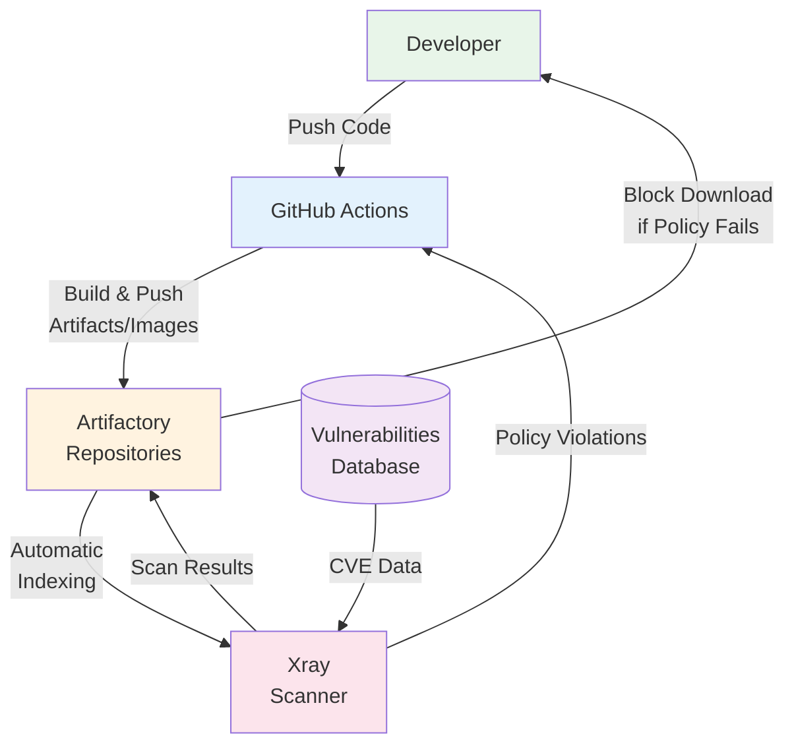

# Day 4 — SonarQube and Xray

## Objectives

- Understand code quality and security scanning
- Run local and CI analyses with SonarQube
- Scan dependencies and artifacts with Xray
- Integrate results into GitHub and CI pipelines

---

# SonarQube — overview

- Code quality: bugs, code smells, vulnerabilities
- Quality profiles and rules
- Quality gates (pass/fail criteria)
- Languages: JS/TS, Java, Python, ...

---

# SonarQube — local setup

- Run SonarQube locally (Docker)

```sh
# minimal local run
docker run -d --name sonarqube -p 9000:9000 sonarqube:lts
```

- Configure project, generate token

---

# SonarQube — analyze a Node.js project

```sh
# with sonar-scanner CLI
sonar-scanner \
  -Dsonar.projectKey=myapp \
  -Dsonar.sources=src \
  -Dsonar.tests=test \
  -Dsonar.host.url=http://localhost:9000 \
  -Dsonar.login=$SONAR_TOKEN
```

- Review issues and quality gate in the UI

---

# SonarQube — GitHub Actions integration

```yaml
name: ci
on: [push, pull_request]
jobs:
  sonar:
    runs-on: ubuntu-latest
    steps:
      - uses: actions/checkout@v4
      - uses: actions/setup-node@v4
        with: { node-version: 20 }
      - run: npm ci
      - name: SonarQube Scan
        uses: SonarSource/sonarqube-scan-action@v2
        env:
          SONAR_TOKEN: ${{ secrets.SONAR_TOKEN }}
          SONAR_HOST_URL: ${{ secrets.SONAR_HOST_URL }}
```

---

# Xray — overview

- Dependency and artifact scanning (SCA + container images)
- Vulnerabilities (CVEs), licenses, policies
- Works with Artifactory repositories

---

# Xray — usage patterns

- CI scan of package manifests (npm, Maven, etc.)
- Image scan after build (SBOM, CVEs)
- Policy enforcement: block downloads/deployments

---

# Xray — GitHub Actions example

```yaml
jobs:
  scan-image:
    runs-on: ubuntu-latest
    steps:
      - uses: actions/checkout@v4
      - uses: docker/setup-buildx-action@v3
      - uses: docker/login-action@v3
        with:
          registry: ${{ secrets.ARTI_REGISTRY }}
          username: ${{ secrets.ARTI_USER }}
          password: ${{ secrets.ARTI_PASSWORD }}
      - name: Build image
        run: docker build -t ${{ secrets.ARTI_REGISTRY }}/myorg/app:${{ github.sha }} .
      - name: Push image
        run: docker push ${{ secrets.ARTI_REGISTRY }}/myorg/app:${{ github.sha }}
      - name: Xray scan
        uses: jfrog/setup-jfrog-cli@v4
      - run: |
          jf rt c --url=${{ secrets.ARTI_URL }} --user=${{ secrets.ARTI_USER }} --password=${{ secrets.ARTI_PASSWORD }} --interactive=false
          jf xr s ${{ secrets.ARTI_REGISTRY }}/myorg/app:${{ github.sha }} --format simple
```

---
layout: section
---

# Artifactory + Xray Integration

---

# Artifactory + Xray Architecture



- Xray continuously scans all artifacts stored in Artifactory
- Integration is seamless and automatic

---

# Scanning Artifacts in Artifactory

## Automatic Scanning

- Xray indexes all repositories configured in watches
- Scans happen automatically when artifacts are uploaded
- Results are available in both Xray and Artifactory UIs

## What Gets Scanned

- **Dependencies**: npm packages, Maven JARs, Python wheels, etc.
- **Container Images**: Docker layers, base images, application layers
- **Build Artifacts**: Generated during CI/CD pipelines

## Scan Results Include

- CVE vulnerabilities with severity scores
- License compliance issues
- Software Bill of Materials (SBOM)
- Component dependency graph

---

# Policy Enforcement in Artifactory

## Watch Configuration

- Define **which** repositories to monitor
- Filter by name patterns (e.g., `*-prod`, `docker-release-*`)

## Policy Rules

```yaml
Policy: Production Security
Rules:
  - Block: Critical vulnerabilities (CVSS ≥ 9.0)
  - Warn: High vulnerabilities (CVSS ≥ 7.0)
  - Block: GPL licenses
  - Warn: Unapproved licenses
```

## Enforcement Actions

- **Block**: Prevent download/deployment of violating artifacts
- **Warn**: Allow but notify team of issues
- **Notify**: Send alerts to Slack, email, webhooks

---
layout: section
---

# Hands-on Exercises

---

# Exercise 4: Container Scanning with Artifactory

**Duration**: 30 minutes

**Objective**: Scan a Docker container for vulnerabilities using Xray + Artifactory

## Steps

1. Build Docker image from `exercises/nodejs_server`
2. Tag image for Artifactory registry
3. Push to Artifactory docker repository
4. Configure Xray watch for the repository
5. View scan results in Xray UI
6. Identify top 3 vulnerabilities
7. Review SBOM (Software Bill of Materials)

**Deliverables**: Scanned image with vulnerability report

---

# Exercise 5: Policy Configuration with Artifactory

**Duration**: 30 minutes

**Objective**: Configure Xray policies to enforce security rules

## Steps

1. Create new Xray Watch for `docker-local` repository
2. Create Policy "Production Security" with rules:
   - Block critical vulnerabilities (CVSS ≥ 9.0)
   - Warn on high vulnerabilities (CVSS ≥ 7.0)
   - Block GPL licenses
3. Assign policy to watch
4. Push image with known vulnerabilities
5. Observe policy violation and blocked download
6. Review violation report
7. Create remediation plan

**Deliverables**: Working policy with enforcement

---

# Best practices

- Treat quality gate failure as build failure
- Keep rulesets lean and team-agreed
- Triage vulnerabilities; fix or suppress with justification
- Automate reports in PRs and releases
- Configure Xray watches for production repositories
- Enforce policies at artifact upload time
- Regular review and update of security policies
