```mermaid
flowchart TB
    subgraph Developer["Developer Workflow"]
        Code[Write Code]
        Commit[Git Commit]
        PR[Create Pull Request]
    end
    
    subgraph CI["CI/CD Pipeline"]
        Trigger[Pipeline Trigger]
        Checkout[Checkout Code]
        Build[Build Application]
        UnitTest[Run Unit Tests]
        Coverage[Generate Coverage<br/>JaCoCo/Istanbul/pytest-cov]
        SonarScan[SonarQube Scan<br/>sonar-scanner]
    end
    
    subgraph Quality["Quality Analysis"]
        SonarServer[SonarQube Server<br/>Process Results]
        QualityGate{Quality Gate<br/>Evaluation}
        PRDecorate[PR Decoration<br/>GitHub Comment]
    end
    
    subgraph Deployment["Deployment Stage"]
        Deploy[Deploy to Environment]
        Monitor[Monitor Metrics]
    end
    
    subgraph Feedback["Feedback Loop"]
        BlockPR[❌ Block PR Merge]
        Notify[📧 Notify Team]
        Improve[Fix Quality Issues]
    end
    
    Code --> Commit
    Commit --> PR
    PR --> Trigger
    Commit --> Trigger
    
    Trigger --> Checkout
    Checkout --> Build
    Build --> UnitTest
    UnitTest --> Coverage
    Coverage --> SonarScan
    
    SonarScan -->|Upload Results| SonarServer
    SonarServer --> QualityGate
    QualityGate -->|PR Context| PRDecorate
    
    QualityGate -->|✅ Pass| Deploy
    Deploy --> Monitor
    
    QualityGate -->|❌ Fail| BlockPR
    BlockPR --> Notify
    Notify --> Improve
    Improve -.->|Re-commit| Code
    
    style SonarScan fill:#e1f5ff
    style SonarServer fill:#e1f5ff
    style QualityGate fill:#fff3e0
    style Deploy fill:#e8f5e9
    style BlockPR fill:#ffebee
    style PRDecorate fill:#fff9c4
```

# Day 4 — SonarQube and Xray

## Objectives

- Understand code quality and security scanning
- Run local and CI analyses with SonarQube
- Scan dependencies and artifacts with Xray
- Integrate results into GitHub and CI pipelines

---

# Prerequisites

## Required Knowledge
- Basic understanding of CI/CD pipelines (Day 3)
- Familiarity with GitHub Actions
- Docker basics
- Understanding of software development lifecycle

## Tools Needed
- Docker installed and running
- GitHub account with repository access
- Access to Artifactory/Xray (for exercises)
- sonar-scanner CLI (or use npx)

## Time Allocation
- **Morning:** SonarQube (3-4 hours)
- **Afternoon:** Xray (3-4 hours)

---

# Why Code Quality and Security Matter

## The Challenge

Software defects cost the global economy **$2.08 trillion** annually (2020 study)

## Key Risks

- **Security Breaches:** Unpatched vulnerabilities lead to data breaches
- **Technical Debt:** Poor code quality slows development by 20-40%
- **Compliance:** Regulatory requirements (GDPR, SOX, HIPAA)
- **Customer Trust:** Quality issues damage reputation

## DevOps Impact

Traditional approach: Find issues late (QA or production)  
**Modern approach:** Shift-left - catch issues during development

---

# DevSecOps Approach

## Security as Code


## Principles

1. **Automate** security and quality checks
2. **Shift-left** - catch issues early
3. **Continuous** monitoring and feedback
4. **Everyone** responsible for quality

---

# Tools Landscape Overview

## Code Quality Tools

- **SonarQube/SonarCloud:** Static code analysis
- **ESLint/PMD/Pylint:** Language-specific linters
- **CodeClimate:** Maintainability analysis

## Security Scanning Tools

- **Xray/Snyk/Aqua:** Dependency & container scanning (SCA)
- **Trivy:** Container vulnerability scanner
- **OWASP Dependency-Check:** Open-source alternative

## Why SonarQube + Xray?

- **Comprehensive:** Code quality + dependency security
- **Enterprise-ready:** Scalable, auditable, policy-based
- **Integration:** CI/CD, Artifactory, GitHub

---
layout: center
---

# Morning Session: SonarQube

Code Quality and Static Analysis

---

# SonarQube — overview

- Code quality: bugs, code smells, vulnerabilities
- Quality profiles and rules
- Quality gates (pass/fail criteria)
- Languages: JS/TS, Java, Python, Go, C#, PHP, and more

## Key Features

- **Continuous Inspection:** Automated code review
- **Quality Gates:** Pass/fail criteria for deployments
- **Security Hotspots:** Identify risky code patterns
- **Technical Debt:** Measure and track maintainability
- **Integration:** IDE, CI/CD, pull requests

---
layout: center
---

# SonarQube Architecture


**Components:**
- **Scanners:** Analyze source code and send results (CLI, Maven, Gradle, IDE plugins)
- **Web Server:** REST API and web UI on port 9000
- **Compute Engine:** Background processing of analysis reports
- **Search Engine:** Elasticsearch for fast querying
- **Database:** PostgreSQL stores projects, issues, metrics, users, configurations

---

# SonarQube Quality Metrics

## Reliability (Bugs)
- Code that will likely fail at runtime
- Examples: null pointer dereference, resource leak, division by zero

## Security (Vulnerabilities)
- Code that could be exploited by attackers
- Examples: SQL injection, XSS, weak cryptography

## Maintainability (Code Smells)
- Confusing, hard-to-maintain code
- Examples: duplicated code, complex methods, unused variables

## Coverage
- Percentage of code tested by automated tests
- Target: typically 80%+ for new code

## Duplication
- Repeated code blocks (copy-paste code)
- Target: < 3%

---

# Quality Profiles

## What is a Quality Profile?

A set of **rules** applied during code analysis

## Default Profiles

- **Sonar way:** Recommended baseline (moderate)
- **Sonar way recommended:** Extended rules
- **Custom:** Team-specific rules

## Configuration

```yaml
# Example: Enable/disable specific rules
Rules:
  - javascript:S1135  # TODO tags should be tracked
  - javascript:S2870  # Delete operators should not be used
  - java:S1192       # String literals should not be duplicated
```

## Best Practices

- Start with defaults, customize gradually
- Involve the team in rule selection
- Review and update quarterly

---

# Quality Gates Configuration

## What is a Quality Gate?

Pass/fail criteria that determines if code is **production-ready**

## Default Gate: "Sonar way"

| Metric | Condition |
|--------|-----------|
| Coverage on New Code | ≥ 80% |
| Duplicated Lines on New Code | ≤ 3% |
| Maintainability Rating on New Code | ≤ A |
| Reliability Rating on New Code | ≤ A |
| Security Rating on New Code | ≤ A |

## Custom Gates

Create stricter or more lenient gates based on:
- Project maturity
- Team capacity
- Risk tolerance

---

# Quality Gates: New Code vs Overall Code

## Why Focus on New Code?

**Water Leak Principle:** Stop new leaks first!

- Legacy code may have many issues
- Impossible to fix everything at once
- Gradual improvement without blocking development

## Configuration Strategy

### New Code Conditions (Strict)
- Coverage on new code ≥ 80%
- Bugs in new code = 0
- Vulnerabilities in new code = 0
- Code Smells in new code ≤ 5

### Overall Code Conditions (Relaxed)
- Coverage ≥ 50%
- Security Hotspots Reviewed = 100%
- Allow gradual improvement

**Result:** Quality improves over time without disrupting velocity

---

# SonarQube Project Settings

## Key Configuration

```properties
# sonar-project.properties
sonar.projectKey=my-app
sonar.projectName=My Application
sonar.projectVersion=1.0.0

# Source code
sonar.sources=src
sonar.tests=test

# Exclusions
sonar.exclusions=**/node_modules/**,**/dist/**
sonar.test.inclusions=**/*.test.js,**/*.spec.js

# Coverage
sonar.javascript.lcov.reportPaths=coverage/lcov.info
```

## Language-Specific Settings

- **JavaScript/TypeScript:** Coverage reports, test paths
- **Java:** Maven/Gradle integration, JaCoCo reports
- **Python:** pytest coverage, exclusions

---

# SonarQube — local setup

## Step 1: Start SonarQube with Docker

```sh
# Run SonarQube locally
docker run -d --name sonarqube \
  -p 9000:9000 \
  -e SONAR_ES_BOOTSTRAP_CHECKS_DISABLE=true \
  sonarqube:lts
```

## Step 2: Access and Configure

1. Wait 2-3 minutes for startup
2. Open http://localhost:9000
3. Login: **admin** / **admin**
4. Change password when prompted

## Step 3: Create Project

1. Click "Create Project" → "Manually"
2. Set project key and display name
3. Generate authentication token
4. Save token securely

**Tip:** Use Docker Compose for persistent setup (see exercises)

---

# SonarQube UI Navigation

## Dashboard Overview

- **Overview:** Quality gate status, metrics summary
- **Issues:** Browse bugs, vulnerabilities, code smells
- **Measures:** Detailed metrics and trends
- **Activity:** Analysis history
- **Administration:** Settings, quality profiles, gates

## Issue Details

Each issue shows:
- **Severity:** Blocker, Critical, Major, Minor, Info
- **Type:** Bug, Vulnerability, Code Smell
- **Effort:** Estimated time to fix
- **Location:** File, line number, code snippet

## Workflow

1. Analyze code → View issues
2. Assign issues to developers
3. Mark as false positive or won't fix (with justification)
4. Fix and re-analyze

---

# Technical Debt Management

## What is Technical Debt?

Estimated time required to fix all maintainability issues

## SonarQube Calculation

```
Technical Debt = Sum of remediation effort for all code smells
```

Example:
- 50 code smells × 10 min avg = **8 hours** of debt

## Debt Ratio

```
Debt Ratio = Technical Debt / Development Time
```

- < 5%: **Excellent**
- 5-10%: **Good**
- 10-20%: **Moderate**
- > 20%: **High** (action needed)

## Managing Debt

- Focus on new code (prevent growth)
- Dedicate time each sprint to reduce debt
- Track trend over time

---

# Branch Analysis

## Why Analyze Branches?

- Compare feature branches to main
- See quality impact before merge
- Enable PR decoration

## Configuration

```yaml
# GitHub Actions - analyze PR
on:
  pull_request:
    branches: [main]

jobs:
  sonar:
    steps:
      - uses: actions/checkout@v4
        with:
          fetch-depth: 0  # Full history for blame
      - name: SonarQube Scan
        env:
          SONAR_TOKEN: ${{ secrets.SONAR_TOKEN }}
          GITHUB_TOKEN: ${{ secrets.GITHUB_TOKEN }}
        run: |
          sonar-scanner \
            -Dsonar.pullrequest.key=${{ github.event.number }} \
            -Dsonar.pullrequest.branch=${{ github.head_ref }} \
            -Dsonar.pullrequest.base=${{ github.base_ref }}
```

## Benefits

- See quality delta in PR
- Block merges that degrade quality
- Faster feedback loop

---

# SonarQube — analyze a Node.js project

## Using sonar-scanner CLI

```sh
# Install sonar-scanner (or use npx)
npm install -g sonar-scanner

# Run analysis
sonar-scanner \
  -Dsonar.projectKey=myapp \
  -Dsonar.sources=src \
  -Dsonar.tests=test \
  -Dsonar.javascript.lcov.reportPaths=coverage/lcov.info \
  -Dsonar.host.url=http://localhost:9000 \
  -Dsonar.login=$SONAR_TOKEN
```

## Using npx (no installation needed)

```sh
npx sonar-scanner \
  -Dsonar.projectKey=myapp \
  -Dsonar.host.url=http://localhost:9000 \
  -Dsonar.login=$SONAR_TOKEN
```

## Review Results

1. Check console for "EXECUTION SUCCESS"
2. Open SonarQube UI
3. Navigate to project
4. Review quality gate status and issues

---

# CI/CD Integration Concepts

## Integration Points

1. **Code Commit:** Trigger analysis on push
2. **Pull Request:** Analyze and decorate PR
3. **Merge to Main:** Full analysis with quality gate
4. **Scheduled:** Daily/weekly analysis for monitoring

## Workflow



## Best Practices

- **Fail fast:** Make quality gate blocking to prevent bad code from merging
- **Fast feedback:** Run scans in parallel with other CI checks
- **Comprehensive:** Include coverage reports for accurate quality metrics
- **PR Decoration:** Show quality status directly in pull requests

---

# SonarQube — GitHub Actions integration

## Basic Configuration

```yaml
name: SonarQube Scan
on:
  push:
    branches: [main]
  pull_request:
    branches: [main]

jobs:
  sonar:
    runs-on: ubuntu-latest
    steps:
      - uses: actions/checkout@v4
        with:
          fetch-depth: 0  # Full history for better analysis
      
      - uses: actions/setup-node@v4
        with:
          node-version: 20
      
      - name: Install dependencies
        run: npm ci
      
      - name: Run tests with coverage
        run: npm test -- --coverage
      
      - name: SonarQube Scan
        uses: SonarSource/sonarqube-scan-action@v2
        env:
          SONAR_TOKEN: ${{ secrets.SONAR_TOKEN }}
          SONAR_HOST_URL: ${{ secrets.SONAR_HOST_URL }}
```

## Required Secrets

- `SONAR_TOKEN`: Generated from SonarQube
- `SONAR_HOST_URL`: SonarQube server URL

---

# Pull Request Decoration

## What is PR Decoration?

Quality gate status and metrics displayed directly in GitHub PR

## Setup

1. **SonarQube:** Configure GitHub integration (Settings → ALM)
2. **GitHub:** Add SonarQube app or use webhook
3. **Workflow:** Include pull request trigger

## PR Comments Show

- Quality gate status (Pass/Fail)
- New bugs, vulnerabilities, code smells
- Coverage on new code
- Duplication metrics
- Link to detailed SonarQube report

## Benefits

- **Visibility:** Developers see issues immediately
- **Context:** Review code quality alongside code changes
- **Enforcement:** Branch protection can require passing quality gate

---

# Exercise 1: Local SonarQube Setup

## Duration: 45 minutes

## Objective
Get hands-on experience with local SonarQube installation and first scan

## Steps
1. Start SonarQube using Docker
2. Access http://localhost:9000 and login
3. Create new project manually
4. Generate project token
5. Navigate to `exercises/nodejs_server`
6. Create `sonar-project.properties`
7. Run sonar-scanner with token
8. Review results in SonarQube UI
9. Explore bugs, code smells, security issues

## Deliverables
- Running SonarQube instance
- Scanned nodejs_server project
- Understanding of basic issue types

**Instructor will provide detailed walkthrough**

---

# Exercise 2: Quality Gates Configuration

## Duration: 45 minutes

## Objective
Configure custom quality gates and see build pass/fail based on code quality

## Steps
1. In SonarQube, go to Quality Gates
2. Create new gate "Strict Quality"
3. Add conditions:
   - Coverage on new code > 80%
   - Bugs = 0
   - Code Smells < 5
   - Security Hotspots reviewed = 100%
4. Assign gate to nodejs_server project
5. Modify code to add bugs (e.g., unused variables)
6. Re-scan project and observe failed gate
7. Fix the bugs
8. Re-scan to see passing gate

## Deliverables
- Custom quality gate configured
- Understanding of pass/fail criteria
- Experience fixing quality gate failures

---

# Exercise 3: GitHub Actions Integration

## Duration: 45 minutes

## Objective
Integrate SonarQube scanning into GitHub Actions workflow

## Steps
1. Fork `exercises/nodejs_server` to personal GitHub
2. Create SonarCloud account or use SonarQube server
3. Add repository secrets: `SONAR_TOKEN`, `SONAR_HOST_URL`
4. Create `.github/workflows/sonar.yml`
5. Commit and push workflow
6. Verify workflow runs successfully
7. Create a PR with new code
8. Observe PR decoration with quality gate status

## Deliverables
- Working GitHub Actions workflow
- PR decoration enabled
- Understanding of CI integration

**Sample workflow provided in exercises folder**

---
layout: center
---

# Artifactory Integration

Connecting SonarQube with Artifact Management

---

# Artifactory + SonarQube Integration

## Integration Patterns

### 1. Metadata Publishing
- Store SonarQube quality metrics as artifact properties
- Track quality trends alongside artifacts

### 2. Quality Gate Enforcement
- Block artifact promotion if quality gate fails
- Ensure only quality code reaches production repos

### 3. Build Info Integration
- Link SonarQube analysis to build metadata
- Full traceability from code to deployment

## Configuration Example

```groovy
// Jenkinsfile with Artifactory + SonarQube
stage('SonarQube') {
  def scannerHome = tool 'SonarScanner'
  withSonarQubeEnv('SonarQube') {
    sh "${scannerHome}/bin/sonar-scanner"
  }
}

stage('Quality Gate') {
  timeout(time: 10, unit: 'MINUTES') {
    waitForQualityGate abortPipeline: true
  }
}

stage('Publish to Artifactory') {
  // Only reached if quality gate passes
  server.upload spec: uploadSpec
}
```

---

# Use Cases

## Scenario 1: Npm Package Publication

```yaml
# GitHub Actions
- name: SonarQube Scan
  uses: SonarSource/sonarqube-scan-action@v2

- name: Quality Gate Check
  run: |
    status=$(curl -u $SONAR_TOKEN: \
      "$SONAR_HOST_URL/api/qualitygates/project_status?projectKey=$PROJECT_KEY")
    if [[ $status == *"ERROR"* ]]; then exit 1; fi

- name: Publish to Artifactory
  run: npm publish --registry=$ARTIFACTORY_REGISTRY
```

## Scenario 2: Docker Image Promotion

- Build image → dev registry
- Run SonarQube scan
- If quality gate passes → promote to prod registry
- If fails → block promotion, notify team

## Benefits

- **Automated Quality Control:** No manual intervention
- **Audit Trail:** Every artifact linked to quality metrics
- **Risk Reduction:** Bad code never reaches production

---
layout: center
---

# Afternoon Session: Xray

Dependency and Container Security Scanning

---

# Xray — overview

- **JFrog Xray:** Universal artifact security and compliance analysis
- Dependency and artifact scanning (SCA + container images)
- Vulnerabilities (CVEs), licenses, policies
- Works with Artifactory repositories

## What is SCA?

**Software Composition Analysis** - analyze third-party and open-source components

## Key Capabilities

- **Vulnerability Detection:** Scan for known CVEs
- **License Compliance:** Identify licensing issues
- **Policy Enforcement:** Automated blocking/warnings
- **Impact Analysis:** Understand vulnerability reach
- **Remediation:** Suggested fixes and upgrades

---
layout: center
---

# Xray Architecture


**Components:**
- **Indexer:** Analyzes artifacts and extracts metadata (dependencies, licenses)
- **Scanner:** Matches components against vulnerability databases
- **Policy Engine:** Evaluates violations and triggers actions
- **Impact Analysis:** Builds dependency graphs to show vulnerability reach
- **Vulnerability DB:** CVE, NVD, VulnDB, and JFrog Security Research data
- **Watches:** Define which artifacts/repositories to monitor
- **Policies:** Define security/license rules and enforcement actions

---

# Software Composition Analysis (SCA)

## What Does SCA Analyze?

### Package Manifests
- **npm:** package.json, package-lock.json
- **Maven:** pom.xml
- **Python:** requirements.txt, Pipfile
- **Go:** go.mod, go.sum

### Container Images
- **Layers:** Each layer scanned separately
- **OS Packages:** System libraries (apt, yum)
- **Application Dependencies:** Bundled libraries

## How It Works

1. **Parse Manifest:** Extract dependencies
2. **Build Dependency Graph:** Including transitive deps
3. **Match CVE Database:** Check against known vulnerabilities
4. **Calculate Risk:** CVSS scores, exploitability
5. **Report Findings:** Vulnerabilities, licenses, remediation

---

# Container Image Scanning

## What is Scanned?

```dockerfile
FROM node:20-alpine          # Base image vulnerabilities
WORKDIR /app
COPY package*.json ./
RUN npm ci --only=production # npm packages vulnerabilities
COPY . .
EXPOSE 3000
CMD ["node", "server.js"]
```

### Scan Targets
1. **Base Image:** OS packages (Alpine, Ubuntu, etc.)
2. **Application Layer:** npm, pip, Maven dependencies
3. **Custom Binaries:** If any compiled code included

## SBOM (Software Bill of Materials)

Complete inventory of components in the image:
- Package name and version
- License information
- Known vulnerabilities
- Dependency tree

---

# Understanding CVE Severity

## CVSS Score (0-10)

| Score | Severity | Recommended Action | SLA |
|-------|----------|-------------------|-----|
| 9.0-10.0 | **Critical** | Fix immediately | 24-48 hours |
| 7.0-8.9 | **High** | Fix within days | 1 week |
| 4.0-6.9 | **Medium** | Fix within weeks | 1 month |
| 0.1-3.9 | **Low** | Evaluate and consider fixing | Backlog |

## CVSS Factors

- **Attack Vector:** Network, Adjacent, Local, Physical
- **Attack Complexity:** Low, High
- **Privileges Required:** None, Low, High
- **User Interaction:** None, Required
- **Impact:** Confidentiality, Integrity, Availability

## Example: Critical CVE

**CVE-2021-44228 (Log4Shell)**
- CVSS: **10.0** (Critical)
- Remote Code Execution
- No authentication required
- Widely exploited in the wild

---

# Vulnerability Remediation Strategies

## 1. Upgrade to Fixed Version

```bash
# Example: Upgrade vulnerable package
npm update lodash@4.17.21
```

**Best when:** Fix is available and compatible

## 2. Apply Security Patch

```bash
# Example: Apply backported patch
npm install lodash@4.17.20-security-patch
```

**Best when:** Major upgrade is risky, patch available

## 3. Replace with Alternative

```bash
# Example: Switch to alternative package
npm uninstall moment
npm install dayjs
```

**Best when:** No fix available, alternative exists

## 4. Mitigate with Configuration

```yaml
# Example: Disable vulnerable feature
config:
  enableXmlParsing: false
```

**Best when:** Vulnerability in unused feature

## 5. Accept Risk (with justification)

- Document why vulnerability is not exploitable in your context
- Set review date
- Monitor for changes

---

# Xray Watches

## What is a Watch?

Defines **what** to scan and monitor

## Watch Configuration

```yaml
Watch: "Production Docker Images"
Resources:
  - Repository: docker-prod
    Filters:
      - path-pattern: "myorg/**"
      - tag-pattern: "v*.*.*"
Policies:
  - Security Policy
  - License Policy
```

## Types of Resources

- **Repositories:** Scan all artifacts in repo
- **Builds:** Scan specific build outputs
- **Release Bundles:** Scan promoted bundles

## Watch Triggers

- **On Artifact Upload:** Immediate scan
- **On Policy Change:** Re-scan existing artifacts
- **Scheduled:** Daily/weekly scans

---

# Xray Policies and Rules

## Policy Structure

```mermaid
flowchart TB
    subgraph WatchDef["Watch Definition"]
        Watch[Watch: Production Artifacts]
        WatchRepo1[Repository: docker-prod-local]
        WatchRepo2[Repository: npm-prod-local]
        WatchFilter[Filters:<br/>path: myorg/**<br/>tag: v*.*.*]
    end
    
    subgraph PolicyDef["Policy Definition"]
        Policy[Policy: Security Policy]
        Rule1[Rule: Critical CVE]
        Rule2[Rule: High CVE]
        Rule3[Rule: License Compliance]
        
        Cond1[Condition:<br/>CVSS ≥ 9.0<br/>Type: Security]
        Cond2[Condition:<br/>CVSS ≥ 7.0<br/>Type: Security]
        Cond3[Condition:<br/>License: GPL, AGPL]
        
        Action1[Action:<br/>❌ Block Download<br/>📧 Email<br/>🎫 Create Jira]
        Action2[Action:<br/>⚠️ Generate Warning<br/>📧 Email]
        Action3[Action:<br/>❌ Block Download<br/>⚡ Notify Legal]
    end
    
    subgraph Execution["Policy Execution"]
        Artifact[Artifact Upload/Scan]
        Evaluate{Evaluate<br/>Against Policy}
        Violation[Policy Violation<br/>Detected]
        Enforce[Enforce Actions]
    end
    
    Watch --> WatchRepo1
    Watch --> WatchRepo2
    Watch --> WatchFilter
    Watch -.->|Assigned| Policy
    
    Policy --> Rule1
    Policy --> Rule2
    Policy --> Rule3
    
    Rule1 --> Cond1
    Rule1 --> Action1
    Rule2 --> Cond2
    Rule2 --> Action2
    Rule3 --> Cond3
    Rule3 --> Action3
    
    WatchRepo1 --> Artifact
    WatchRepo2 --> Artifact
    Artifact --> Evaluate
    Policy -.->|Rules| Evaluate
    Evaluate -->|Violation Found| Violation
    Violation --> Enforce
    Action1 -.-> Enforce
    Action2 -.-> Enforce
    Action3 -.-> Enforce
    
    style Watch fill:#e8f5e9
    style Policy fill:#fff3e0
    style Rule1 fill:#ffebee
    style Rule2 fill:#fff9c4
    style Rule3 fill:#e1f5ff
    style Action1 fill:#ffebee
    style Action2 fill:#fff9c4
    style Enforce fill:#f3e5f5
```



## How It Works

**1. Watch** → Defines WHAT to monitor (repositories, paths, tags)
**2. Policy** → Defines RULES for security and compliance
**3. Rules** → Combine CONDITIONS with ACTIONS
**4. Conditions** → What to check (CVSS score, license type, CVE age)
**5. Actions** → What to do when violated (block, warn, notify)

## Rule Components

1. **Condition:** What to check (CVE score, license type, malicious packages)
2. **Action:** What to do (block, warn, create ticket, notify)
3. **Grace Period:** Optional time before enforcement (e.g., 7 days)
4. **Exemptions:** Ignore specific CVEs with justification

## Example Rule

```yaml
Rule: "Block Critical Vulnerabilities in Production"
Conditions:
  - CVSS Score ≥ 9.0
  - Issue Type: Security
  - Applies to: All packages
Actions:
  - Block Download (HTTP 403)
  - Send Email to: security@company.com
  - Create Jira Ticket in: SEC project
  - Webhook: Slack #security-alerts
Grace Period: None (immediate enforcement)
```

---

# License Compliance

## Why Track Licenses?

- **Legal Risk:** Some licenses require source disclosure
- **Commercial Restrictions:** GPL, AGPL incompatible with proprietary software
- **Compliance:** Corporate policies, customer requirements

## License Categories

| License | Type | Risk | Commercial Use |
|---------|------|------|----------------|
| MIT, Apache 2.0 | Permissive | Low | Yes |
| LGPL | Weak Copyleft | Medium | Conditions apply |
| GPL, AGPL | Strong Copyleft | High | Restricted |
| Proprietary | Custom | Varies | Review terms |

## Xray License Scanning

```yaml
Policy: "License Compliance"
Rule: "Block GPL in Production"
Conditions:
  - License Type: GPL
  - License Type: AGPL
Actions:
  - Block Download
  - Notify Legal Team
```

## Best Practices

- Define acceptable licenses early
- Review dependencies before adding
- Regular license audits

---

# Artifactory + Xray Integration

## Automatic Scanning

```mermaid
flowchart TB
    subgraph Build["Build Process"]
        BuildApp[Build Application<br/>Compile, Package]
        RunTests[Run Tests<br/>Unit & Integration]
        CreateArtifact[Create Artifact<br/>JAR, NPM, Docker Image]
    end
    
    subgraph Artifactory["Artifactory Repository"]
        Upload[Upload Artifact<br/>POST /api/docker/...]
        Store[(Artifact Storage<br/>Binary Repository)]
        Metadata[Artifact Properties<br/>buildInfo, metadata]
    end
    
    subgraph Xray["Xray Analysis"]
        Watch{Watch<br/>Triggered?}
        Index[Index Artifact<br/>Extract Dependencies]
        Scan[Vulnerability Scan<br/>CVE Matching]
        PolicyCheck{Policy<br/>Evaluation}
    end
    
    subgraph Actions["Enforcement Actions"]
        Pass[✅ Artifact Available<br/>Download Permitted]
        Block[❌ Block Download<br/>HTTP 403]
        Warn[⚠️ Warning<br/>Allow with Alert]
    end
    
    subgraph Notifications["Notifications"]
        Email[📧 Email Alert]
        Webhook[🔔 Webhook<br/>Slack, Teams, Jira]
        Dashboard[📊 Dashboard Update]
    end
    
    BuildApp --> RunTests
    RunTests --> CreateArtifact
    CreateArtifact --> Upload
    Upload --> Store
    Upload --> Metadata
    
    Store -->|Upload Event| Watch
    Watch -->|Yes| Index
    Index --> Scan
    Scan --> PolicyCheck
    
    PolicyCheck -->|No Violations| Pass
    PolicyCheck -->|Critical/High| Block
    PolicyCheck -->|Warning Level| Warn
    
    Pass --> Store
    Block -.->|Reject Download| Store
    Warn --> Store
    
    Block --> Email
    Block --> Webhook
    Warn --> Dashboard
    Pass --> Dashboard
    
    style Upload fill:#e1f5ff
    style Scan fill:#fff3e0
    style Block fill:#ffebee
    style Pass fill:#e8f5e9
    style Warn fill:#fff9c4
    style Index fill:#e1f5ff
```



## Repository Configuration

1. **Enable Xray Indexing** on Artifactory repository
2. **Create Watch** to monitor the repository
3. **Assign Policies** to define rules and actions
4. **Automatic Scanning:** Artifacts scanned immediately on upload

## Download Blocking

When policy violation is detected:
- **Blocking Policy:** Downloads return HTTP 403 Forbidden
- **Warning Policy:** Downloads allowed with warning message
- **Notification:** Team alerted via email, Slack, Jira, or webhooks
- **Grace Period:** Optional delay before enforcement (e.g., 7 days to remediate)

---

# CI/CD Integration with Xray

## GitHub Actions Integration

```yaml
jobs:
  scan-and-deploy:
    runs-on: ubuntu-latest
    steps:
      - uses: actions/checkout@v4
      
      - name: Build Docker Image
        run: |
          docker build -t myapp:${{ github.sha }} .
      
      - name: Setup JFrog CLI
        uses: jfrog/setup-jfrog-cli@v4
        env:
          JF_URL: ${{ secrets.ARTIFACTORY_URL }}
          JF_ACCESS_TOKEN: ${{ secrets.ARTIFACTORY_TOKEN }}
      
      - name: Push to Artifactory
        run: |
          jf docker push myregistry/myapp:${{ github.sha }}
      
      - name: Scan with Xray
        run: |
          jf docker scan myregistry/myapp:${{ github.sha }}
      
      - name: Fail on High/Critical
        run: |
          # Get scan results and fail if critical/high found
          jf scan --fail=true --min-severity=high
```

## Integration Benefits

- **Early Detection:** Find vulnerabilities before deployment
- **Automated Blocking:** Prevent vulnerable artifacts from reaching production
- **Fast Feedback:** Developers notified immediately

---

# Scan Results Interpretation

## Sample Xray Report

```
┌─────────────────────────┬──────────┬────────────┬──────────────────┐
│ Component               │ Severity │ CVE        │ Fixed Version    │
├─────────────────────────┼──────────┼────────────┼──────────────────┤
│ lodash@4.17.19          │ Critical │ CVE-2021-1 │ 4.17.21          │
│ express@4.16.0          │ High     │ CVE-2022-2 │ 4.18.2           │
│ axios@0.21.1            │ Medium   │ CVE-2021-3 │ 0.21.2           │
└─────────────────────────┴──────────┴────────────┴──────────────────┘

Total: 3 vulnerabilities
  Critical: 1
  High: 1
  Medium: 1
  Low: 0
```

## What to Do

1. **Critical/High:** Fix immediately
   - Update to fixed version
   - Or find alternative package
2. **Medium:** Plan fix in next sprint
3. **Low:** Add to backlog

## Dependency Tree Analysis

```
myapp@1.0.0
├── express@4.16.0 (vulnerable)
│   ├── body-parser@1.18.3
│   └── accepts@1.3.5
└── lodash@4.17.19 (vulnerable)
```

Xray shows full dependency path to help understand impact

---

# Exercise 4: Container Image Scanning

## Duration: 30 minutes

## Objective
Scan a Docker container image for vulnerabilities using Xray

## Steps
1. Build Docker image from nodejs_server
   ```bash
   docker build -t myapp:latest .
   ```
2. Tag for Artifactory registry
   ```bash
   docker tag myapp:latest <artifactory-url>/docker-local/myapp:1.0.0
   ```
3. Login and push to Artifactory
   ```bash
   docker login <artifactory-url>
   docker push <artifactory-url>/docker-local/myapp:1.0.0
   ```
4. Configure Xray to scan docker-local repository
5. Trigger scan (or wait for automatic scan)
6. View scan results in Xray
7. Identify vulnerabilities by severity
8. Review SBOM (Software Bill of Materials)

## Deliverables
- Docker image scanned by Xray
- Understanding of vulnerability reports
- Knowledge of SBOM

---

# Exercise 5: Xray Policy Configuration

## Duration: 30 minutes

## Objective
Configure Xray policies to enforce security and compliance rules

## Steps
1. Create new Xray Watch for docker-local repository
2. Create new Policy "Production Security"
3. Add rules:
   - Block critical vulnerabilities (CVSS ≥ 9.0)
   - Warn on high vulnerabilities (CVSS ≥ 7.0)
   - Block GPL licenses
   - Warn on LGPL licenses
4. Assign policy to watch
5. Intentionally use a package with critical CVE
6. Rebuild and push image
7. Observe policy violation
8. Verify that download is blocked (HTTP 403)
9. Review violation report
10. Create remediation plan

## Deliverables
- Working Xray policy
- Understanding of policy enforcement
- Experience with violation handling

---
layout: center
---

# Best Practices and Wrap-up

Organizational Adoption and Continuous Improvement

---

# SonarQube Best Practices

## 1. Start Conservative, Tighten Gradually

- Begin with default quality gate
- Involve team in rule selection
- Increase standards as team matures

## 2. Focus on New Code

- Use "water leak" principle
- Don't block development on legacy debt
- Improve incrementally

## 3. Integrate Early in Development

- IDE plugins for instant feedback
- PR decoration for review-time checks
- Make quality gate blocking in CI/CD

## 4. Team Ownership

- Developers responsible for fixing issues
- Regular review of false positives
- Collaborative rule customization

## 5. Monitor and Adjust

- Track metrics over time
- Celebrate improvements
- Adjust standards based on reality

---

# Xray Best Practices

## 1. Define Clear Policies

- **Production:** Strict (block critical/high)
- **Staging:** Moderate (warn on high)
- **Development:** Lenient (warn only)

## 2. Automate Scanning

- Scan on every build
- Integrate with CI/CD
- Block promotions on violations

## 3. Prioritize Remediation

- **Critical in prod:** Emergency patch
- **High in prod:** Fix within days
- **Medium:** Next sprint
- **Low:** Backlog

## 4. License Management

- Define acceptable licenses upfront
- Review before adding dependencies
- Regular license audits

## 5. Keep Vulnerability Database Updated

- Xray updates daily from CVE feeds
- Review notifications regularly
- Stay informed on emerging threats

---

# Troubleshooting Guide

## SonarQube Issues

### Problem: Scanner can't connect to server
**Symptoms:** Connection timeout, 403/401 errors  
**Solutions:**
- Verify `SONAR_HOST_URL` is correct
- Check firewall rules allow port 9000
- Verify SonarQube server is running: `docker ps`
- Test authentication token is valid

### Problem: Quality gate fails unexpectedly
**Symptoms:** Gate fails but issues look minor  
**Solutions:**
- Review gate conditions carefully
- Check "New Code" period setting (default: previous version)
- Verify branch analysis is configured correctly
- Review actual vs expected metrics

### Problem: Coverage showing 0%
**Symptoms:** Tests run but coverage is 0%  
**Solutions:**
- Ensure test execution generates coverage reports
- Verify coverage report path: `sonar.javascript.lcov.reportPaths`
- Check coverage file exists and is in correct format
- For Java: ensure JaCoCo plugin is configured

---

# Troubleshooting Guide (continued)

## Xray Issues

### Problem: No vulnerabilities found
**Symptoms:** Scan completes but shows no results  
**Solutions:**
- Verify Xray indexing is complete (can take minutes)
- Check repository is configured for Xray scanning
- Ensure artifacts contain dependency manifests
- Review watch configuration includes the repository

### Problem: Policy not enforced
**Symptoms:** Violations shown but downloads not blocked  
**Solutions:**
- Verify watch is **active** (not paused)
- Check policy is assigned to the watch
- Ensure repository is in watch scope
- Verify action is "Block" not just "Warn"

### Problem: False positive vulnerabilities
**Symptoms:** CVEs reported for unused code  
**Solutions:**
- Ignore specific CVEs with written justification
- Update watch filters to exclude test dependencies
- Consider using runtime vs build-time scanning
- Contact Xray support for database corrections

---

# Organizational Adoption

## Implementation Roadmap

### Phase 1: Pilot (1-2 months)
- Select 2-3 projects
- Set up SonarQube and Xray
- Configure lenient quality gates
- Train pilot teams

### Phase 2: Expand (3-6 months)
- Roll out to more teams
- Refine quality gates based on learnings
- Establish policies and governance
- Create internal documentation

### Phase 3: Enforce (6-12 months)
- Make quality gates blocking
- Enforce policies organization-wide
- Regular reviews and adjustments
- Continuous improvement

## Success Factors

✅ **Executive Support:** Management buy-in essential  
✅ **Team Training:** Invest in education  
✅ **Gradual Rollout:** Don't boil the ocean  
✅ **Feedback Loops:** Listen and adapt  
✅ **Celebrate Wins:** Recognize improvements

---

# Summary and Resources

## What We Covered Today

### Morning: SonarQube
- Code quality and static analysis
- Quality profiles and gates
- Local and CI/CD integration
- Technical debt management

### Afternoon: Xray
- Dependency and container scanning
- CVE severity and remediation
- Policies and watches
- License compliance

## Key Takeaways

1. **Shift-left security** catches issues early
2. **Automate quality checks** in CI/CD
3. **Focus on new code** for continuous improvement
4. **Define clear policies** for enforcement
5. **Remediate based on risk** (CVSS scores)

---

# Resources and Next Steps

## Documentation

- **SonarQube Docs:** https://docs.sonarqube.org
- **SonarCloud:** https://sonarcloud.io
- **JFrog Xray Docs:** https://jfrog.com/help/r/jfrog-security-documentation
- **CVSS Calculator:** https://www.first.org/cvss/calculator

## Training Materials

- Exercise files: `exercises/nodejs_server/`
- Sample workflows: `.github/workflows/`
- Docker Compose files for local setup
- Configuration examples

## Day 5 Preview

Tomorrow we'll cover:
- Infrastructure as Code (Terraform)
- Configuration Management (Ansible)
- Kubernetes deployment pipelines

## Questions?

**Open discussion and Q&A**
