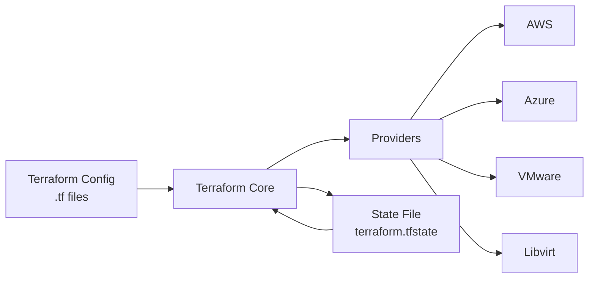
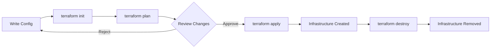

# Day 2 — Terraform basics

## Goal: Build infrastructure as code and prepare K8s nodes

**What we'll build today:**
- Automated VM provisioning with Terraform
- 3-node Kubernetes cluster infrastructure
- Cloud-init configuration for VM initialization
- Ansible inventory generation

**Prerequisites check:**
✅ Terraform ≥ 1.5.0 installed
✅ QEMU/KVM + libvirt configured
✅ 8+ GB RAM available
✅ Basic understanding of VMs and infrastructure

---

# What is Infrastructure as Code?

**Traditional Infrastructure Management:**
- Manual VM creation through GUI/CLI
- Snowflake servers (unique, undocumented configurations)
- Hard to replicate or recover
- No version history or audit trail
- Error-prone and time-consuming

**Infrastructure as Code (IaC) Approach:**
- Infrastructure defined in code files
- Automated provisioning and configuration
- Version-controlled and reviewable
- Reproducible environments
- Self-documenting infrastructure

---

# Benefits of Infrastructure as Code

**Version Control:**
- Track all infrastructure changes over time
- Code reviews before applying changes
- Easy rollback to previous configurations
- Collaboration through Git workflows

**Reproducibility:**
- Same code = same infrastructure every time
- Identical dev/staging/production environments
- Disaster recovery becomes code deployment

**Collaboration:**
- Teams work together on infrastructure
- Knowledge sharing through code
- Automated testing and validation

---

# Terraform's Role in IaC

**What is Terraform?**
- Open-source IaC tool by HashiCorp
- Declarative configuration language (HCL)
- Provider-agnostic (AWS, Azure, GCP, VMware, etc.)
- Manages infrastructure lifecycle

**Why Terraform?**
- Large ecosystem of providers (1000+)
- State management for tracking resources
- Plan before apply (preview changes)
- Modular and reusable code

---

# Terraform Architecture Overview



**Key Components:**
- **Configuration Files (.tf)**: Define desired infrastructure
- **Providers**: Plugins to interact with APIs (AWS, libvirt, etc.)
- **State File**: Tracks current infrastructure state
- **Terraform Core**: Orchestrates everything

---

# HCL Syntax Basics

**HashiCorp Configuration Language (HCL):**

```hcl
# Resource block: creates infrastructure
resource "libvirt_domain" "web_server" {
  name   = "web-01"
  memory = "2048"
  vcpu   = 2
}

# Variable: parameterize configurations
variable "vm_count" {
  type    = number
  default = 3
}

# Output: extract information
output "vm_ip" {
  value = libvirt_domain.web_server.network_interface[0].addresses[0]
}
```

---

# Terraform Workflow



**Core Commands:**
1. **`init`**: Download providers and initialize working directory
2. **`plan`**: Preview changes before applying
3. **`apply`**: Create/update infrastructure
4. **`destroy`**: Remove all managed infrastructure

---

# Exercise 1: Hello Terraform

**Goal:** Create your first Terraform configuration

**Tasks:**
1. Create `main.tf` with a simple null_resource
2. Run `terraform init` to initialize
3. Run `terraform plan` to preview
4. Run `terraform apply` to execute
5. Observe the state file created
6. Run `terraform destroy` to clean up

**Time:** 10 minutes

**Expected outcome:**
- Understand the basic Terraform workflow
- See how state is managed
- Comfortable with core commands

---

# Resource Blocks in Detail

**Basic Resource Syntax:**

```hcl
resource "provider_type" "local_name" {
  argument1 = "value1"
  argument2 = "value2"
  
  nested_block {
    nested_arg = "value"
  }
}
```

**Real Example:**

```hcl
resource "libvirt_volume" "os_image" {
  name   = "ubuntu-22.04.qcow2"
  pool   = "default"
  source = "https://cloud-images.ubuntu.com/..."
  format = "qcow2"
}
```

---

# Variables: Making Configs Reusable

**Variable Types:**

```hcl
variable "vm_count" {
  type        = number
  description = "Number of VMs to create"
  default     = 3
}

variable "vm_memory" {
  type    = string
  default = "2048"
}

variable "vm_names" {
  type    = list(string)
  default = ["web-01", "web-02", "web-03"]
}

variable "vm_config" {
  type = object({
    memory = number
    vcpu   = number
  })
}
```

---

# Variable Validation

**Ensure correct values:**

```hcl
variable "vm_count" {
  type        = number
  description = "Number of VMs (1-10)"
  default     = 3
  
  validation {
    condition     = var.vm_count >= 1 && var.vm_count <= 10
    error_message = "VM count must be between 1 and 10"
  }
}

variable "environment" {
  type = string
  
  validation {
    condition     = contains(["dev", "staging", "prod"], var.environment)
    error_message = "Environment must be dev, staging, or prod"
  }
}
```

---

# Outputs: Extracting Information

**Outputs expose data for:**
- Other Terraform modules
- External tools (Ansible inventories)
- Displaying important information

```hcl
output "vm_ips" {
  description = "IP addresses of created VMs"
  value       = libvirt_domain.k8s_node[*].network_interface[0].addresses[0]
}

output "ssh_command" {
  description = "SSH connection string"
  value       = "ssh user@${libvirt_domain.web.network_interface[0].addresses[0]}"
}
```

**Usage:**

```sh
terraform output vm_ips
terraform output -json > inventory.json
```

---

# Exercise 2: Variables and Outputs

**Goal:** Create a parameterized VM configuration

**Tasks:**
1. Define variables for VM name, memory, and CPU count
2. Create a libvirt_domain resource using these variables
3. Add outputs for VM IP address and connection info
4. Apply with different variable values using `-var`
5. View outputs using `terraform output`

**Time:** 15 minutes

**Expected outcome:**
- Comfortable with variable definitions and usage
- Understand how to extract information with outputs
- See benefits of parameterization

---
layout: center
---

# ☕ Break (10 minutes)

---

# State Management: The Heart of Terraform

**What is State?**
- JSON file tracking real infrastructure
- Maps configuration to real-world resources
- Stores resource metadata and dependencies
- Essential for Terraform operation

**Why State Matters:**
- Terraform knows what exists vs. what should exist
- Calculates the minimal changes needed
- Tracks resource dependencies
- Enables team collaboration

**State File Location:**

```sh
# Default: local file
terraform.tfstate

# Production: remote backend
# (S3, Consul, Terraform Cloud, etc.)
```

---

# Local vs Remote State

**Local State:**
- ✅ Simple for learning and testing
- ✅ No setup required
- ❌ Not suitable for teams
- ❌ No locking mechanism
- ❌ Risk of data loss

**Remote State:**
- ✅ Shared across team
- ✅ State locking prevents conflicts
- ✅ Encrypted and backed up
- ✅ Audit trail of changes
- ⚠️ Requires backend setup

**Remote Backend Example:**

```hcl
terraform {
  backend "s3" {
    bucket = "my-terraform-state"
    key    = "prod/terraform.tfstate"
    region = "us-east-1"
  }
}
```

---

# State Commands

**Inspect State:**

```sh
# List all resources in state
terraform state list

# Show details of specific resource
terraform state show libvirt_domain.k8s_master

# View entire state as JSON
terraform show -json
```

**Modify State (Advanced):**

```sh
# Move resource to different name
terraform state mv libvirt_domain.old libvirt_domain.new

# Remove resource from state (doesn't destroy)
terraform state rm libvirt_domain.decommissioned

# Import existing infrastructure
terraform import libvirt_domain.existing /path/to/domain
```

---

# State Locking and Collaboration

**The Problem:**
- Multiple team members run Terraform simultaneously
- Concurrent state modifications cause corruption
- Race conditions lead to infrastructure issues

**The Solution: State Locking**

```hcl
terraform {
  backend "s3" {
    bucket         = "my-terraform-state"
    key            = "prod/terraform.tfstate"
    region         = "us-east-1"
    dynamodb_table = "terraform-locks"  # Locking mechanism
    encrypt        = true
  }
}
```

**Best Practices:**
- Always use remote state for teams
- Enable state locking
- Never edit state files manually
- Regular state backups

---

# Understanding Providers

**What are Providers?**
- Plugins that interact with APIs
- Enable Terraform to manage different platforms
- Each provider offers resources and data sources
- Downloaded during `terraform init`

**Provider Configuration:**

```hcl
terraform {
  required_providers {
    libvirt = {
      source  = "dmacvicar/libvirt"
      version = "~> 0.7"
    }
  }
}

provider "libvirt" {
  uri = "qemu:///system"
}
```

---

# Libvirt Provider for Local Development

**Why Libvirt for Training?**
- ✅ Free and open-source
- ✅ Runs on local machines
- ✅ Fast iteration and testing
- ✅ No cloud costs
- ✅ Similar concepts to production providers

**Common Libvirt Resources:**

```hcl
# Base OS image
resource "libvirt_volume" "base" { ... }

# VM disk volume
resource "libvirt_volume" "vm_disk" { ... }

# Cloud-init configuration
resource "libvirt_cloudinit_disk" "init" { ... }

# Virtual machine
resource "libvirt_domain" "vm" { ... }
```

---

# Production Providers (Optional)

**vSphere Provider for Production:**

```hcl
provider "vsphere" {
  user           = var.vsphere_user
  password       = var.vsphere_password
  vsphere_server = var.vsphere_server
}

resource "vsphere_virtual_machine" "vm" {
  name             = "k8s-master-01"
  datacenter_id    = data.vsphere_datacenter.dc.id
  datastore_id     = data.vsphere_datastore.ds.id
  resource_pool_id = data.vsphere_resource_pool.pool.id
  
  # Template cloning, customization specs, etc.
}
```

**Key Concepts:** Datacenter, Cluster, Datastore, Network mapping, Templates, Tagging

*Note: We focus on libvirt for hands-on; vSphere concepts are similar*

---

# Exercise 3: Multiple VMs with Libvirt

**Goal:** Create multiple VMs using count/for_each

**Tasks:**
1. Create base volume from cloud image
2. Use `count` to create 3 VM volumes
3. Define 3 libvirt_domain resources
4. Configure basic networking
5. Apply and verify VMs are running
6. Use `virsh list` to see created VMs

**Time:** 20 minutes

**Expected outcome:**
- Understand resource iteration with count
- Multiple VM provisioning
- Libvirt provider familiarity

---

# Advanced: Count and For_Each

**Count: Simple Iteration**

```hcl
resource "libvirt_domain" "worker" {
  count  = var.worker_count
  name   = "k8s-worker-${count.index + 1}"
  memory = "2048"
  vcpu   = 2
}

# Access: libvirt_domain.worker[0], worker[1], etc.
```

**For_Each: Map-Based Iteration**

```hcl
variable "nodes" {
  type = map(object({
    memory = number
    vcpu   = number
  }))
  default = {
    "master"   = { memory = 4096, vcpu = 4 }
    "worker-1" = { memory = 2048, vcpu = 2 }
    "worker-2" = { memory = 2048, vcpu = 2 }
  }
}

resource "libvirt_domain" "node" {
  for_each = var.nodes
  name     = each.key
  memory   = each.value.memory
  vcpu     = each.value.vcpu
}
```

---

# Terraform Modules

**What are Modules?**
- Reusable Terraform code packages
- Encapsulate and abstract infrastructure patterns
- Promote DRY (Don't Repeat Yourself) principle
- Versioned for stability

**Module Structure:**

```
modules/
└── k8s-node/
    ├── main.tf        # Resources
    ├── variables.tf   # Input variables
    ├── outputs.tf     # Output values
    └── README.md      # Documentation
```

**Using a Module:**

```hcl
module "k8s_master" {
  source = "./modules/k8s-node"
  
  node_name = "master-01"
  memory    = 4096
  vcpu      = 4
  role      = "master"
}
```

---

# Templating with templatefile()

**Use Case:** Generate configuration files dynamically

```hcl
# Create Ansible inventory from Terraform
resource "local_file" "ansible_inventory" {
  filename = "../ansible/inventory.ini"
  content = templatefile("${path.module}/inventory.tpl", {
    masters = libvirt_domain.master[*].network_interface[0].addresses[0]
    workers = libvirt_domain.worker[*].network_interface[0].addresses[0]
  })
}
```

**Template File (inventory.tpl):**

```ini
[masters]
%{ for ip in masters ~}
${ip}
%{ endfor ~}

[workers]
%{ for ip in workers ~}
${ip}
%{ endfor ~}
```

---

# Cloud-Init Integration

**What is Cloud-Init?**
- Industry-standard VM initialization tool
- Configures VMs on first boot
- Sets up users, SSH keys, packages, networking

**Cloud-Init with Terraform:**

```hcl
data "template_file" "user_data" {
  template = file("${path.module}/cloud-init.yaml")
  vars = {
    hostname = "k8s-master-01"
    ssh_key  = file("~/.ssh/id_rsa.pub")
  }
}

resource "libvirt_cloudinit_disk" "init" {
  name      = "init-${var.node_name}.iso"
  user_data = data.template_file.user_data.rendered
}

resource "libvirt_domain" "vm" {
  cloudinit = libvirt_cloudinit_disk.init.id
  # ...
}
```

---

# Exercise 4: Cloud-Init Configuration

**Goal:** Use cloud-init to configure VMs automatically

**Tasks:**
1. Create cloud-init YAML file with user/SSH key setup
2. Use `template_file` to parameterize cloud-init
3. Attach cloud-init to libvirt_domain resources
4. Apply and verify SSH access works
5. Confirm user was created correctly

**Time:** 20 minutes

**Expected outcome:**
- Understand cloud-init integration
- Automated VM initialization
- Template usage for configuration

---

# Documentation & Resources

**Official Documentation:**
- 📘 [Terraform Docs](https://developer.hashicorp.com/terraform) - Core concepts & CLI
- 📗 [Provider Registry](https://registry.terraform.io/) - All providers & modules
- 📙 [HCL Reference](https://developer.hashicorp.com/terraform/language) - Language syntax
- 🔧 [Libvirt Provider](https://registry.terraform.io/providers/dmacvicar/libvirt/) - Provider docs

**Learning Resources:**
- [HashiCorp Tutorials](https://developer.hashicorp.com/terraform/tutorials)
- [Terraform Best Practices](https://www.terraform-best-practices.com/)

**Community Support:**
- [Terraform Discuss](https://discuss.hashicorp.com/c/terraform-core)
- [GitHub Issues](https://github.com/hashicorp/terraform)

**Quick Tips:**
- Use `terraform --help` and `terraform <command> --help`
- Try `terraform console` for testing expressions
- Enable debug logs: `export TF_LOG=DEBUG`

---

# Debugging & Troubleshooting

**Common Errors and Solutions:**

**Error: State locking failed**
- Another Terraform process is running
- Solution: Wait or manually unlock (use with caution)

**Error: Provider plugin not found**
- Missing `terraform init`
- Solution: Run `terraform init` to download providers

**Error: Resource already exists**
- Infrastructure created outside Terraform
- Solution: Import with `terraform import` or remove manually

**Error: Invalid configuration**
- Syntax or validation error
- Solution: Check HCL syntax, run `terraform validate`

---

# Debugging Tools

**Increase Verbosity:**

```sh
# Enable detailed logging
export TF_LOG=DEBUG
export TF_LOG_PATH=terraform.log
terraform apply

# Trace-level logging (very detailed)
export TF_LOG=TRACE
```

**Validate Configuration:**

```sh
# Check syntax and configuration
terraform validate

# Format code consistently
terraform fmt -recursive

# Generate dependency graph
terraform graph | dot -Tpng > graph.png
```

**Inspect State:**

```sh
terraform show
terraform state list
terraform state show <resource>
```

---

# Exercise 5: 3-Node K8s Cluster Infrastructure

**Final Lab: Build Complete K8s Infrastructure**

**Goal:** Create a production-like 3-node Kubernetes cluster

**Requirements:**
- 1 master node (4 GB RAM, 2 vCPU)
- 2 worker nodes (2 GB RAM, 2 vCPU each)
- Cloud-init for user setup and SSH keys
- Network configuration
- Generate Ansible inventory file

**Steps:**
1. Write Terraform configuration from scratch
2. Use variables for all parameters
3. Implement cloud-init for VM initialization
4. Output inventory file for Ansible (Day 3)
5. Validate all nodes are accessible via SSH

**Time:** 45 minutes

---

# Production Best Practices

**Remote State and Locking:**

```hcl
terraform {
  backend "s3" {
    bucket         = "company-terraform-state"
    key            = "k8s-cluster/terraform.tfstate"
    region         = "eu-west-1"
    dynamodb_table = "terraform-locks"
    encrypt        = true
  }
}
```

**Workspace Management:**

```sh
# Create separate environments
terraform workspace new dev
terraform workspace new staging
terraform workspace new prod

# Switch between workspaces
terraform workspace select prod
```

---

# More Best Practices

**Module Versioning:**

```hcl
module "k8s_cluster" {
  source  = "git::https://github.com/company/tf-modules.git//k8s?ref=v1.2.3"
  version = "~> 1.2"  # For registry modules
  
  cluster_name = "production"
  node_count   = 3
}
```

**CI/CD Integration Preview:**
- Automated `terraform validate` on PRs
- `terraform plan` for review
- Manual approval gate
- Automated `terraform apply` after approval
- Slack/Teams notifications

**Security:**
- Never commit `.tfstate` or secrets
- Use variable files (`.tfvars`) for sensitive data
- Encrypt state at rest and in transit
- Regular state backups

---

# What We Learned Today

**Terraform Fundamentals:**
✅ Infrastructure as Code concepts and benefits
✅ Terraform architecture and workflow
✅ HCL syntax and configuration structure

**Core Concepts:**
✅ Resources, variables, and outputs
✅ State management and importance
✅ Providers and their role

**Advanced Topics:**
✅ Count and for_each for iteration
✅ Modules for reusability
✅ Templating and cloud-init integration

**Practical Skills:**
✅ Created multiple VMs with libvirt
✅ Built 3-node K8s cluster infrastructure
✅ Generated Ansible inventory automatically

---

# Next Steps

**Tomorrow (Day 3): Ansible**
- Use Terraform-generated inventory
- Configure K8s nodes with Ansible
- Deploy Kubernetes using Kubespray
- Integrate Terraform and Ansible workflows

**Continue Learning:**
- Explore more Terraform providers
- Build reusable modules
- Implement remote state backends
- Try Terraform Cloud/Enterprise

**Homework (Optional):**
- Add monitoring resources to your infrastructure
- Create a module for K8s nodes
- Implement variable validation
- Document your Terraform code

---
layout: center
---

# Questions & Discussion

**What questions do you have?**

**Share your experience:**
- What was challenging?
- What was most useful?
- What would you like to explore more?

**Thank you!** 🎉
