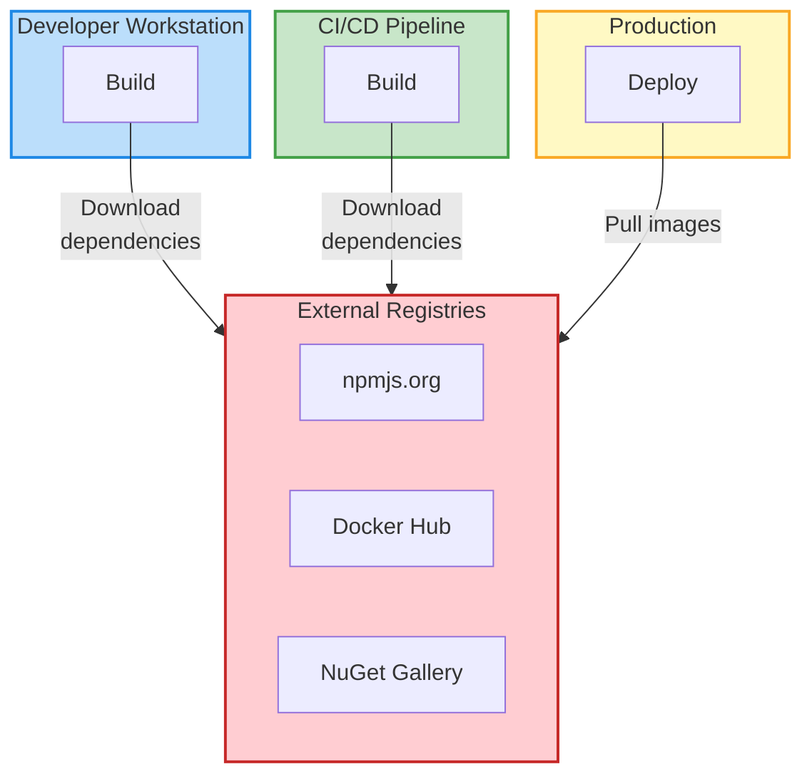
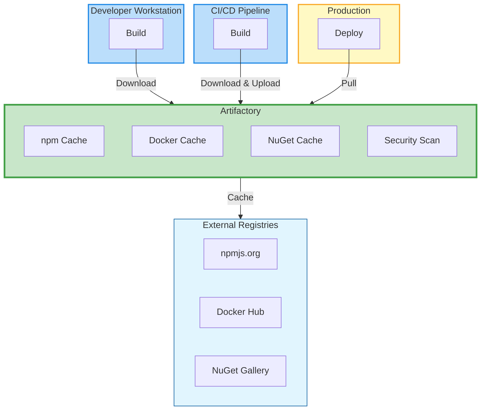
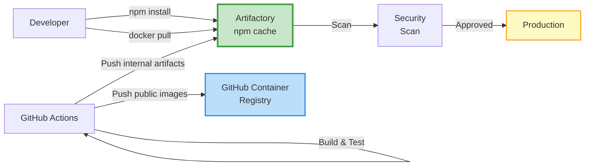
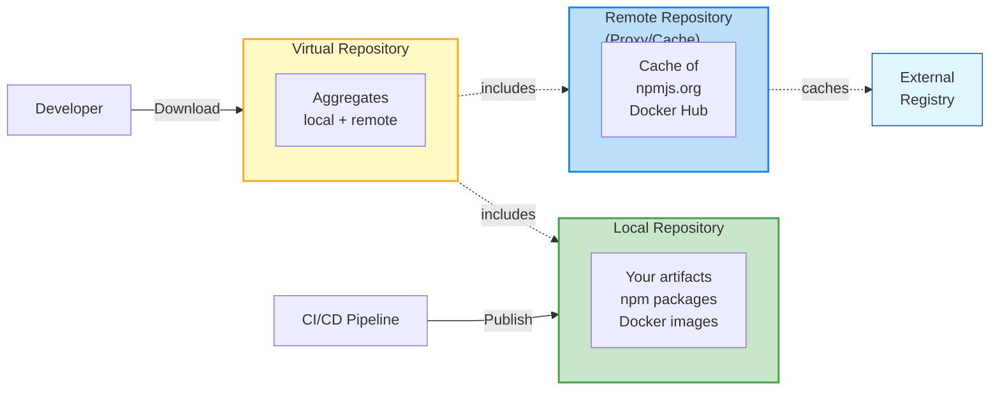
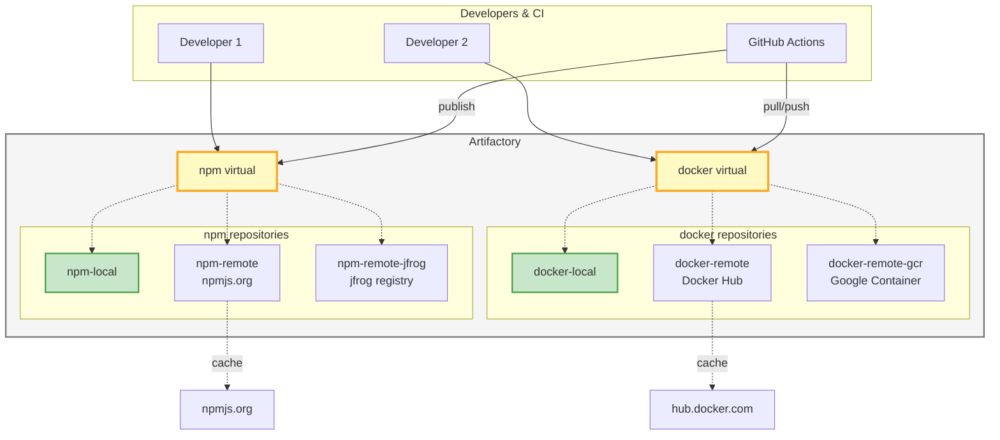

# Artifactory

---
layout: two-cols-header
---

# Introduction to Artifact Management

::left::

## What is an Artifact?

An **artifact** is any output produced during the software development lifecycle:

- **Binaries**: compiled executables, libraries
- **Packages**: npm, NuGet, Maven, Python wheels
- **Container images**: Docker images
- **Documentation**: generated docs, PDFs
- **Build outputs**: compiled code, bundles

::right::

## Why Artifact Management Matters

**Problems it solves:**

- ✅ **Reproducibility**: Same build outputs every time
- ✅ **Traceability**: Track what went into production
- ✅ **Speed**: Cache dependencies, faster builds
- ✅ **Security**: Scan and control what's used
- ✅ **Governance**: Enforce policies and licenses
- ✅ **Reliability**: Don't depend on external services

---

## The Problem: Traditional Approach



**Issues:**
- Network failures block builds
- No control over dependency availability
- Security vulnerabilities undetected
- Bandwidth costs
- Different versions across environments

---

## The Solution: Centralized Artifact Management



**Benefits:**
- Single source of truth
- Works offline (cached dependencies)
- Centralized security scanning
- Bandwidth optimization
- Consistent across all environments

---
layout: two-cols-header
---

# GHCR vs Artifactory: When to Use Each?

::left::

## GitHub Container Registry (Day 2)

**✅ Great for:**
- Quick setup (built into GitHub)
- Open source projects
- Public container images
- Simple CI/CD with GitHub Actions
- Free for public repositories

**📦 What it handles:**
- Container images (Docker, OCI)
- npm packages
- Maven, NuGet, RubyGems packages

**💡 We used GHCR on Day 2** because it's perfect for getting started quickly!

::right::

## JFrog Artifactory (Today)

**✅ Enterprise-grade for:**
- Centralized artifact management
- **All package types** in one place
- Advanced security scanning
- License compliance
- Fine-grained access control
- High availability & performance
- Offline/air-gapped environments

**📦 Supports 30+ package types:**
- Docker, npm, Maven, NuGet, PyPI, Go modules, Helm charts, and more!

**🏢 Use in production** for governance, security, and control.

---

# Migration Path: GHCR → Artifactory

## Building on Day 2's Work

**What we'll do today:**

1. **Keep GHCR** for open source/public images (it's free!)
2. **Add Artifactory** for:
   - Private/internal artifacts
   - Caching external dependencies
   - Security scanning before production
   - Multi-format artifact management

**Our updated workflow:**



**🎯 Best practice**: Use both! GHCR for simplicity, Artifactory for enterprise needs.

---
layout: section
---

# Installation and configuration

---

# Installation with Docker

## Quick Start (for development/testing)

JFrog Artifactory offers a free OSS version perfect for learning:

```bash
# Pull the Artifactory OSS image
docker pull releases-docker.jfrog.io/jfrog/artifactory-oss:latest

# Create a data volume for persistence
docker volume create artifactory-data

# Run Artifactory
docker run --name artifactory \
  -d \
  -p 8081:8081 \
  -p 8082:8082 \
  -v artifactory-data:/var/opt/jfrog/artifactory \
  releases-docker.jfrog.io/jfrog/artifactory-oss:latest
```

**Access**: After 1-2 minutes, open http://localhost:8081

---

# Installation with Docker Compose

## Production-ready Setup

```yaml
# docker-compose.yml
version: '3.8'

services:
  artifactory:
    image: releases-docker.jfrog.io/jfrog/artifactory-oss:latest
    container_name: artifactory
    restart: unless-stopped
    ports:
      - "8081:8081"  # Web UI
      - "8082:8082"  # Artifactory access
    volumes:
      - ./data:/var/opt/jfrog/artifactory
    environment:
      - JF_SHARED_DATABASE_TYPE=postgresql
      - JF_SHARED_DATABASE_USERNAME=artifactory
      - JF_SHARED_DATABASE_PASSWORD=password
    depends_on:
      - postgres
      
  postgres:
    image: postgres:15
    container_name: artifactory-postgres
    restart: unless-stopped
    environment:
      - POSTGRES_DB=artifactory
      - POSTGRES_USER=artifactory
      - POSTGRES_PASSWORD=password
    volumes:
      - ./postgres:/var/lib/postgresql/data
```

```bash
docker-compose up -d
```

---

# Initial Configuration

## First Login

**Default credentials:**
- Username: `admin`
- Password: `password`

**First-time setup wizard will guide you through:**

1. **Change admin password** (required for security)
2. **Configure base URL** (e.g., http://artifactory.mycompany.com:8081)
3. **Set proxy settings** (if behind corporate proxy)
4. **Configure default repositories** (quick-start templates)

**⚠️ Important:** Always change the default password immediately!

---

# Accessing the UI

## Web Interface Tour

**Main URL**: `http://localhost:8081` (or your configured domain)

**Key sections in the UI:**

- **📦 Artifacts**: Browse and search all artifacts
- **🔧 Administration**: Configure repositories, users, permissions
- **📊 Monitoring**: View storage, connections, logs
- **🔍 Search**: Find artifacts across all repositories
- **⚙️ User Profile**: API keys, settings, notifications

**Quick access:**
- **Application** → List all packages and artifacts
- **Artifacts** → Browse repository structure
- **Builds** → View CI/CD build information

---
layout: section
---

# User Interface

---
layout: two-cols-header
---

# Exploring the UI

::left::

## Main Navigation

**Left Sidebar:**
- **Home**: Dashboard and quick links
- **Artifacts**: Repository browser
- **Builds**: Build history and info
- **Pipelines**: CI/CD pipeline integration
- **Distribution**: Edge nodes and distribution
- **Security & Compliance**: Xray integration (Day 4)

**Top Bar:**
- Search bar (global artifact search)
- User menu (profile, API keys)
- Quick actions

::right::

## Repository Browser

**Artifacts view shows:**
- Repository tree structure
- Package metadata
- Download statistics
- Dependencies
- Security scan results

**Actions available:**
- 📥 Download artifacts
- 🗑️ Delete (with permissions)
- 📋 Copy/Move between repos
- 🔗 Get download URLs
- 📊 View statistics

---

# Searching for Artifacts

## Global Search Features

**Search by:**
- **Package name**: `express`, `react`, `lodash`
- **Version**: `@4.18.2`, `>=1.0.0`
- **Checksum**: SHA-256, MD5
- **Property**: custom metadata
- **Repository**: filter by specific repos

**Search syntax examples:**

```
# Find all versions of a package
name:express

# Find specific version
name:express AND version:4.18.2

# Search in specific repository
name:express AND repo:npm-local

# By date uploaded
uploaded:[NOW-7DAYS TO NOW]
```

**Advanced:**
- Use AQL (Artifactory Query Language) for complex queries
- Save frequent searches
- Export search results

---

# Managing Artifacts

## Common Operations

**Upload artifacts:**
- Via UI: Drag & drop or browse
- Via CLI: `curl`, `jfrog-cli`
- Via package managers: `npm publish`, `docker push`
- Via CI/CD: GitHub Actions, Jenkins

**Download artifacts:**
- Direct download from UI
- Package manager: `npm install`, `docker pull`
- REST API: programmatic access
- Bulk download via CLI

**Artifact metadata:**
- View properties (name, version, size, checksums)
- Custom properties (build info, team, environment)
- Dependencies tree
- Usage statistics
- Security scan results (if Xray enabled)

---
layout: section
epoch: d3pm
---

# Repository Management

---

# Understanding Repository Types

## Three Core Types



**🎯 Best Practice**: Developers/CI should always use **virtual** repositories

---

# Local Repository

## For Your Organization's Artifacts

**Purpose:**
- Store artifacts **produced by your team**
- Internal packages and libraries
- Build outputs from CI/CD
- Container images you create

**Configuration example:**

```yaml
Repository Key: npm-local
Package Type: npm
Description: Internal npm packages
Layout: npm-default

Settings:
  ✅ Handle Releases
  ✅ Handle Snapshots
  ❌ Exclude Patterns: **/*-test.tgz
```

**Use cases:**
- Publish internal libraries: `npm publish --registry http://artifactory:8082/npm-local`
- Share code between teams
- Version control for microservices

---

# Remote Repository (Proxy/Cache)

## Proxy to External Registries

**Purpose:**
- **Cache** packages from external sources (npmjs.org, Docker Hub)
- Improve download speed
- Work offline
- Control what enters your organization

**Configuration example:**

```yaml
Repository Key: npm-remote
Package Type: npm
URL: https://registry.npmjs.org
Description: Proxy to npm registry

Settings:
  Remote URL: https://registry.npmjs.org
  ✅ Store Artifacts Locally (cache)
  ✅ Synchronize Properties
  Cache Expiry: 7 days
  Missed Retrieval Cache: 1 hour
```

**Benefits:**
- Download once, use many times
- Offline access to cached packages
- Bandwidth savings
- Faster CI/CD builds

---

# Virtual Repository

## Aggregate Multiple Repositories

**Purpose:**
- **Single endpoint** for developers/CI
- Combines local + multiple remote repos
- Transparent access to all sources
- Resolution order configurable

**Configuration example:**

```yaml
Repository Key: npm
Package Type: npm
Description: Virtual aggregation of all npm repos

Included Repositories (in order):
  1. npm-local      (check first)
  2. npm-remote     (fallback to npmjs.org)
  
Default Deployment Repository: npm-local
```

**How it works:**
1. Request `npm install express`
2. Check `npm-local` first
3. If not found, check `npm-remote`
4. If not cached, fetch from npmjs.org
5. Cache in `npm-remote`, serve to client

**🎯 Configure npm to use**: `http://artifactory:8082/npm/`

---

# Repository Architecture Example



---

# NPM Repository Setup

## Complete npm Configuration

**1. Create repositories in Artifactory:**

- Local: `npm-local` (for your packages)
- Remote: `npm-remote` (proxy to npmjs.org)
- Virtual: `npm` (combines both)

**2. Configure npm on your machine:**

```bash
# Set Artifactory as your npm registry
npm config set registry http://artifactory.mycompany.com:8082/artifactory/api/npm/npm/

# Configure authentication
npm login --registry=http://artifactory.mycompany.com:8082/artifactory/api/npm/npm/
# Or use .npmrc file
```

**3. Create `.npmrc` in project root:**

```ini
registry=http://artifactory.mycompany.com:8082/artifactory/api/npm/npm/
always-auth=true
```

---

# NPM Repository Setup (cont.)

## Publishing Packages

```bash
# Publish to Artifactory (goes to npm-local)
npm publish

# Install from Artifactory (checks npm virtual)
npm install express
# Flow: npm -> npm-local (not found) -> npm-remote -> npmjs.org -> cached -> served
```

**Package metadata in Artifactory:**

```json
{
  "name": "my-internal-lib",
  "version": "1.0.0",
  "repo": "npm-local",
  "path": "my-internal-lib/-/my-internal-lib-1.0.0.tgz",
  "created": "2025-01-15T10:30:00.000Z",
  "size": "45678",
  "checksums": {
    "sha256": "abc123...",
    "md5": "def456..."
  }
}
```

**🔑 Authentication**: Use `.npmrc` with auth token from Artifactory

---

# Docker Repository Setup

## Complete Docker Configuration

**1. Create repositories in Artifactory:**

- Local: `docker-local` (your images)
- Remote: `docker-remote` (proxy to Docker Hub)
- Virtual: `docker` (combines both)

**2. Configure Docker:**

```bash
# Login to Artifactory Docker registry
docker login artifactory.mycompany.com:8082

# Or specify the registry in commands
docker login artifactory.mycompany.com:8082/docker
```

**3. Tag and push images:**

```bash
# Build image
docker build -t my-app:1.0.0 .

# Tag for Artifactory
docker tag my-app:1.0.0 artifactory.mycompany.com:8082/docker-local/my-app:1.0.0

# Push to Artifactory
docker push artifactory.mycompany.com:8082/docker-local/my-app:1.0.0
```

---

# Docker Repository Setup (cont.)

## Pulling Images via Artifactory

```bash
# Pull from Artifactory (checks virtual repo)
docker pull artifactory.mycompany.com:8082/docker/nginx:latest

# Flow: docker virtual 
#   -> docker-local (not found)
#   -> docker-remote (check cache)
#   -> Docker Hub (if not cached)
#   -> cache in docker-remote
#   -> serve to client
```

**Benefits:**
- Faster pulls (cached locally)
- Works offline
- Security scanning (with Xray)
- Consistent across team

**Repository configuration:**

```yaml
docker-remote:
  URL: https://registry-1.docker.io
  Cache: enabled
  Max Unique Tags: 100  # Keep last 100 tags per image
```

---
layout: section
---

# GitHub Integration

---

# Integrating with GitHub Actions

## Why Integrate?

**Benefits:**
- Publish artifacts from CI/CD automatically
- Use private packages in builds
- Cache dependencies for faster builds
- Security scanning during build

**Integration points:**
- **Push**: Upload build artifacts to Artifactory
- **Pull**: Download dependencies from Artifactory
- **Scan**: Check for vulnerabilities
- **Deploy**: Publish releases

---

# GitHub Actions + npm + Artifactory

## Example Workflow

```yaml
name: Build and Publish

on:
  push:
    branches: [main]

jobs:
  build:
    runs-on: ubuntu-latest
    steps:
      - uses: actions/checkout@v4
      
      # Configure npm to use Artifactory
      - name: Setup npm registry
        run: |
          echo "registry=http://artifactory:8082/artifactory/api/npm/npm/" > .npmrc
          echo "//artifactory:8082/artifactory/api/npm/npm/:_authToken=${{ secrets.ARTIFACTORY_TOKEN }}" >> .npmrc
      
      - name: Install dependencies
        run: npm ci  # Uses Artifactory for downloads
      
      - name: Build
        run: npm run build
      
      - name: Test
        run: npm test
      
      # Publish to Artifactory
      - name: Publish package
        if: github.ref == 'refs/heads/main'
        run: npm publish
```

---

# GitHub Actions + Docker + Artifactory

## Push/Pull Docker Images

```yaml
name: Build Docker Image

on:
  push:
    branches: [main]

jobs:
  docker:
    runs-on: ubuntu-latest
    steps:
      - uses: actions/checkout@v4
      
      # Login to Artifactory Docker registry
      - name: Login to Artifactory
        uses: docker/login-action@v3
        with:
          registry: artifactory.mycompany.com:8082
          username: ${{ secrets.ARTIFACTORY_USER }}
          password: ${{ secrets.ARTIFACTORY_PASSWORD }}
      
      # Build and push
      - name: Build and push
        uses: docker/build-push-action@v5
        with:
          push: true
          tags: |
            artifactory.mycompany.com:8082/docker-local/my-app:${{ github.sha }}
            artifactory.mycompany.com:8082/docker-local/my-app:latest
```

---

# Authentication Best Practices

## Securing Artifactory Access

**1. Generate API Token in Artifactory:**
- User menu → Edit Profile → Generate API Key
- Or use identity tokens (recommended)

**2. Store in GitHub Secrets:**
- Repository Settings → Secrets and variables → Actions
- Add: `ARTIFACTORY_TOKEN`, `ARTIFACTORY_USER`, `ARTIFACTORY_PASSWORD`

**3. Use in workflows:**

```yaml
env:
  ARTIFACTORY_TOKEN: ${{ secrets.ARTIFACTORY_TOKEN }}
```

**⚠️ Never commit credentials to code!**

**npm authentication:**

```bash
# .npmrc with environment variable
//artifactory:8082/artifactory/api/npm/npm/:_authToken=${ARTIFACTORY_TOKEN}
```

**Docker authentication:**

```bash
echo "${ARTIFACTORY_PASSWORD}" | docker login \
  -u "${ARTIFACTORY_USER}" \
  --password-stdin \
  artifactory.mycompany.com:8082
```

---
layout: section
---

# Hands-on Exercises

**Duration**: Approximately 3 hours

**Prerequisites:**
- Docker and Docker Compose installed
- Node.js and npm installed
- Access to a running Artifactory instance
- Sample Node.js project from Day 2

---

# Exercise 1: Install Artifactory with Docker

## Objective
Get Artifactory running locally using Docker

## Steps (20 minutes)

```bash
# 1. Pull and run Artifactory OSS
docker run --name artifactory -d \
  -p 8081:8081 -p 8082:8082 \
  -v artifactory-data:/var/opt/jfrog/artifactory \
  releases-docker.jfrog.io/jfrog/artifactory-oss:latest

# 2. Wait for startup (check logs)
docker logs -f artifactory

# 3. Access UI at http://localhost:8081
# Login: admin / password

# 4. Complete setup wizard
#    - Change password
#    - Skip base URL for now
#    - Create default repositories
```

**Expected outcome:**
- Artifactory accessible at http://localhost:8081
- Admin password changed
- Default repositories created

---

# Exercise 2: Configure npm to Use Artifactory

## Objective
Set up npm to download packages through Artifactory

## Steps (25 minutes)

**1. Create npm repositories in Artifactory UI:**

- Navigate to Administration → Repositories → Add Repositories
- Create **Remote**: `npm-remote` → URL: `https://registry.npmjs.org`
- Create **Local**: `npm-local`
- Create **Virtual**: `npm` → Include: `npm-local`, `npm-remote`

**2. Configure npm on your machine:**

```bash
# Set Artifactory as registry
npm config set registry http://localhost:8082/artifactory/api/npm/npm/

# Generate API token in Artifactory (User menu → Edit Profile → API Key)
# Then login
npm login --registry=http://localhost:8082/artifactory/api/npm/npm/
# Username: admin
# Password: [your-new-password]
# Email: admin@example.com
```

---

# Exercise 2: Configure npm (cont.)

## Steps (continued)

**3. Test the setup:**

```bash
# Install a package through Artifactory
npm install express --save

# Verify in Artifactory UI:
# - Go to Artifacts → npm-remote
# - Search for "express"
# - Confirm it was cached
```

**4. Create project `.npmrc`:**

```bash
# In your project directory
cat > .npmrc << 'EOF'
registry=http://localhost:8082/artifactory/api/npm/npm/
always-auth=true
EOF
```

**Expected outcome:**
- npm installs packages through Artifactory
- Packages cached in npm-remote repository
- Faster subsequent installs

---

# Exercise 3: Publish a Node.js Package

## Objective
Publish an internal package to Artifactory

## Steps (30 minutes)

**1. Create a simple library:**

```bash
mkdir my-internal-lib
cd my-internal-lib
npm init -y
```

**2. Update `package.json`:**

```json
{
  "name": "@mycompany/my-internal-lib",
  "version": "1.0.0",
  "description": "Internal utility library",
  "main": "index.js",
  "publishConfig": {
    "registry": "http://localhost:8082/artifactory/api/npm/npm-local/"
  }
}
```

---

# Exercise 3: Publish a Node.js Package (cont.)

## Steps (continued)

**3. Add some code:**

```javascript
// index.js
module.exports = {
  greet: (name) => `Hello, ${name}!`,
  version: '1.0.0'
};
```

**4. Publish to Artifactory:**

```bash
npm publish

# Verify in Artifactory UI:
# - Navigate to Artifacts → npm-local
# - Find your package: @mycompany/my-internal-lib
# - Check metadata, checksums
```

**5. Use in another project:**

```bash
cd ../another-project
npm install @mycompany/my-internal-lib
```

**Expected outcome:**
- Package published to npm-local
- Visible in Artifactory UI
- Can be installed by other projects

---

# Exercise 4: Configure Docker Registry

## Objective
Set up Docker to use Artifactory for image management

## Steps (35 minutes)

**1. Create Docker repositories in Artifactory:**

- **Remote**: `docker-remote` → URL: `https://registry-1.docker.io`
- **Local**: `docker-local`
- **Virtual**: `docker` → Include both, set `docker-local` as default deployment

**2. Configure Docker daemon:**

For **Docker Desktop**, go to Settings → Docker Engine, add:

```json
{
  "insecure-registries": ["localhost:8082"]
}
```

For **Linux**, edit `/etc/docker/daemon.json`:

```json
{
  "insecure-registries": ["localhost:8082"]
}
```

Then restart Docker:

```bash
sudo systemctl restart docker
```

---

# Exercise 4: Configure Docker Registry (cont.)

## Steps (continued)

**3. Login to Artifactory Docker registry:**

```bash
docker login localhost:8082
# Username: admin
# Password: [your-password]
```

**4. Pull an image through Artifactory:**

```bash
# Pull through the virtual repository
docker pull localhost:8082/docker/nginx:alpine

# Verify in Artifactory UI:
# - Artifacts → docker-remote → library → nginx
# - Check tags and layers cached
```

**Expected outcome:**
- Docker configured to use Artifactory
- Images pulled and cached
- Faster subsequent pulls

---

# Exercise 5: Push Docker Image to Artifactory

## Objective
Build and push the **nodejs_server** Docker image from Day 2 to Artifactory

## Steps (30 minutes)

**1. Navigate to your nodejs_server from Day 2:**

```bash
cd exercises/nodejs_server
# This is the same app we containerized on Day 2!
```

**2. Review the Dockerfile from Day 2:**

```dockerfile
# Dockerfile (multi-stage build from Day 2)
FROM node:20-alpine AS deps
WORKDIR /app
COPY package*.json ./
RUN npm ci --omit=dev

FROM node:20-alpine AS runner
WORKDIR /app
COPY --from=deps /app/node_modules ./node_modules
COPY . .
EXPOSE 3000
CMD ["node", "server.js"]
```

**3. Build the image (same as Day 2):**

```bash
docker build -t nodejs-server:1.0.0 .
```

---

# Exercise 5: Push Docker Image (cont.)

## Steps (continued)

**4. Tag for Artifactory (instead of GHCR):**

```bash
# On Day 2, we tagged for GHCR like this:
# docker tag nodejs-server:1.0.0 ghcr.io/org/nodejs-server:1.0.0

# Today, we tag for Artifactory:
docker tag nodejs-server:1.0.0 \
  localhost:8082/docker-local/nodejs-server:1.0.0

docker tag nodejs-server:1.0.0 \
  localhost:8082/docker-local/nodejs-server:latest
```

**5. Push to Artifactory:**

```bash
# On Day 2: docker push ghcr.io/org/nodejs-server:1.0.0
# Today: push to Artifactory instead
docker push localhost:8082/docker-local/nodejs-server:1.0.0
docker push localhost:8082/docker-local/nodejs-server:latest
```

**6. Verify in Artifactory:**

- Go to Artifacts → docker-local → nodejs-server
- View image layers, manifest (same layers as Day 2!)
- Check image size and checksums
- Notice: Same image, different registry

**Expected outcome:**
- Same Docker image from Day 2, now in Artifactory
- Multiple tags visible (1.0.0 and latest)
- Image can be pulled by team members from Artifactory
- Ready for security scanning on Day 4!

**💡 Comparison:**
- **Day 2**: `docker push ghcr.io/org/nodejs-server:1.0.0` (public GitHub registry)
- **Day 3**: `docker push localhost:8082/docker-local/nodejs-server:1.0.0` (private Artifactory)

---

# Exercise 6: Migrate Day 2 Workflow to Artifactory

## Objective
Enhance your Day 2 CI/CD workflow to use Artifactory alongside GHCR

## Recap: Day 2 Workflow

**What we had on Day 2:**
- ✅ Automated tests with npm
- ✅ Docker build and push to **GHCR**
- ✅ Tagged with commit SHA and latest

**What we'll add today:**
- 📦 Use Artifactory for **npm dependencies** (faster, cached)
- 🔒 Push Docker images to **Artifactory** for internal use
- 🌐 Keep GHCR for public/open source images (optional)

---

# Exercise 6: Setup (Steps 1-2)

## Steps (40 minutes total)

**1. Add Artifactory secrets to GitHub:**

- Go to your repository → Settings → Secrets and variables → Actions
- Add `ARTIFACTORY_URL`: `http://your-artifactory-server:8082`
- Add `ARTIFACTORY_USER`: `admin`  
- Add `ARTIFACTORY_PASSWORD`: your password
- Add `ARTIFACTORY_TOKEN`: your API token (from Artifactory UI)

**2. Review your Day 2 workflow:**

```yaml
# Day 2 workflow (.github/workflows/ci.yml)
name: CI/CD

on:
  push:
    branches: [main]

jobs:
  test:
    runs-on: ubuntu-latest
    steps:
      - uses: actions/checkout@v4
      - uses: actions/setup-node@v4
        with:
          node-version: '20'
          cache: 'npm'
      - run: npm ci
      - run: npm test

  docker:
    needs: test
    runs-on: ubuntu-latest
    permissions:
      packages: write
    steps:
      - uses: actions/checkout@v4
      - uses: docker/login-action@v3
        with:
          registry: ghcr.io
          username: ${{ github.actor }}
          password: ${{ secrets.GITHUB_TOKEN }}
      - uses: docker/build-push-action@v5
        with:
          push: true
          tags: ghcr.io/${{ github.repository }}:${{ github.sha }}
```

---

# Exercise 6: Enhanced Workflow with Artifactory

## Updated workflow with Artifactory integration

```yaml
# .github/workflows/ci.yml (Enhanced version)
name: CI/CD with Artifactory

on:
  push:
    branches: [main, develop]

jobs:
  test:
    runs-on: ubuntu-latest
    steps:
      - uses: actions/checkout@v4
      
      - name: Setup Node.js
        uses: actions/setup-node@v4
        with:
          node-version: '20'
      
      # NEW: Configure npm to use Artifactory for dependencies
      - name: Setup Artifactory npm registry
        run: |
          echo "registry=${{ secrets.ARTIFACTORY_URL }}/artifactory/api/npm/npm/" > .npmrc
          echo "//${{ secrets.ARTIFACTORY_URL }}/artifactory/api/npm/npm/:_authToken=${{ secrets.ARTIFACTORY_TOKEN }}" >> .npmrc
      
      # npm ci now pulls from Artifactory (faster, cached!)
      - name: Install dependencies via Artifactory
        run: npm ci
      
      - name: Run tests
        run: npm test
```

---

# Exercise 6: Docker Build with Dual Registry Push

## Push to both GHCR (public) and Artifactory (internal)

```yaml
  docker:
    needs: test
    if: github.ref == 'refs/heads/main'
    runs-on: ubuntu-latest
    permissions:
      contents: read
      packages: write
    steps:
      - uses: actions/checkout@v4
      
      # Login to GHCR (keep this from Day 2 for public images)
      - name: Login to GitHub Container Registry
        uses: docker/login-action@v3
        with:
          registry: ghcr.io
          username: ${{ github.actor }}
          password: ${{ secrets.GITHUB_TOKEN }}
      
      # NEW: Also login to Artifactory
      - name: Login to Artifactory Docker
        uses: docker/login-action@v3
        with:
          registry: ${{ secrets.ARTIFACTORY_URL }}
          username: ${{ secrets.ARTIFACTORY_USER }}
          password: ${{ secrets.ARTIFACTORY_PASSWORD }}
      
      # Build once, push to both registries
      - name: Build and push to both registries
        uses: docker/build-push-action@v5
        with:
          context: .
          push: true
          tags: |
            ghcr.io/${{ github.repository }}:${{ github.sha }}
            ghcr.io/${{ github.repository }}:latest
            ${{ secrets.ARTIFACTORY_URL }}/docker-local/nodejs-server:${{ github.sha }}
            ${{ secrets.ARTIFACTORY_URL }}/docker-local/nodejs-server:latest
```

**💡 Why push to both?**
- **GHCR**: Free, public access, great for open source
- **Artifactory**: Internal use, security scanning, production deployment

---

# Exercise 6: Verification Steps

## Testing the enhanced workflow

**3. Commit and push the changes:**

```bash
git add .github/workflows/ci.yml
git commit -m "Integrate Artifactory with Day 2 CI/CD workflow"
git push
```

**4. Monitor the workflow run:**

- Go to GitHub → Actions tab
- Click on the running workflow
- Watch each step complete:
  - ✅ npm dependencies pulled from Artifactory (faster!)
  - ✅ Tests run successfully
  - ✅ Docker image pushed to both registries

**5. Verify in GitHub:**

- Go to your repository main page
- Check **Packages** section → Image appears in GHCR with commit SHA tag

**6. Verify in Artifactory:**

- Open Artifactory UI → Artifacts → npm-remote
  - See cached npm dependencies (express, etc.)
- Navigate to docker-local → nodejs-server
  - View your image with tags: latest and commit SHA
  - Check image layers and manifest
- Go to Builds tab (if build info integration enabled)
  - See build information linked to git commit

---

# Exercise 6: What We Accomplished

## Expected outcomes and benefits

**✅ Migration complete! You've successfully:**

1. **Enhanced your Day 2 workflow** with enterprise-grade artifact management
2. **Integrated Artifactory** for npm and Docker without breaking existing setup
3. **Kept GHCR** for public images (best of both worlds!)
4. **Improved build speed** - npm dependencies now cached in Artifactory
5. **Added security scanning capability** - ready for Day 4!
6. **Enabled full traceability** - from git commit to production artifact

**📊 Compare the results:**

| Aspect | Day 2 (GHCR only) | Day 3 (with Artifactory) |
|--------|-------------------|--------------------------|
| npm dependencies | Downloaded from npmjs.org every time | Cached in Artifactory, faster builds |
| Docker images | GHCR only | Both GHCR (public) + Artifactory (internal) |
| Security scanning | None | Ready for Xray integration (Day 4) |
| Offline capability | No | Yes, cached artifacts work offline |
| Governance | Limited | Full control over artifacts |

**🎯 Next**: On Day 4, we'll add security scanning with Xray!

---

# Troubleshooting Common Issues

## npm Issues

**Problem**: `npm install` fails with 401 Unauthorized

**Solution:**

```bash
# Regenerate API token in Artifactory
# Update .npmrc with new token
npm login --registry=http://localhost:8082/artifactory/api/npm/npm/
```

**Problem**: Package not found

**Solution:**
- Check virtual repository includes both local and remote
- Verify remote repository URL is correct
- Test with a known package: `npm install express`

---

# Troubleshooting Common Issues (cont.)

## Docker Issues

**Problem**: `unauthorized: authentication required`

**Solution:**

```bash
# Ensure you're logged in
docker login localhost:8082

# Check credentials are correct
```

**Problem**: `x509: certificate signed by unknown authority`

**Solution:**

```bash
# Add to insecure registries in Docker daemon config
# Or configure proper SSL certificates for Artifactory
```

**Problem**: Image push fails with "denied"

**Solution:**
- Verify you have write permissions to docker-local
- Check repository is set as default deployment target
- Ensure correct image naming: `<artifactory-url>/<repo>/<image>:<tag>`

---

# Best Practices Summary

## Repository Structure

✅ **Always use virtual repositories** for consumers
✅ **Separate local and remote** repositories
✅ **Consistent naming**: `<type>-local`, `<type>-remote`, `<type>` (virtual)
✅ **Set up mirrors** for critical external registries

## Security

✅ **Use API tokens** instead of passwords
✅ **Rotate credentials** regularly
✅ **Never commit credentials** to source control
✅ **Use GitHub Secrets** for CI/CD credentials
✅ **Enable access logging** in Artifactory

## Performance

✅ **Configure cache expiry** appropriately
✅ **Clean up old artifacts** with retention policies
✅ **Monitor storage usage** regularly
✅ **Use cleanup policies** for docker-remote (limit unique tags)
