# Production Architecture

## Tutorial Infrastructure Overview

### Objectives

- Understand the production environment setup
- Learn about the infrastructure components
- Prepare for hands-on exercises

### Content

- Infrastructure overview: VMware, virtual machines, networking
- Tool stack: Terraform, Ansible, Kubernetes
- Tutorial architecture and environment setup
- Access and credentials

---

# Infrastructure Components

## Virtualization Layer

- **VMware vSphere**: Virtual infrastructure management
- Virtual machines for Kubernetes nodes
- Network configuration and storage

## Automation Tools

- **Terraform**: Infrastructure provisioning and management
- **Ansible**: Configuration management and deployment
- **Kubernetes**: Container orchestration platform

---

# Tutorial Environment

## Architecture Overview

```mermaid
flowchart TB
  subgraph physical["🖥️ Physical Layer"]
    BM[Bare Metal Servers]
  end
  
  subgraph virt["💻 Virtualization Layer"]
    LV[libvirt / VMware vSphere]
    VM1[VM - K8s Master]
    VM2[VM - K8s Worker 1]
    VM3[VM - K8s Worker 2]
  end
  
  subgraph iac["🏗️ Infrastructure as Code"]
    TF[Terraform]
  end
  
  subgraph config["⚙️ Configuration Management"]
    ANS[Ansible]
    KS[Kubespray Collection]
  end
  
  subgraph orchestration["☸️ Container Orchestration"]
    K8S[Kubernetes Cluster]
    POD1[Pod: App Container 1]
    POD2[Pod: App Container 2]
    POD3[Pod: App Container 3]
  end
  
  BM -->|Provides resources| LV
  LV -->|Creates & manages| VM1
  LV -->|Creates & manages| VM2
  LV -->|Creates & manages| VM3
  
  TF -->|Provisions infrastructure| LV
  TF -->|Generates inventory| ANS
  
  ANS -->|Configures VMs| VM1
  ANS -->|Configures VMs| VM2
  ANS -->|Configures VMs| VM3
  
  KS -->|Deploys K8s via Ansible| ANS
  
  VM1 -->|Hosts| K8S
  VM2 -->|Hosts| K8S
  VM3 -->|Hosts| K8S
  
  K8S -->|Schedules & manages| POD1
  K8S -->|Schedules & manages| POD2
  K8S -->|Schedules & manages| POD3
  
  style physical fill:#e0e0e0,stroke:#757575,stroke-width:2px,color:#000
  style virt fill:#bbdefb,stroke:#1e88e5,stroke-width:2px,color:#000
  style iac fill:#fff9c4,stroke:#f9a825,stroke-width:2px,color:#000
  style config fill:#c8e6c9,stroke:#43a047,stroke-width:2px,color:#000
  style orchestration fill:#d1c4e9,stroke:#7e57c2,stroke-width:2px,color:#000
  
  style BM fill:#bdbdbd,stroke:#616161,stroke-width:2px
  style LV fill:#90caf9,stroke:#1976d2,stroke-width:2px
  style TF fill:#fff59d,stroke:#f57f17,stroke-width:2px
  style ANS fill:#a5d6a7,stroke:#388e3c,stroke-width:2px
  style K8S fill:#b39ddb,stroke:#5e35b1,stroke-width:2px
```

**Lab Infrastructure Stack:**
- **Physical Layer**: Bare metal servers providing compute resources
- **Virtualization**: libvirt or VMware vSphere for VM management
- **IaC**: Terraform provisions and manages infrastructure
- **Configuration**: Ansible configures VMs and deploys applications
- **Orchestration**: Kubernetes deployed via Ansible (Kubespray)
- **Applications**: Containerized workloads running in pods

## Access Information

**TODO**: Add details about:
- Access credentials
- Network topology
- VM specifications
- Repository structure
