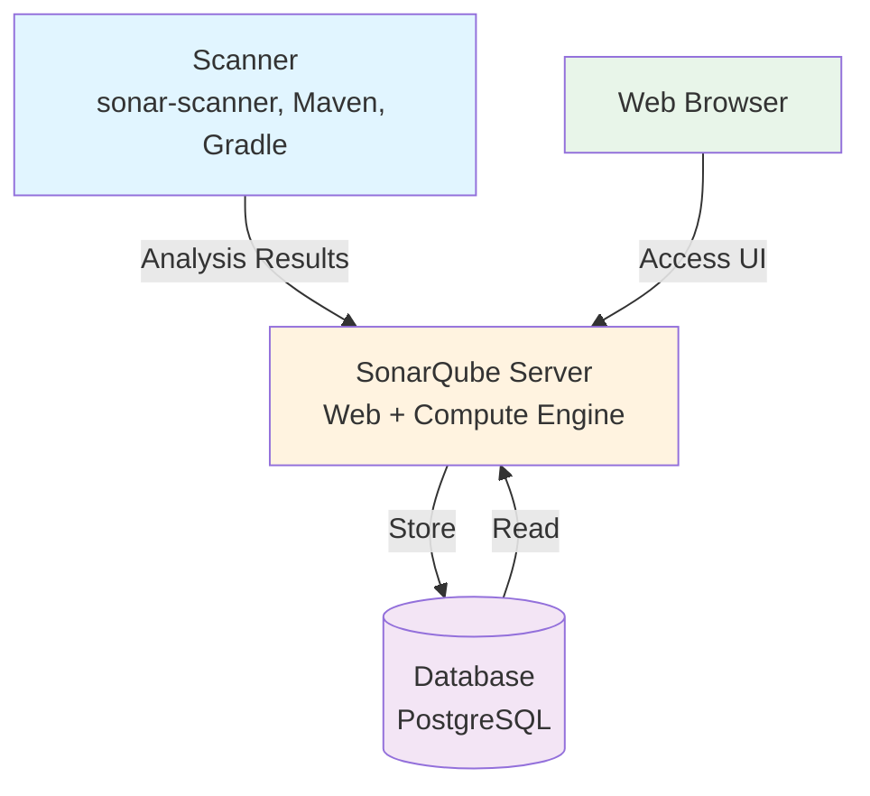
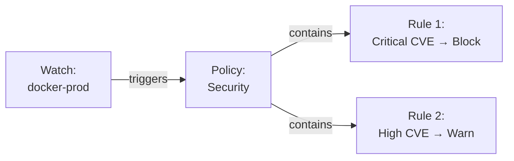

# Day 4 Improvement Recommendations

This document provides actionable recommendations for improving the Day 4 training content on SonarQube and Xray.

## Priority Matrix

| Priority | Item | Estimated Effort | Impact |
|----------|------|------------------|--------|
| **P0** | Expand slide content to 35-40 slides | High | Critical |
| **P0** | Add 5 hands-on exercises | High | Critical |
| **P1** | Add Artifactory + Xray integration | Medium | High |
| **P1** | Add SonarQube deep dive (quality gates, profiles) | Medium | High |
| **P1** | Add Xray deep dive (policies, watches) | Medium | High |
| **P2** | Add architecture diagrams | Low | Medium |
| **P2** | Add session structure (AM/PM) | Low | Medium |
| **P3** | Add troubleshooting section | Low | Low |
| **P3** | Add prerequisites slide | Low | Low |

## Detailed Recommendations

### 1. Slide Structure Reorganization

**Current:** 9 slides in flat structure  
**Recommended:** 35-40 slides organized by topic and time

```markdown
# Recommended Slide Organization

## Introduction (Slides 1-5)
- Title and objectives
- Prerequisites check
- Why code quality and security matter
- DevSecOps approach
- Tools landscape overview

## SonarQube Section (Slides 6-20)
- Architecture overview (with diagram)
- Key concepts and metrics
- Quality profiles configuration
- Quality gates explanation
- Quality gates configuration
- Local setup guide
- Project analysis walkthrough
- UI navigation
- Technical debt management
- Branch analysis
- CI/CD integration concepts
- GitHub Actions setup
- PR decoration
- Exercise 1 slide
- Exercise 2 slide

## Artifactory Integration (Slides 21-23)
- Integration patterns
- Configuration example
- Use cases

## Xray Section (Slides 24-35)
- Architecture overview (with diagram)
- SCA explained
- Container scanning
- CVE and vulnerability scoring
- Watches configuration
- Policies and rules
- License compliance
- Artifactory integration
- CI/CD integration
- Scan results interpretation
- Exercise 3 slide
- Exercise 4 slide
- Exercise 5 slide

## Best Practices & Wrap-up (Slides 36-40)
- SonarQube best practices
- Xray best practices
- Troubleshooting guide
- Organizational adoption
- Summary and resources
```

### 2. Exercise Specifications

#### Exercise 1: SonarQube Local Setup
**Duration:** 45 minutes  
**Location:** After SonarQube basics slides

**Objective:** Get hands-on experience with local SonarQube installation and first scan

**Steps:**
1. Start SonarQube using Docker
   ```bash
   docker run -d --name sonarqube -p 9000:9000 sonarqube:lts
   ```
2. Wait for startup, access http://localhost:9000
3. Login with admin/admin, change password
4. Create new project manually
5. Generate project token
6. Install sonar-scanner (or use npx)
7. Navigate to exercises/nodejs_server
8. Create sonar-project.properties
9. Run scanner with token
10. Review results in SonarQube UI
11. Explore bugs, code smells, security issues

**Deliverables:**
- Running SonarQube instance
- Scanned nodejs_server project
- Understanding of basic issues

---

#### Exercise 2: Quality Gates Configuration
**Duration:** 45 minutes  
**Location:** After quality gates slides

**Objective:** Configure custom quality gates and see build pass/fail based on code quality

**Steps:**
1. In SonarQube, go to Quality Gates
2. Create new gate "Strict Quality"
3. Add conditions:
   - Coverage on new code > 80%
   - Bugs = 0
   - Code Smells < 5
   - Security Hotspots reviewed = 100%
4. Assign gate to nodejs_server project
5. Modify code to add bugs (e.g., unused variables)
6. Re-scan project
7. Observe failed quality gate
8. Fix the bugs
9. Re-scan to see passing gate

**Deliverables:**
- Custom quality gate configured
- Understanding of pass/fail criteria
- Experience fixing quality gate failures

---

#### Exercise 3: GitHub Actions Integration
**Duration:** 45 minutes  
**Location:** After CI/CD integration slides

**Objective:** Integrate SonarQube scanning into GitHub Actions workflow

**Steps:**
1. Fork nodejs_server to personal GitHub
2. Create SonarCloud account (or use SonarQube server)
3. Add repository secrets:
   - SONAR_TOKEN
   - SONAR_HOST_URL (if using server)
4. Create .github/workflows/sonar.yml
5. Add SonarQube scan action
6. Commit and push
7. Verify workflow runs successfully
8. Create a PR with new code
9. Observe PR decoration with quality gate status
10. Configure branch protection to require passing quality gate

**Deliverables:**
- Working GitHub Actions workflow
- PR decoration enabled
- Understanding of CI integration

**Workflow Example:**
```yaml
name: SonarQube Scan
on:
  push:
    branches: [ main ]
  pull_request:
    branches: [ main ]

jobs:
  sonar:
    runs-on: ubuntu-latest
    steps:
      - uses: actions/checkout@v4
        with:
          fetch-depth: 0
      - uses: actions/setup-node@v4
        with:
          node-version: 20
      - run: npm ci
      - run: npm test -- --coverage
      - name: SonarQube Scan
        uses: SonarSource/sonarqube-scan-action@v2
        env:
          SONAR_TOKEN: ${{ secrets.SONAR_TOKEN }}
          SONAR_HOST_URL: ${{ secrets.SONAR_HOST_URL }}
```

---

#### Exercise 4: Xray Container Scanning
**Duration:** 30 minutes  
**Location:** After Xray basics slides

**Objective:** Scan a Docker container image for vulnerabilities using Xray

**Steps:**
1. Build Docker image from nodejs_server
   ```bash
   docker build -t myapp:latest .
   ```
2. Tag for Artifactory registry
   ```bash
   docker tag myapp:latest <artifactory-url>/docker-local/myapp:1.0.0
   ```
3. Push to Artifactory
   ```bash
   docker push <artifactory-url>/docker-local/myapp:1.0.0
   ```
4. Configure Xray to scan docker-local repository
5. Trigger scan (or wait for automatic scan)
6. View scan results in Xray
7. Identify vulnerabilities by severity
8. Review SBOM (Software Bill of Materials)
9. Investigate top 3 critical vulnerabilities

**Deliverables:**
- Docker image scanned by Xray
- Understanding of vulnerability reports
- Knowledge of SBOM

---

#### Exercise 5: Xray Policy Configuration
**Duration:** 30 minutes  
**Location:** After Xray policies slides

**Objective:** Configure Xray policies to enforce security and compliance rules

**Steps:**
1. Create new Xray Watch for docker-local repository
2. Create new Policy "Production Security"
3. Add rules:
   - Block critical vulnerabilities
   - Warn on high vulnerabilities
   - Block GPL licenses
   - Warn on LGPL licenses
4. Assign policy to watch
5. Intentionally use a package with critical CVE
6. Rebuild and push image
7. Observe policy violation
8. Check that download/deployment is blocked
9. Review violation report
10. Create remediation plan

**Deliverables:**
- Working Xray policy
- Understanding of policy enforcement
- Experience with violation handling

### 3. Content Additions

#### New Slides to Add

**Slide: SonarQube Architecture**
```markdown
---
layout: center
---

# SonarQube Architecture



- Scanner analyzes code and sends results
- Server processes and stores data
- Database persists all information
- Web UI for visualization and configuration
---
```

**Slide: Quality Metrics Deep Dive**
```markdown
---

# SonarQube Quality Metrics

## Reliability (Bugs)
- Code that will likely fail at runtime
- Examples: null pointer, resource leak, division by zero

## Security (Vulnerabilities)
- Code that could be exploited
- Examples: SQL injection, XSS, weak crypto

## Maintainability (Code Smells)
- Confusing, hard-to-maintain code
- Examples: duplicated code, complex methods, unused variables

## Coverage
- Percentage of code tested by automated tests
- Target: typically 80%+

## Duplication
- Repeated code blocks
- Target: < 3%

---
```

**Slide: Quality Gates - New Code vs Overall Code**
```markdown
---

# Quality Gates: New Code Focus

## Why Focus on New Code?

- Legacy code may have many issues
- Impossible to fix everything at once
- "Water leak" principle: stop new leaks first

## Configuration Strategy

**New Code Conditions** (Strict):
- Coverage on new code ≥ 80%
- Bugs in new code = 0
- Vulnerabilities in new code = 0

**Overall Code Conditions** (Relaxed):
- Coverage ≥ 50%
- Bugs < 100
- Vulnerabilities < 20

This allows gradual improvement while ensuring quality for new development.

---
```

**Slide: Xray Watches and Policies**
```markdown
---

# Xray: Watches and Policies

## Watch
- Defines **what** to scan
- Repositories, builds, release bundles
- Can filter by name patterns

## Policy
- Defines **rules** and **actions**
- Multiple rules per policy
- Examples: security, license compliance

## Rule
- Conditions (CVE score, license type)
- Actions (fail, warn, notify)



---
```

**Slide: CVE Severity Levels**
```markdown
---

# Understanding CVE Severity

## CVSS Score (0-10)

| Score | Severity | Action |
|-------|----------|--------|
| 9.0-10.0 | **Critical** | Fix immediately |
| 7.0-8.9 | **High** | Fix within days |
| 4.0-6.9 | **Medium** | Fix within weeks |
| 0.1-3.9 | **Low** | Consider fixing |

## Factors
- Exploitability: How easy to exploit?
- Impact: Confidentiality, Integrity, Availability
- Context: Network vs local, authenticated vs not

## Response Strategy
1. Critical/High in production → Emergency fix
2. Medium → Include in next sprint
3. Low → Backlog, evaluate risk vs effort

---
```

**Slide: Troubleshooting Common Issues**
```markdown
---

# Troubleshooting Guide

## SonarQube Issues

**Problem:** Scanner can't connect to server  
**Solution:** Check SONAR_HOST_URL, firewall, server status

**Problem:** Quality gate fails unexpectedly  
**Solution:** Review gate conditions, check "New Code" period setting

**Problem:** Coverage showing 0%  
**Solution:** Ensure test execution generates coverage reports (lcov, jacoco)

## Xray Issues

**Problem:** No vulnerabilities found  
**Solution:** Verify Xray indexing complete, check repository configuration

**Problem:** Policy not enforced  
**Solution:** Verify watch is active, policy assigned, repository in scope

**Problem:** False positive vulnerabilities  
**Solution:** Ignore specific CVEs with justification, update watches

---
```

### 4. README.md Update Suggestion

**Current Day 4 in README.md:**
```
Day 4
    - SonarQube
    - XRAY
```

**Recommended Update:**
```
Day 4 - Code Quality and Security Scanning
    Morning
        - Introduction to code quality and security
        - SonarQube
            - Architecture and concepts
            - Quality profiles and gates
            - Local setup and analysis
            - Exercise: Local SonarQube setup
            - Exercise: Quality gates configuration
        - CI/CD integration
            - GitHub Actions
            - Exercise: SonarQube in CI/CD
    Afternoon
        - Xray
            - Overview and architecture
            - Vulnerability scanning (SCA, containers)
            - Policies and watches
            - Integration with Artifactory
            - Exercise: Container scanning
            - Exercise: Policy configuration
        - Best practices and troubleshooting
        - Wrap-up and Q&A
```

### 5. Implementation Checklist

- [ ] Expand introduction section (add 3-4 slides)
- [ ] Add SonarQube architecture diagram
- [ ] Add quality metrics explanation slide
- [ ] Add quality profiles deep dive
- [ ] Add quality gates configuration details
- [ ] Add new code vs overall code strategy slide
- [ ] Add SonarQube project settings slide
- [ ] Add technical debt management slide
- [ ] Add branch analysis slide
- [ ] Add Exercise 1 slide with detailed instructions
- [ ] Add Exercise 2 slide with detailed instructions
- [ ] Add Artifactory integration section (2-3 slides)
- [ ] Add Xray architecture diagram
- [ ] Add SCA explanation slide
- [ ] Add CVE severity levels slide
- [ ] Add vulnerability remediation strategies
- [ ] Add watches and policies deep dive
- [ ] Add license compliance slide
- [ ] Add Exercise 3 slide with detailed instructions
- [ ] Add Exercise 4 slide with detailed instructions
- [ ] Add Exercise 5 slide with detailed instructions
- [ ] Add troubleshooting slide
- [ ] Add best practices slides (separate for SonarQube and Xray)
- [ ] Add session markers (AM/PM)
- [ ] Add prerequisites slide
- [ ] Update README.md Day 4 structure
- [ ] Review consistency with 1 full day duration
- [ ] Create exercise preparation materials/scripts if needed

### 6. Exercise Materials Preparation

For successful hands-on exercises, prepare:

1. **Docker Compose File** for quick setup:
```yaml
version: '3'
services:
  sonarqube:
    image: sonarqube:lts
    ports:
      - "9000:9000"
    environment:
      - SONAR_ES_BOOTSTRAP_CHECKS_DISABLE=true
```

2. **sonar-project.properties Template**:
```properties
sonar.projectKey=nodejs-server
sonar.projectName=Node.js Server
sonar.sources=.
sonar.exclusions=node_modules/**,test/**
sonar.tests=test
sonar.javascript.lcov.reportPaths=coverage/lcov.info
```

3. **Sample Dockerfile** for nodejs_server:
```dockerfile
FROM node:20-alpine
WORKDIR /app
COPY package*.json ./
RUN npm ci --only=production
COPY . .
EXPOSE 3000
CMD ["node", "server.js"]
```

4. **Quick Setup Scripts** for students who encounter issues

### 7. Pedagogical Notes

**Key Learning Objectives:**
1. Understand importance of automated quality and security checks
2. Configure and run SonarQube scans locally and in CI/CD
3. Interpret quality reports and take action
4. Configure Xray for vulnerability scanning
5. Create and enforce security policies
6. Integrate quality/security into development workflow

**Teaching Tips:**
- Start with "why" before "how"
- Use real-world examples and CVEs
- Show actual vulnerabilities in popular packages
- Demonstrate impact of quality gates on development workflow
- Discuss organizational adoption challenges
- Emphasize continuous improvement mindset

**Common Student Questions:**
- Q: Should we fix all issues at once?
  A: No, focus on new code first, use "water leak" approach
- Q: How strict should quality gates be?
  A: Start lenient, tighten gradually with team agreement
- Q: What about false positives?
  A: Mark as false positive with justification, don't disable rules globally
- Q: Which vulnerabilities should we fix first?
  A: Critical/High in production code, exploitable vulnerabilities

## Next Steps

1. Review this document with training lead
2. Prioritize which improvements to implement first
3. Create detailed issues for approved improvements
4. Assign resources and timeline
5. Implement changes iteratively
6. Test exercises with pilot group
7. Gather feedback and iterate
