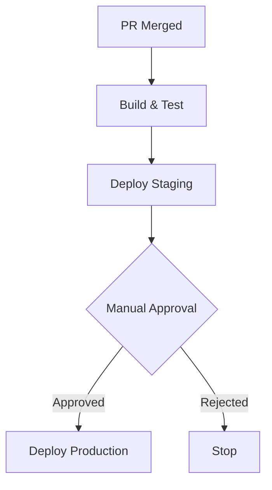
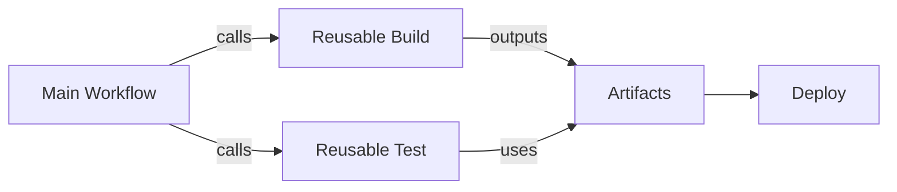
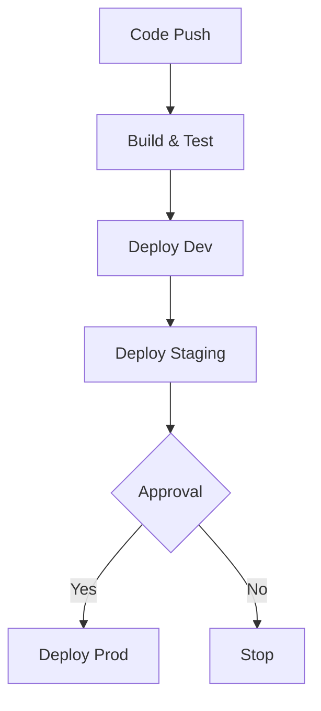
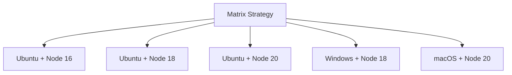
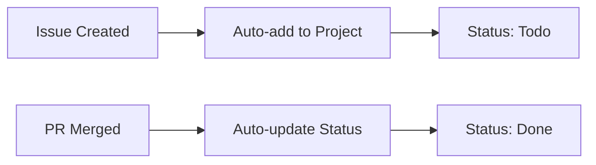
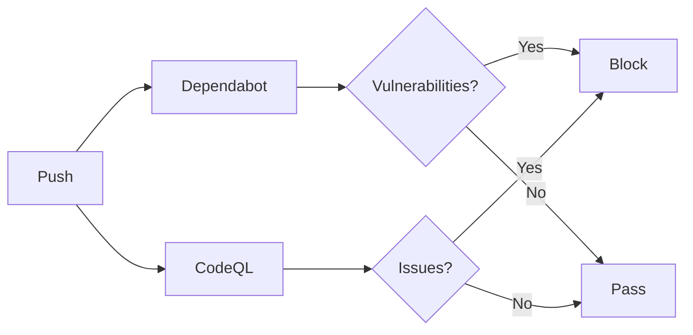
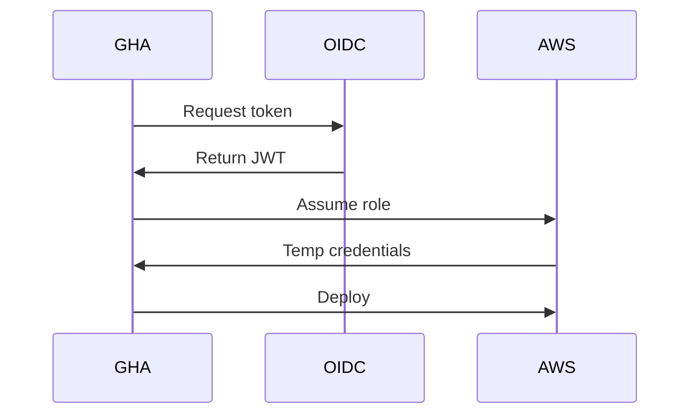
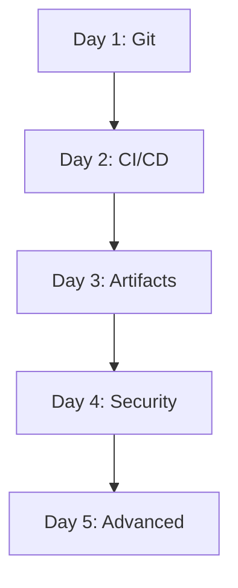

# Day 5 Dev Training - Detailed Issue Proposals

This document contains detailed specifications for 10 improvement issues to enhance the Day 5 training content.

## Table of Contents

1. [Issue #1: Expand Advanced GitHub Actions Content](#issue-1-expand-advanced-github-actions-content) (HIGH)
2. [Issue #2: Enhance Reusable Workflows Section](#issue-2-enhance-reusable-workflows-section) (HIGH)
3. [Issue #3: Add Security and Environments Section](#issue-3-add-security-and-environments-section) (HIGH)
4. [Issue #4: Expand Project Management Section](#issue-4-expand-project-management-section) (HIGH)
5. [Issue #5: Expand Practical Exercises](#issue-5-expand-practical-exercises) (HIGH)
6. [Issue #6: Add Time Estimates and Day Structure](#issue-6-add-time-estimates-and-day-structure) (MEDIUM)
7. [Issue #7: Add Visual Diagrams and Examples](#issue-7-add-visual-diagrams-and-examples) (MEDIUM)
8. [Issue #8: Add Troubleshooting and Debugging Guide](#issue-8-add-troubleshooting-and-debugging-guide) (LOW)
9. [Issue #9: Add Best Practices Summary Section](#issue-9-add-best-practices-summary-section) (LOW)
10. [Issue #10: Add Cross-References to Previous Days](#issue-10-add-cross-references-to-previous-days) (LOW)

---

## Issue #1: Expand Advanced GitHub Actions Content

**Priority**: HIGH  
**File**: `slides/pages/dev-advanced-github.md`  
**Estimated Effort**: 7-9 new slides, ~1.5 hours of content

### Problem

The current Advanced GitHub Actions section has only 1 slide covering advanced triggers with brief mentions of schedule, issue_comment, workflow_run, and path filters. Missing several important topics essential for a full day of training.

### Current State

- Only 1 slide covering advanced triggers
- No coverage of matrix builds, concurrency, or workflow dispatch
- Minimal context usage examples

### Proposed Changes

#### 1. Add Matrix Builds Section (1-2 slides)

```yaml
---
# Matrix Builds

Test across multiple configurations in parallel:

\`\`\`yaml
strategy:
  matrix:
    os: [ubuntu-latest, windows-latest, macos-latest]
    node-version: [16, 18, 20]
    include:
      - os: ubuntu-latest
        node-version: 20
        extra: "lint"
    exclude:
      - os: windows-latest
        node-version: 16
\`\`\`

**Key features**:
- Basic matrix syntax
- Include/exclude options
- Fail-fast vs continue-on-error
- Real-world use cases
```

#### 2. Add Concurrency Control Section (1 slide)

```yaml
---
# Concurrency Control

Prevent overlapping workflow runs:

\`\`\`yaml
concurrency:
  group: ${{ github.workflow }}-${{ github.ref }}
  cancel-in-progress: true
\`\`\`

**Use cases**:
- Save CI minutes by canceling outdated runs
- Prevent deployment conflicts
- Control resource usage
```

#### 3. Add Workflow Dispatch Section (1 slide)

```yaml
---
# Manual Workflow Triggers

\`\`\`yaml
on:
  workflow_dispatch:
    inputs:
      environment:
        type: choice
        options: [dev, staging, prod]
        required: true
      debug:
        type: boolean
        default: false
      version:
        type: string
        description: 'Version to deploy'
\`\`\`

**Access inputs**: `${{ inputs.environment }}`
```

#### 4. Add Contexts Deep Dive (1-2 slides)

Expand coverage of:
- `${{ github }}` context (ref, sha, actor, event_name, repository, etc.)
- `${{ secrets }}` context and best practices
- `${{ env }}` vs `${{ vars }}`
- `${{ steps }}` and `${{ needs }}` for job/step outputs
- `${{ runner }}` context

#### 5. Add Debugging Section (1 slide)

```yaml
---
# Debugging Workflows

**Enable debug logging**:
\`\`\`yaml
# Set repository secrets:
# ACTIONS_STEP_DEBUG = true
# ACTIONS_RUNNER_DEBUG = true
\`\`\`

**Techniques**:
- Read workflow logs effectively
- Use tmate action for SSH debugging
- Print context for troubleshooting: `echo '${{ toJSON(github) }}'`
- Common error patterns
```

#### 6. Add Performance Optimization (1 slide)

```yaml
---
# Performance Optimization

**Best practices**:
- Minimize job dependencies
- Run jobs in parallel when possible
- Use appropriate runners (ubuntu is fastest)
- Cache dependencies aggressively
- Optimize Docker layer caching
```

### Benefits

- Comprehensive coverage of advanced GitHub Actions features
- Students learn production-ready patterns
- Better prepares for real-world scenarios
- Brings content closer to full day duration

---

## Issue #2: Enhance Reusable Workflows Section

**Priority**: HIGH  
**File**: `slides/pages/dev-advanced-github.md`  
**Estimated Effort**: 3-4 slides, ~45-60 minutes of content

### Problem

The current reusable workflows section is only 1 slide with a minimal example. This is a critical topic for team collaboration and DRY principles, requiring more depth.

### Current State

- 1 slide with basic workflow_call example
- No coverage of inputs/outputs
- No secrets management patterns
- No organization best practices

### Proposed Changes

#### Slide 1: Reusable Workflows with Inputs and Outputs

```yaml
---
# Reusable Workflows - Inputs & Outputs

\`\`\`yaml
# .github/workflows/reusable-build.yml
on:
  workflow_call:
    inputs:
      node-version:
        required: true
        type: string
      environment:
        required: false
        type: string
        default: 'dev'
    outputs:
      build-id:
        description: "Build identifier"
        value: ${{ jobs.build.outputs.build-id }}

jobs:
  build:
    runs-on: ubuntu-latest
    outputs:
      build-id: ${{ steps.build.outputs.id }}
    steps:
      - uses: actions/checkout@v4
      - uses: actions/setup-node@v4
        with:
          node-version: ${{ inputs.node-version }}
      - run: npm ci && npm run build
      - id: build
        run: echo "id=$(date +%s)" >> $GITHUB_OUTPUT
\`\`\`
```

#### Slide 2: Calling Reusable Workflows

```yaml
---
# Using Reusable Workflows

\`\`\`yaml
# .github/workflows/ci.yml
jobs:
  build:
    uses: ./.github/workflows/reusable-build.yml
    with:
      node-version: '20'
      environment: 'production'
  
  deploy:
    needs: build
    runs-on: ubuntu-latest
    steps:
      - run: echo "Deploying build ${{ needs.build.outputs.build-id }}"
\`\`\`

**Key points**:
- Use `uses:` to call reusable workflow
- Pass inputs with `with:`
- Access outputs via `needs.<job>.outputs.<output>`
```

#### Slide 3: Secrets Inheritance

```yaml
---
# Managing Secrets in Reusable Workflows

\`\`\`yaml
# Define in reusable workflow
on:
  workflow_call:
    secrets:
      NPM_TOKEN:
        required: true
      DEPLOY_KEY:
        required: false

# Call with explicit secrets
jobs:
  build:
    uses: ./.github/workflows/reusable.yml
    secrets:
      NPM_TOKEN: ${{ secrets.NPM_TOKEN }}
      DEPLOY_KEY: ${{ secrets.DEPLOY_KEY }}
    
    # Or inherit all secrets
    secrets: inherit
\`\`\`
```

#### Slide 4: Organization and Best Practices

- **Centralized workflows**: Store in `.github` repository for org-wide access
- **Versioning**: Use tags or branches (`@v1`, `@main`)
- **Naming**: Clear, descriptive names (`reusable-build.yml`, `reusable-test.yml`)
- **Documentation**: Document inputs, outputs, and secrets in README
- **When to use**: Reusable workflows vs composite actions

#### Slide 5: Composite Actions (bonus)

```yaml
---
# Composite Actions

For reusable steps within a workflow:

\`\`\`yaml
# .github/actions/setup-node-env/action.yml
name: 'Setup Node Build Environment'
description: 'Setup Node.js and install dependencies'
inputs:
  node-version:
    required: true
runs:
  using: "composite"
  steps:
    - uses: actions/setup-node@v4
      with:
        node-version: ${{ inputs.node-version }}
        cache: 'npm'
    - run: npm ci
      shell: bash
\`\`\`

Use: `uses: ./.github/actions/setup-node-env`
```

### Benefits

- Students learn proper workflow organization
- Reduces workflow duplication
- Teaches team collaboration patterns
- Essential for scaling GitHub Actions usage

---

## Issue #3: Add Security and Environments Section

**Priority**: HIGH  
**File**: `slides/pages/dev-advanced-github.md`  
**Estimated Effort**: 7-8 slides, ~1.5 hours of content

### Problem

Security and environment management are critical production topics currently under-represented. Only 1 slide briefly mentions environments.

### Current State

- 1 slide briefly mentioning protected environments, reviewers, and wait timers
- No security best practices
- No OIDC coverage
- No integration with security scanning tools

### Proposed Changes

#### Section 1: Environment Protection (2 slides)

**Slide 1: Environment Configuration**

```yaml
---
# Environment Protection

\`\`\`yaml
jobs:
  deploy:
    runs-on: ubuntu-latest
    environment:
      name: production
      url: https://example.com
    steps:
      - uses: actions/checkout@v4
      - run: ./deploy.sh
\`\`\`

**Configuration** (in repository settings):
- Required reviewers (individuals, teams)
- Wait timers (delays before deployment)
- Deployment branches (restrict to main, release/*)
- Environment secrets and variables
```

**Slide 2: Approval Workflow Diagram**

Include Mermaid diagram:


#### Section 2: OIDC Authentication (2 slides)

**Slide 1: OIDC Concepts**

- **Traditional**: Long-lived credentials in secrets
- **OIDC**: Short-lived tokens, no stored credentials
- **Benefits**: Better security, automatic rotation, audit trail

**Slide 2: OIDC Implementation**

```yaml
---
# OIDC with AWS

\`\`\`yaml
jobs:
  deploy-aws:
    runs-on: ubuntu-latest
    permissions:
      id-token: write
      contents: read
    steps:
      - uses: aws-actions/configure-aws-credentials@v4
        with:
          role-to-assume: arn:aws:iam::123456789:role/GitHubActions
          aws-region: us-east-1
      - run: aws s3 sync ./dist s3://my-bucket
\`\`\`

Works with: AWS, Azure, GCP, HashiCorp Vault
```

#### Section 3: Security Best Practices (2-3 slides)

**Slide 1: Secrets Management**

- Never hardcode secrets
- Use repository/environment/organization secrets
- Principle of least privilege
- Secret rotation policies
- Secrets disabled in PRs from forks (security)

**Slide 2: Dependency Security**

```yaml
---
# Dependabot Configuration

\`\`\`yaml
# .github/dependabot.yml
version: 2
updates:
  - package-ecosystem: "npm"
    directory: "/"
    schedule:
      interval: "weekly"
    open-pull-requests-limit: 10
\`\`\`

**Features**:
- Automated dependency updates
- Security advisories
- Dependency review action
```

**Slide 3: Code Scanning with CodeQL**

```yaml
---
# CodeQL Security Scanning

\`\`\`yaml
name: "CodeQL"
on:
  push:
    branches: [main]
  pull_request:
  schedule:
    - cron: '0 6 * * 1'

jobs:
  analyze:
    runs-on: ubuntu-latest
    permissions:
      security-events: write
    steps:
      - uses: actions/checkout@v4
      - uses: github/codeql-action/init@v3
        with:
          languages: javascript
      - uses: github/codeql-action/analyze@v3
\`\`\`
```

#### Section 4: Workflow Security (1 slide)

```yaml
---
# Workflow Security

**Limit permissions**:
\`\`\`yaml
permissions:
  contents: read      # Minimal by default
  pull-requests: write  # Only what's needed
\`\`\`

**Prevent injection**:
- Avoid `${{ github.event.pull_request.title }}` in commands
- Use environment variables: `env: TITLE: ${{ ... }}`

**Safe PR handling**:
- Use `pull_request_target` carefully
- Validate inputs from untrusted sources
```

### Benefits

- Essential for production deployments
- Modern security practices
- Compliance and audit requirements
- Aligns with industry best practices

---

## Issue #4: Expand Project Management Section

**Priority**: HIGH  
**File**: `slides/pages/dev-advanced-github.md`  
**Estimated Effort**: 9-11 slides, ~2 hours of content

### Problem

"Project management with GitHub" is listed as a major Day 5 topic in README.md, but currently has only 1 slide with a brief list of features.

### Current State

- 1 slide briefly listing features
- No hands-on guidance
- No workflow automation examples
- Minimal depth on any topic

### Proposed Changes

#### Section 1: GitHub Projects v2 (3-4 slides)

**Slide 1: Introduction to Projects v2**

- What is GitHub Projects v2
- Differences from Projects (classic)
- Table view vs Board view
- Integration with issues and pull requests

**Slide 2: Project Configuration**

- Creating a project
- Adding items (issues, PRs, draft issues)
- Custom fields: text, number, date, single select, iteration
- Views: table, board, roadmap
- Filters and grouping

**Slide 3: Automation**

```yaml
---
# Project Automation

**Built-in automations**:
- Auto-add items when: Issue created, PR opened
- Auto-set status when: Issue closed, PR merged
- Auto-archive items

**GraphQL API**:
\`\`\`graphql
mutation {
  updateProjectV2ItemFieldValue(input: {
    projectId: "PROJECT_ID"
    itemId: "ITEM_ID"
    fieldId: "FIELD_ID"
    value: { singleSelectOptionId: "OPTION_ID" }
  }) {
    projectV2Item { id }
  }
}
\`\`\`
```

**Slide 4: Workflow Integration**

```yaml
---
# Integrate Projects with Workflows

\`\`\`yaml
name: Update Project Status
on:
  issues:
    types: [opened, closed]

jobs:
  update-project:
    runs-on: ubuntu-latest
    steps:
      - uses: actions/add-to-project@v0.5.0
        with:
          project-url: https://github.com/users/USERNAME/projects/1
          github-token: ${{ secrets.GH_TOKEN }}
\`\`\`
```

#### Section 2: Issue Management (2-3 slides)

**Slide 1: Issue Templates and Forms**

```yaml
---
# Issue Templates

\`\`\`yaml
# .github/ISSUE_TEMPLATE/bug_report.yml
name: Bug Report
description: File a bug report
labels: ["bug", "triage"]
body:
  - type: input
    id: version
    attributes:
      label: Version
      placeholder: v1.0.0
    validations:
      required: true
  - type: textarea
    id: description
    attributes:
      label: What happened?
    validations:
      required: true
  - type: dropdown
    id: severity
    attributes:
      label: Severity
      options: [Critical, High, Medium, Low]
\`\`\`
```

**Slide 2: Labels and Milestones**

- Creating and organizing labels
  - Priority: P0, P1, P2, P3
  - Type: bug, feature, documentation
  - Status: needs-triage, in-progress, blocked
- Color coding strategy
- Milestones for release planning
- Linking issues to milestones

**Slide 3: Issue Automation**

```yaml
---
# Automate Issue Management

\`\`\`yaml
name: Auto-label issues
on:
  issues:
    types: [opened]

jobs:
  label:
    runs-on: ubuntu-latest
    steps:
      - uses: actions/github-script@v7
        with:
          script: |
            if (context.payload.issue.title.includes('[BUG]')) {
              await github.rest.issues.addLabels({
                owner: context.repo.owner,
                repo: context.repo.repo,
                issue_number: context.payload.issue.number,
                labels: ['bug', 'needs-triage']
              });
            }
\`\`\`
```

#### Section 3: Branch Protection and Code Owners (2 slides)

**Slide 1: Branch Protection Rules**

Configure protection for main/production branches:

- ✅ Require pull request reviews (1-3 reviewers)
- ✅ Dismiss stale approvals on new commits
- ✅ Require review from code owners
- ✅ Require status checks to pass (CI, CodeQL, etc.)
- ✅ Require conversation resolution
- ✅ Require signed commits
- ✅ Require linear history
- ❌ Allow force pushes (usually disabled)
- ❌ Allow deletions (usually disabled)

**Slide 2: Code Owners**

```
---
# CODEOWNERS File

\`\`\`
# Global owners
*                           @org/team-leads

# Frontend
/src/frontend/**            @org/frontend-team
*.css                       @org/design-team

# Backend
/src/backend/**             @org/backend-team
/src/api/**                 @org/api-team

# Infrastructure
/.github/**                 @org/devops-team
/terraform/**               @org/devops-team
/Dockerfile                 @org/security-team

# Documentation
/docs/**                    @org/tech-writers
*.md                        @org/tech-writers
\`\`\`

**Features**:
- Automatic review requests
- Enforce with branch protection
- Team-based ownership
```

#### Section 4: Discussions and Wiki (1 slide)

**Discussions**:
- Categories: Announcements, Q&A, Ideas, Show and tell
- Polls for community decisions
- Convert discussions to issues
- Pin important discussions

**Wiki**:
- Documentation organization
- Sidebar navigation
- Collaborative editing
- When to use Wiki vs docs/ folder

#### Section 5: Additional Features (1 slide)

- Pull request templates
- Saved replies for common responses
- Slash commands
- Keyboard shortcuts
- Notification management strategies

### Benefits

- Comprehensive project management skills
- Better team collaboration
- Industry-standard practices
- Meets Day 5 program objectives

---

## Issue #5: Expand Practical Exercises

**Priority**: HIGH  
**File**: `slides/pages/dev-advanced-github.md`  
**Estimated Effort**: 10 detailed exercises, ~4-5 hours total

### Problem

Current exercises section lists only 4 topics without detailed instructions. Day 1 has 10 detailed exercises with step-by-step instructions and observation sections, providing a quality benchmark.

### Current State

- 4 exercise topics listed:
  1. Add scheduled maintenance workflow
  2. Create reusable workflow for testing
  3. Set up environment protections
  4. Create a Project board with automation

### Proposed Changes

Add 10 detailed exercises matching Day 1 pedagogical style with objectives, step-by-step instructions, and observation sections.

#### Exercise 1: Matrix Build Workflow (20-30 min)

**Objective**: Create a workflow that tests code across multiple Node.js versions and operating systems

**Instructions**:
1. Create `.github/workflows/matrix-test.yml`
2. Configure matrix with:
   - `node-version: [16, 18, 20]`
   - `os: [ubuntu-latest, windows-latest]`
3. Add steps: checkout, setup Node, install dependencies, run tests
4. Add `include` entry for Node 20 on Ubuntu to also run linting
5. Push and observe workflow running multiple jobs in parallel

**Observations**:
- How many jobs were created?
- Which job runs linting?
- What happens if one job fails?
- Try adding `fail-fast: false` - what changes?

---

#### Exercise 2: Concurrency Control (15-20 min)

**Objective**: Prevent multiple workflow runs for the same branch from running simultaneously

**Instructions**:
1. Create workflow that runs on push
2. Add long-running step: `sleep 60`
3. Add concurrency configuration:
   ```yaml
   concurrency:
     group: ${{ github.workflow }}-${{ github.ref }}
     cancel-in-progress: true
   ```
4. Push multiple commits rapidly to same branch
5. Observe in Actions tab how concurrent runs are canceled

**Observations**:
- Which runs were canceled?
- Which run completed?
- What does the concurrency group name represent?

---

#### Exercise 3: Workflow Dispatch with Inputs (20-25 min)

**Objective**: Create a manually triggered workflow with deployment options

**Instructions**:
1. Create `.github/workflows/manual-deploy.yml`
2. Add `workflow_dispatch` trigger with inputs:
   - `environment`: choice (dev, staging, prod)
   - `version`: string
   - `dry-run`: boolean (default: true)
3. Use inputs in workflow: `${{ inputs.environment }}`
4. Trigger manually from GitHub Actions tab with different inputs

**Observations**:
- How do you access the manual trigger UI?
- How are inputs displayed in the workflow run?
- What happens when you don't specify optional inputs?

---

#### Exercise 4: Reusable Workflow with Inputs and Outputs (30-40 min)

**Objective**: Create and use a reusable workflow for building

**Instructions**:
1. Create `.github/workflows/reusable-build.yml`:
   - Add `workflow_call` trigger
   - Add input: `node-version` (required, string)
   - Add output: `build-time`
   - Build and output timestamp
2. Create `.github/workflows/use-reusable.yml`:
   - Call the reusable workflow with `uses:`
   - Pass node-version input
   - Access and display the build-time output
3. Push and observe both workflows

**Observations**:
- How is the reusable workflow displayed in Actions tab?
- Can you see the output value being passed?
- Try calling with different node-version values

---

#### Exercise 5: Environment Protection with Approvals (20-30 min)

**Objective**: Set up staging and production environments with deployment protection

**Instructions**:
1. Go to Settings → Environments
2. Create "staging" environment:
   - No protection rules
   - Add variable: `API_URL=https://staging.example.com`
3. Create "production" environment:
   - Add required reviewer (yourself)
   - Set wait timer: 5 minutes
   - Add variable: `API_URL=https://prod.example.com`
4. Create workflow with both environments
5. Push and observe approval process

**Observations**:
- Does staging deploy automatically?
- What UI appears for production approval?
- What happens if you reject deployment?
- How long does wait timer delay deployment?

---

#### Exercise 6: Caching for Performance (20-30 min)

**Objective**: Speed up workflow using dependency caching

**Instructions**:
1. Create workflow without caching, record run time
2. Add caching:
   ```yaml
   - uses: actions/cache@v4
     with:
       path: ~/.npm
       key: ${{ runner.os }}-node-${{ hashFiles('**/package-lock.json') }}
       restore-keys: ${{ runner.os }}-node-
   ```
3. Run again and compare times
4. Check cache entries in Settings → Actions → Caches

**Observations**:
- What was the time difference?
- Check cache hit/miss in logs
- What happens if you change package-lock.json?

---

#### Exercise 7: GitHub Project with Automation (30-40 min)

**Objective**: Create a project board that automatically organizes issues

**Instructions**:
1. Create new Project (table view)
2. Add custom fields:
   - Status (single select): Todo, In Progress, Done
   - Priority (single select): Low, Medium, High, Critical
   - Estimate (number)
3. Create automation rules:
   - Auto-add items when issues created
   - Auto-set status to "Done" when issues closed
4. Create 3-5 test issues, observe auto-add
5. Close an issue, observe status change
6. Switch to board view, organize by Status

**Observations**:
- How quickly do items appear in project?
- What other automation options are available?
- Can you link pull requests to project items?

---

#### Exercise 8: Branch Protection and Code Owners (20-30 min)

**Objective**: Configure branch protection requiring code owner approval

**Instructions**:
1. Create `CODEOWNERS` file:
   ```
   *                    @yourusername
   /.github/**          @yourusername
   /docs/**             @yourusername
   ```
2. Go to Settings → Branches → Add rule for `main`:
   - Require PR before merging
   - Require 1 approval
   - Require review from code owners
   - Require status checks (select your CI workflow)
3. Create feature branch, make changes to `.github/workflows/`
4. Create pull request, observe required reviews

**Observations**:
- Who is automatically requested for review?
- Can you merge without approval?
- What happens if CI fails?

---

#### Exercise 9: CodeQL Security Scanning (30-40 min)

**Objective**: Set up automated security scanning

**Instructions**:
1. Go to Security tab → Code scanning → Set up CodeQL
2. GitHub creates `.github/workflows/codeql.yml`
3. Review generated workflow
4. Commit the workflow file
5. Add intentionally vulnerable code (example: eval() in JavaScript)
6. Push and wait for scan
7. Review alerts in Security → Code scanning

**Observations**:
- What languages were detected?
- How long did the scan take?
- What severity levels are shown?
- How do you dismiss a false positive?

---

#### Exercise 10: Debug a Failing Workflow (20-30 min)

**Objective**: Learn workflow debugging techniques

**Instructions**:
1. Create workflow with intentional issues:
   ```yaml
   jobs:
     debug-test:
       runs-on: ubuntu-latest
       steps:
         - run: npm test  # Missing checkout!
         - run: echo "${{ secrets.MISSING_SECRET }}"
         - run: node nonexistent.js
   ```
2. Enable debug logging: Set secret `ACTIONS_STEP_DEBUG = true`
3. Run workflow, review logs
4. Fix issues one by one

**Observations**:
- What additional info appears with debug logging?
- How do you identify which step failed?
- What error messages are most helpful?

---

### Format Notes

Each exercise should follow this structure:
```markdown
## Exercise N: Title (time estimate)

**Objective**: Clear learning goal

**Instructions**:
1. Step-by-step instructions
2. With specific commands/actions
3. Expected to complete

**Observations**:
- Questions to think about
- Things to notice
- Experiments to try
```

### Benefits

- Hands-on experience with all major features
- Detailed guidance matching Day 1 style
- Clear learning objectives
- Troubleshooting practice
- Production-ready skills

---

## Issue #6: Add Time Estimates and Day Structure

**Priority**: MEDIUM  
**File**: `slides/pages/dev-advanced-github.md`  
**Estimated Effort**: Metadata additions throughout

### Problem

Day 5 content lacks time estimates and session structure that other days use. Day 1 uses `epoch` markers and clear timing.

### Current State

- No `epoch` markers (d5am, d5pm)
- No time estimates per section
- No break indicators
- Unclear pacing

### Proposed Changes

#### Add Epoch Markers

```yaml
---
layout: center
epoch: d5am
---
# Morning Session

**Duration**: 3.5 hours

---
layout: section
epoch: d5pm
---
# Afternoon Session

**Duration**: 3.5 hours
```

#### Suggested Day Structure

```
Day 5 Schedule (7 hours total)

Morning (3.5 hours: 8:30 AM - 12:00 PM)
├── 08:30-08:45 (15 min) - Introduction
├── 08:45-09:30 (45 min) - Advanced Actions Triggers
├── 09:30-10:15 (45 min) - Workflow Organization
├── 10:15-10:30 (15 min) - ☕ BREAK
├── 10:30-11:15 (45 min) - Security & Environments
└── 11:15-12:00 (45 min) - Performance & Optimization

Lunch (12:00 PM - 1:00 PM)

Afternoon (3.5 hours: 1:00 PM - 4:30 PM)
├── 13:00-14:30 (90 min) - Project Management
├── 14:30-15:15 (45 min) - Security Scanning
├── 15:15-15:30 (15 min) - ☕ BREAK
├── 15:30-16:00 (30 min) - Debugging & Troubleshooting
├── 16:00-16:20 (20 min) - Best Practices
└── 16:20-16:30 (10 min) - Wrap-up & Q&A
```

#### Add Time Estimates to Slides

```yaml
---
# Advanced GitHub Actions — Matrix Builds

**Time: 15 minutes**

Content...
```

### Benefits

- Instructors can pace the day
- Students know what to expect
- Ensures content fits in one day
- Professional training structure
- Matches style of other days

---

## Issue #7: Add Visual Diagrams and Examples

**Priority**: MEDIUM  
**File**: `slides/pages/dev-advanced-github.md`  
**Estimated Effort**: 6-7 diagrams, 10+ screenshots

### Problem

Current content is very text-heavy with mostly code examples. Visual diagrams improve understanding, especially for complex workflows.

### Current State

- Mostly code examples
- No workflow diagrams
- No UI screenshots
- No architecture visualizations

### Proposed Changes

#### Workflow Diagrams (Mermaid)

**1. Reusable Workflow Flow**


**2. Environment Deployment Pipeline**


**3. Matrix Build Visualization**


**4. Project Automation Flow**


**5. Security Scanning Pipeline**


**6. OIDC Authentication**


#### UI Screenshots

Add screenshots for:
1. GitHub Projects v2 table and board views
2. Environment protection rules settings
3. Branch protection configuration
4. Code scanning alerts
5. Matrix job visualization
6. Manual workflow dispatch form
7. Approval waiting state
8. CodeQL alert detail
9. Dependabot PR
10. Project automation rules

#### Comparison Tables

**Reusable vs Composite Actions**
| Feature | Reusable Workflow | Composite Action |
|---------|------------------|------------------|
| Location | `.github/workflows/` | Any directory |
| Trigger | `workflow_call` | `uses:` step |
| Runners | Different runners | Parent runner |
| Outputs | Job-level | Step-level |

**Environment Comparison**
| Env | Auto Deploy | Approval | Wait | Branches |
|-----|-------------|----------|------|----------|
| Dev | ✅ | ❌ | ❌ | Any |
| Staging | ✅ | ❌ | ❌ | main, develop |
| Production | ❌ | ✅ 2 | ⏱️ 15m | main only |

### Benefits

- Visual learners benefit
- Complex workflows easier to understand
- More engaging presentation
- Professional appearance
- Better accessibility

---

## Issue #8: Add Troubleshooting and Debugging Guide

**Priority**: LOW  
**File**: `slides/pages/dev-advanced-github.md`  
**Estimated Effort**: 7-9 slides, ~1 hour of content

### Problem

Students will encounter errors when working with GitHub Actions. A troubleshooting section helps them debug independently.

### Proposed Changes

#### Section: Debugging Workflows (2-3 slides)

**Slide 1: Debug Logging**

```yaml
---
# Debug Logging

Enable detailed output:
\`\`\`yaml
# Set repository secrets:
# ACTIONS_STEP_DEBUG = true
# ACTIONS_RUNNER_DEBUG = true
\`\`\`

**Or in workflow**:
\`\`\`yaml
env:
  ACTIONS_STEP_DEBUG: true
\`\`\`
```

**Slide 2: Interactive Debugging**

```yaml
---
# SSH Debugging with tmate

\`\`\`yaml
steps:
  - uses: actions/checkout@v4
  - name: Setup tmate
    uses: mxschmitt/action-tmate@v3
    if: failure()  # Only on failure
\`\`\`

**Alternative**: Print context for debugging
\`\`\`yaml
- run: echo '${{ toJSON(github) }}'
\`\`\`
```

#### Section: Common Errors (2-3 slides)

**Slide 1: Syntax Errors**

- Invalid YAML
- Wrong event names (`pull-request` vs `pull_request`)
- Missing required fields

**Slide 2: Permission Errors**

```yaml
Error: Resource not accessible by integration

Solution:
permissions:
  contents: write
  pull-requests: write
```

**Slide 3: Runtime Errors**

- Command not found → Add setup step
- File not found → Add checkout
- Exit code 1 → Review logs for actual error

#### Section: Reading Logs (1 slide)

- Find failed step (red X)
- Expand to see output
- Scroll to bottom (error usually at end)
- Look for "Error:" messages
- Check exit codes

### Benefits

- Students gain troubleshooting skills
- Reduces frustration
- Builds confidence
- Prepares for real-world scenarios

---

## Issue #9: Add Best Practices Summary Section

**Priority**: LOW  
**File**: `slides/pages/dev-advanced-github.md`  
**Estimated Effort**: 8-10 slides, ~30-45 minutes

### Problem

Best practices are scattered throughout slides. A consolidated summary provides a reference guide.

### Proposed Changes

#### Section: Workflow Organization (1-2 slides)

**DRY Principle**:
- Use reusable workflows
- Extract common steps
- Avoid duplication

**Naming Conventions**:
- Workflows: `ci-build-test.yml`
- Jobs: `build`, `test`, `deploy`
- Secrets: `AWS_ACCESS_KEY`, `NPM_TOKEN`

#### Section: Security (2 slides)

**Secrets**:
- Never hardcode
- Use environment-specific secrets
- Rotate regularly
- Principle of least privilege

**Permissions**:
```yaml
permissions:
  contents: read  # Minimal
  pull-requests: write  # Only what's needed
```

#### Section: Performance (1-2 slides)

**Caching**:
- Cache dependencies
- Use built-in caching when available
- Cache build outputs

**Parallelization**:
- Run independent jobs in parallel
- Use matrix for testing
- Strategic job dependencies

#### Section: Team Collaboration (1-2 slides)

**Code Review**:
- Require PR reviews (1-2 reviewers)
- Use code owners
- Require passing CI
- Dismiss stale approvals

**Branch Strategy**:
- Protect main/production branches
- Require status checks
- Require signed commits
- No force push

### Benefits

- Consolidates learning
- Provides future reference
- Professional practices
- Reduces future errors

---

## Issue #10: Add Cross-References to Previous Days

**Priority**: LOW  
**File**: `slides/pages/dev-advanced-github.md`  
**Estimated Effort**: Narrative additions throughout

### Problem

Day 5 appears isolated with no connection to previous learning from Days 1, 2, and 4.

### Proposed Changes

#### Add Introduction Connecting Days

```markdown
---
# Day 5 — Building on the Week

**Day 1**: Git & GitHub basics → branches, PRs

**Day 2**: CI/CD basics → first workflows

**Day 4**: Security → SonarQube, Xray

**Today**: Advanced Actions & project management
```

#### Add Callbacks in Sections

**In Advanced Triggers**:
```markdown
**Recall from Day 2**: We created workflows with `on: push`

**Today**: We expand to sophisticated triggers
```

**In Security Section**:
```markdown
**Building on Day 4**: We learned SonarQube and Xray

**Today**: GitHub-native security (CodeQL, Dependabot)
```

#### Add "Week's Journey" Review



#### Add Complete Example

Show workflow using concepts from all 5 days:
- Git workflows (Day 1)
- CI/CD automation (Day 2)
- Artifact management (Day 3)
- Security scanning (Day 4)
- Advanced features (Day 5)

### Benefits

- Shows learning progression
- Reinforces earlier concepts
- Creates cohesive training
- Helps students see "big picture"

---

## Implementation Priority

### Phase 1: Core Content (HIGH - Essential)
1. Issue #1: Advanced GitHub Actions
2. Issue #2: Reusable Workflows
3. Issue #3: Security & Environments
4. Issue #4: Project Management
5. Issue #5: Detailed Exercises

**Result**: Brings Day 5 from 3-5 hours to 6-7 hours (full day)

### Phase 2: Structure (MEDIUM - Strongly Recommended)
6. Issue #6: Time structure
7. Issue #7: Visual diagrams

**Result**: Improved consistency and engagement

### Phase 3: Polish (LOW - Nice to Have)
8. Issue #8: Troubleshooting guide
9. Issue #9: Best practices
10. Issue #10: Cross-references

**Result**: Enhanced learning experience

---

## Summary

These 10 issues, when implemented, will transform Day 5 from insufficient coverage (3-5 hours) to comprehensive full-day training (6-7 hours) that matches the quality and depth of other training days.

**Key Metrics**:
- Current: 81 lines, 3-5 hours, 4 basic exercises
- After HIGH issues: ~350-400 lines, 6-7 hours, 10 detailed exercises
- Matches Day 1 quality and depth
